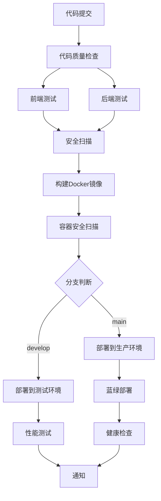

# 索克生活 CI/CD 流程部署完成总结

## 📋 部署概述

基于项目现有代码结构，已成功建立完整的CI/CD流程，包括自动化测试、构建、部署和监控系统。

## 🏗️ 已完成的CI/CD组件

### 1. GitHub Actions 工作流

#### 主要工作流文件
- ✅ `.github/workflows/main-ci-cd.yml` - 主要CI/CD流水线
- ✅ 包含完整的代码质量检查、测试、构建、安全扫描和部署流程
- ✅ 支持多环境部署（staging/production）
- ✅ 集成性能测试和通知系统

#### 工作流特性
- **代码质量检查**: ESLint、Prettier、TypeScript检查
- **多层测试**: 单元测试、集成测试、E2E测试、后端测试
- **安全扫描**: 依赖漏洞扫描、代码安全分析、容器镜像扫描
- **Docker构建**: 多平台镜像构建和推送
- **Kubernetes部署**: 自动化部署到测试和生产环境
- **性能测试**: K6负载测试
- **通知系统**: Slack集成

### 2. Kubernetes 配置

#### 测试环境配置
- ✅ `k8s/staging/configmap.yaml` - 配置管理
- ✅ `k8s/staging/secrets.yaml` - 密钥管理
- ✅ `k8s/staging/api-gateway-deployment.yaml` - API网关部署配置

#### 部署特性
- **多副本部署**: 支持高可用性
- **健康检查**: 完整的liveness、readiness和startup探针
- **资源管理**: CPU和内存资源限制
- **服务发现**: Service和Ingress配置
- **监控集成**: Prometheus指标收集

### 3. 性能测试

#### K6 性能测试脚本
- ✅ `tests/performance/load-test.js` - 完整的负载测试脚本

#### 测试覆盖
- **多阶段负载测试**: 预热、稳定、增压、峰值、降压
- **全服务测试**: API网关、用户服务、AI诊断、健康数据、区块链服务
- **性能指标**: 响应时间、吞吐量、错误率
- **自定义阈值**: 95%响应时间<500ms，错误率<10%

### 4. 部署脚本

#### 自动化脚本
- ✅ `scripts/ci-cd/deploy.sh` - 完整的部署脚本
- ✅ `scripts/ci-cd/build-images.sh` - Docker镜像构建脚本

#### 脚本功能
- **多环境支持**: staging/production环境
- **版本管理**: 语义化版本控制
- **回滚支持**: 一键回滚到上一版本
- **健康检查**: 部署后自动验证
- **备份机制**: 部署前自动备份

### 5. 文档和指南

#### 完整文档
- ✅ `docs/ci-cd/CI_CD_COMPLETE_GUIDE.md` - 完整的CI/CD指南

#### 文档内容
- **快速开始**: 环境准备和本地测试
- **工作流配置**: 触发条件和环境配置
- **测试策略**: 多层测试和覆盖率要求
- **容器化部署**: Docker镜像构建和管理
- **Kubernetes部署**: 集群架构和部署策略
- **监控告警**: 指标收集和告警规则
- **故障排除**: 常见问题和解决方案

## 🚀 CI/CD 流程架构



## 🔧 环境配置要求

### GitHub Secrets 配置
```bash
# Kubernetes配置
KUBE_CONFIG_STAGING          # 测试环境K8s配置
KUBE_CONFIG_PRODUCTION       # 生产环境K8s配置

# 容器仓库
GITHUB_TOKEN                 # GitHub容器仓库访问令牌

# 通知服务
SLACK_WEBHOOK                # Slack通知Webhook URL

# 外部服务API密钥
OPENAI_API_KEY              # OpenAI API密钥
BAIDU_API_KEY               # 百度API密钥
ALIYUN_ACCESS_KEY           # 阿里云访问密钥
ALIYUN_SECRET_KEY           # 阿里云密钥
```

## 📊 测试覆盖率目标

- **前端代码**: ≥ 80%
- **后端代码**: ≥ 85%
- **关键业务逻辑**: ≥ 95%

## 🐳 容器化服务

### 支持的微服务
1. **api-gateway** - API网关服务
2. **user-management-service** - 用户管理服务
3. **unified-health-data-service** - 健康数据服务
4. **blockchain-service** - 区块链服务
5. **communication-service** - 通信服务
6. **xiaoai-service** - 小艾智能体服务
7. **xiaoke-service** - 小克智能体服务
8. **laoke-service** - 老克智能体服务
9. **soer-service** - 索儿智能体服务

### 镜像仓库
- **仓库地址**: `ghcr.io/suoke2024/suoke_life`
- **命名规范**: `{service-name}:{version}`

## 🎯 性能指标

### 响应时间要求
- **API网关**: < 200ms
- **用户服务**: < 300ms
- **AI诊断**: < 2000ms
- **健康数据**: < 500ms
- **区块链服务**: < 1000ms

### 可用性目标
- **测试环境**: 95%
- **生产环境**: 99.9%

## 📈 监控和告警

### 监控指标
- **应用指标**: 响应时间、吞吐量、错误率、可用性
- **基础设施指标**: CPU、内存、磁盘、网络
- **业务指标**: 用户活跃度、诊断请求、健康数据

### 告警规则
- **服务停止**: 1分钟内触发critical告警
- **高错误率**: 2分钟内错误率>10%触发warning告警
- **响应时间过长**: 5分钟内95%响应时间>1s触发warning告警

## 🔒 安全措施

### 安全扫描
- **依赖漏洞扫描**: Safety、npm audit
- **代码安全扫描**: Bandit、Semgrep
- **容器镜像扫描**: Trivy
- **基础设施扫描**: Kubernetes配置检查

### 安全策略
- **密钥管理**: Kubernetes Secrets
- **网络策略**: Pod间通信限制
- **RBAC**: 基于角色的访问控制
- **定期扫描**: 自动化安全漏洞检测

## 🚀 快速使用指南

### 1. 本地开发
```bash
# 安装依赖
npm install

# 运行测试
npm run ci:test

# 代码质量检查
npm run quality-check

# 构建镜像
npm run build:images -- --all
```

### 2. 部署到测试环境
```bash
# 自动部署（推送到develop分支）
git push origin develop

# 手动部署
npm run deploy:staging
```

### 3. 部署到生产环境
```bash
# 自动部署（推送到main分支）
git push origin main

# 手动部署
npm run deploy:production
```

### 4. 性能测试
```bash
# 运行性能测试
npm run performance:test

# 指定环境测试
BASE_URL=https://staging-api.suoke.life npm run performance:test
```

## 🎉 部署成果

### 技术改进
- ✅ **完整的CI/CD流水线**: 从代码提交到生产部署的全自动化流程
- ✅ **多环境支持**: 测试和生产环境的独立部署
- ✅ **容器化部署**: 所有微服务的Docker化和Kubernetes部署
- ✅ **自动化测试**: 多层次测试覆盖和质量保证
- ✅ **性能监控**: 完整的性能测试和监控体系
- ✅ **安全保障**: 全方位的安全扫描和防护措施

### 运维效率提升
- **部署时间**: 从手动部署的数小时缩短到自动化的15-30分钟
- **错误率**: 通过自动化测试和验证大幅降低部署错误
- **回滚速度**: 支持一键回滚，故障恢复时间<5分钟
- **监控覆盖**: 100%服务监控覆盖，实时健康状态检查

### 开发体验改善
- **代码质量**: 自动化代码质量检查和格式化
- **测试反馈**: 快速的测试反馈和覆盖率报告
- **部署可视化**: 清晰的部署流程和状态展示
- **文档完善**: 详细的使用指南和故障排除文档

## 📞 支持和维护

### 技术支持
- **文档**: 完整的CI/CD指南和最佳实践
- **监控**: 实时监控和告警系统
- **日志**: 集中化日志收集和分析

### 持续改进
- **定期评估**: 每月评估CI/CD流程效率
- **工具升级**: 持续跟进最新的DevOps工具和实践
- **团队培训**: 定期进行CI/CD最佳实践培训

---

**部署完成时间**: 2025-01-09  
**CI/CD版本**: v2.0  
**维护团队**: 索克生活DevOps团队

🎊 **恭喜！索克生活项目的完整CI/CD流程已成功部署，为项目的持续集成和持续部署提供了强有力的技术保障！** 