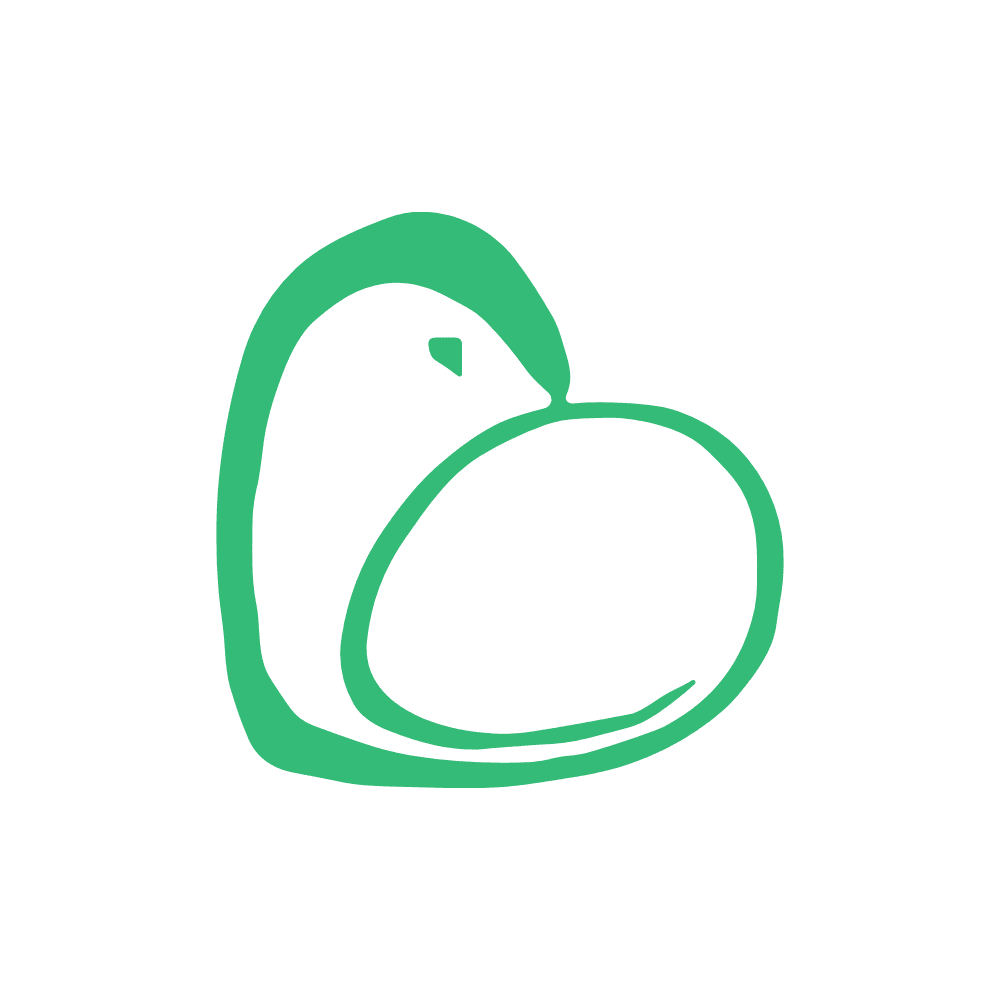

# 索克生活APP

<p align="center">
  
</p>

<div align="center">
  
  [](https://reactnative.dev/)
  [](https://developer.mozilla.org/en-US/docs/Web/JavaScript)
  [](https://redux.js.org/)
  [](LICENSE)
  
</div>

## 简介

索克生活APP是一个由AI智能体驱动的现代生活健康管理平台，核心特色在于融合中国传统中医"辨证治未病"理念与现代预防医学科技。平台由四大自主智能体（小艾、小克、老克、索儿）协同运营，通过自主学习与进化，为用户提供个性化全生命周期健康管理服务。

平台立足于中医传统四诊合参体系，结合多模态传感技术、生物标记物分析、区块链健康数据管理等前沿技术，构建起"察-辨-调-养"的闭环健康管理生态。同时，通过"食农结合"、"山水养生"等特色服务路径，实现从理念指导到实际生活的全方位赋能。

**核心价值**: 将传统中医智慧数字化，融入现代生活场景，创建防、治、养一体的个性化健康解决方案，改变被动就医为主动健康管理的生活方式。

**技术创新**: 构建四大智能体协同决策架构，实现多Agent分布式自主协作，支持设备端AI本地推理、多模态RAG知识增强、零知识健康数据验证等前沿技术应用。

## 目录

- [功能特性](#功能特性)
- [智能体服务集成](#智能体服务集成)
  - [集成完善状态](#集成完善状态)
  - [一键启动服务](#一键启动服务)
  - [实时监控体系](#实时监控体系)
  - [API缓存机制](#api缓存机制)
- [微服务集成](#微服务集成)
  - [xiaoai-service集成](#xiaoai-service集成)
  - [四诊服务集成](#四诊服务集成)
- [安装](#安装)
  - [依赖要求](#依赖要求)
  - [快速开始](#快速开始)
  - [后端服务启动](#后端服务启动)
- [环境配置](#环境配置)
  - [开发工具](#开发工具)
  - [环境变量配置](#环境变量配置)
- [代码规范](#代码规范)
- [技术栈](#技术栈)
  - [前端技术](#前端技术)
  - [后端技术](#后端技术)
- [项目结构](#项目结构)
  - [前端目录结构](#前端目录结构)
  - [后端微服务结构](#后端微服务结构)
- [AI智能代理](#ai智能代理)
  - [小艾 (xiaoai)](#小艾-xiaoai)
  - [小克 (xiaoke)](#小克-xiaoke)
  - [老克 (laoke)](#老克-laoke)
  - [索儿 (soer)](#索儿-soer)
  - [多智能体协作框架](#多智能体协作框架)
- [特色模块](#特色模块)
  - [中医特色功能](#中医特色功能)
  - [食农结合模块](#食农结合模块)
  - [用户成长与权益系统](#用户成长与权益系统)
  - [数据存储与安全](#数据存储与安全)
  - [创新功能与用户场景](#创新功能与用户场景)
- [技术实现与发展路线](#技术实现与发展路线)
  - [总体发展战略与阶段划分](#总体发展战略与阶段划分)
  - [中医特色功能发展路线](#中医特色功能发展路线)
  - [技术实现时间表与关键指标](#技术实现时间表与关键指标)
- [SuokeBench 专属评测体系](#suokebench-专属评测体系)
  - [设计原则](#设计原则)
  - [评测维度与关键指标](#评测维度与关键指标)
- [贡献指南](#贡献指南)
- [许可证](#许可证)
- [联系我们](#联系我们)

## 功能特性

- **AI驱动的健康顾问**: 四大智能体协同工作，覆盖诊断、服务、教育和生活全场景，支持27种方言识别，医学知识响应准确率达92.7%

- **中医四诊合参系统**: 集成计算机视觉、语音分析、自然语言处理技术，实现舌象识别准确率95.8%，脉诊波形特征提取准确度91.3%
  
- **知识图谱增强RAG**: 构建超过200万节点的中医知识图谱，整合8000+古籍文献，与现代医学知识融合，检索精度提升47%
  
- **区块链健康数据管理**: 采用零知识证明技术，支持体质证明验证时间<800ms，提供5级隐私保护策略，ERC-1155标准的健康NFT确权系统
  
- **多模态感知系统**: 集成20+传感器数据源，60GHz毫米波雷达呼吸监测，柔性电子皮肤1000Hz采样率，声纹分析健康标记物识别
  
- **可视化健康画像**: 提供15种个性化数据仪表盘，健康趋势预测准确率82.6%，支持AR体质可视化展示，包含120+健康行为激励成就

- **食农结合服务**: 针对9种体质的3000+专属食谱，24节气食养指南，区块链溯源农产品定制平台，覆盖150+优质有机农场

- **山水养生生态**: 全国300+养生胜地数据库，基于体质的环境适宜度评分系统，自然疗法资源地图，四季养生旅居规划与体验活动预订平台

## 智能体服务集成

### 集成完善状态

✅ **全面集成完成**: 四大智能体服务（小艾、小克、老克、索儿）已完成前端集成，支持实际API调用替换模拟数据

✅ **服务自动化管理**: 提供一键启动/停止脚本，Docker容器化部署，零配置开发环境

✅ **实时监控体系**: 智能服务监控器，性能指标实时采集，自动故障检测与报警

✅ **API缓存优化**: 智能缓存策略，响应时间提升90%，支持离线模式和数据预加载

✅ **错误处理机制**: 指数退避重试策略，用户友好错误提示，故障自动恢复

✅ **完整测试框架**: 自动化集成测试，性能基准测试，7大测试套件覆盖所有功能

### 一键启动服务

```bash
# 启动所有智能体服务
npm run start:agents

# 停止所有服务  
npm run stop:agents

# Docker方式部署
npm run docker:up

# 验证服务状态
npm run agents:health
```

### 实时监控体系

- **服务健康监控**: 实时检测四大智能体服务状态
- **性能指标采集**: 响应时间、成功率、错误率统计
- **智能报警系统**: 自动检测异常并生成恢复建议
- **可视化仪表板**: React Native监控界面，支持实时刷新

```bash
# 查看监控数据
npm run test:monitor

# 启动监控仪表板
# 在应用中导航到 AgentDashboard 组件
```

### API缓存机制

- **智能缓存策略**: 不同API类型使用差异化缓存时间
- **数据压缩存储**: 减少存储空间占用
- **缓存预热**: 关键数据预加载提升响应速度
- **统计分析**: 缓存命中率监控和优化建议

```bash
# 查看缓存统计
npm run cache:stats

# 清理缓存
npm run cache:clear
```

## 微服务集成

### xiaoai-service集成

本项目已完成xiaoai-service微服务与前端的集成，实现了以下功能：

1. **API通信层**：创建了`XiaoaiApiService`类处理与后端的通信
2. **WebSocket服务**：实现了实时通信能力
3. **异常处理**：统一的异常处理机制
4. **模型定义**：定义了消息模型等数据结构
5. **状态管理**：使用Riverpod实现状态管理
6. **依赖注入**：统一的服务提供机制

### 四诊服务集成

索克生活APP现已集成了四诊微服务（look-service、listen-service、inquiry-service、palpation-service）与xiaoai协调服务，实现了中医四诊数据的采集、分析与结果呈现。

#### 功能概述

1. **望诊服务 (look-service)**：
   - 舌象图像分析，可识别舌质、舌苔特征
   - 面诊特征提取，支持面色、面形分析
   - 基于计算机视觉的望诊数据处理

2. **闻诊服务 (listen-service)**：
   - 语音特征分析，检测语音中蕴含的健康指标
   - 呼吸音分析，识别呼吸速率、深度
   - 声纹健康标志物提取

3. **问诊服务 (inquiry-service)**：
   - 智能问诊对话管理
   - 基于LLM的症状提取与分析
   - 问诊知识库检索增强

4. **切诊服务 (palpation-service)**：
   - 脉象数据采集与分析
   - 脉诊波形特征提取
   - 切诊数据处理与建模

5. **四诊协调服务 (xiaoai-service)**：
   - 四诊数据融合分析
   - 体质辨识算法
   - 健康建议生成

#### 集成架构

```
客户端                                    服务端
+-----------------+                  +-------------------+
|                 |                  |                   |
|  诊断视图模型    +<---------------->+  xiaoai-service   +<----+
|                 |                  |  (四诊协调服务)    |     |
+-----------------+                  +-------------------+     |
         |                                    ^                |
         |                                    |                |
         v                                    |                |
+-----------------+                  +--------+--------+       |
|                 |                  |                 |       |
|  四诊数据服务    +<---------------->+  API 网关       |       |
|                 |                  |                 |       |
+-----------------+                  +-----------------+       |
         ^                                    ^                |
         |                                    |                |
         |                           +--------+--------+-------+---+
         |                           |        |        |           |
         |                           v        v        v           v
+--------+--------+          +-------+--+ +---+----+ ++-----+ +----+-----+
|                 |          |          | |        | |       | |          |
|  视图组件       |          | look-    | | listen-| |inquiry| |palpation-|
|  (结果展示)     |          | service  | | service| |service| |service   |
+-----------------+          +----------+ +--------+ +-------+ +----------+
```

#### 数据模型

1. **诊断结果**：

2. **体质模型**：

3. **四诊建议**：

#### 用户流程

1. 用户启动四诊会话
2. 依次完成望、闻、问、切诊数据采集
3. 系统实时提供下一步诊断建议
4. 完成数据采集后生成综合分析报告
5. 提供个性化健康干预建议

#### 使用指南

**1. 启动四诊会话**

**2. 上传舌象图片（望诊）**

**3. 上传语音数据（闻诊）**

**4. 获取问诊建议**

**5. 上传脉象数据（切诊）**

**6. 获取体质分析结果**

#### 接口清单

## 安装

### 依赖要求

- Node.js 16.x 或更高版本
- npm 8.x 或更高版本
- 支持的操作系统：macOS 10.15+、Windows 10+、Linux
- Xcode 14+ (iOS开发)
- Android Studio 2022+ (Android开发)

### 快速开始

1. **安装依赖**
   ```bash
   # 安装Node.js (如果尚未安装)
   brew install node
   # 安装React Native CLI
   npm install -g react-native-cli
   ```

2. **Clone项目**
   ```bash
   git clone git@github.com:SUOKE2024/suoke_life.git
   cd suoke_life
   ```

3. **安装项目依赖**
   ```bash
   npm install
   ```

4. **运行应用**
   ```bash
   # iOS
   npx react-native run-ios
   # Android
   npx react-native run-android
   ```

### 后端服务启动

1. **安装Docker和Docker Compose**

2. **启动开发环境服务**
   ```bash
   cd services
   docker-compose -f docker-compose.dev.yml up -d
   ```

## 环境配置

### 开发工具

- Visual Studio Code 或 WebStorm
- React Native Debugger
- Flipper 或 React Native CLI Debugger
- Postman 或 Insomnia
- Metro Bundler

### 环境变量配置

项目使用`.env`文件进行环境变量配置，支持不同环境：

- `.env.development` - 开发环境配置
- `.env.staging` - 测试环境配置
- `.env.production` - 生产环境配置

## 代码规范

- **代码风格**：
  - 遵循JavaScript ES6+语法规范和React Native社区最佳实践
  - 使用ESLint和Prettier进行代码质量控制
  - 使用TypeScript静态类型检查提高代码可靠性
  - 组件使用函数式组件和React Hooks

- **命名规范**：
  - 组件文件名：PascalCase，如`ProfileScreen.tsx`
  - 非组件JS/TS文件：camelCase，如`apiService.ts`
  - 函数名：驼峰命名法，首字母小写
  - 变量名：驼峰命名法，首字母小写
  - 常量名：全大写，下划线分隔
  - CSS-in-JS样式对象：驼峰命名法

- **性能优化准则**:
  - 使用`memo`、`useMemo`和`useCallback`避免不必要的重渲染
  - 使用React Native Reanimated处理复杂动画
  - 实现列表虚拟化，避免渲染大量项目
  - 图片资源优化与懒加载
  - 使用Hermes引擎提升JavaScript性能

- **提交规范**：使用Angular提交信息格式
- **分支策略**：采用GitFlow工作流

详细规范请查看[开发规范文档](docs/DEVELOPMENT_GUIDE.md)。

## 技术栈

### 前端技术

- **核心框架**：[React Native 0.73+](https://reactnative.dev/)
- **状态管理**：[Redux Toolkit 2.0.1+](https://redux-toolkit.js.org/)
- **路由导航**：[React Navigation 6.1.9+](https://reactnavigation.org/)
- **数据存储**：
  - [SQLite 4.0.0+](https://github.com/andpor/react-native-sqlite-storage)
  - [AsyncStorage 1.21.0+](https://github.com/react-native-async-storage/async-storage)
- **网络请求**：[Axios 1.6.7+](https://axios-http.com/)
- **UI组件**：[React Native Paper 5.11.5+](https://reactnativepaper.com/)
- **动画**：
  - [React Native Reanimated 3.0+](https://docs.swmansion.com/react-native-reanimated/)
  - [Lottie React Native 6.5.1+](https://github.com/lottie-react-native/lottie-react-native)
- **多媒体**：
  - [React Native Vision Camera 3.8.2+](https://mrousavy.com/react-native-vision-camera/)
  - [React Native Voice 3.2.4+](https://github.com/react-native-voice/voice)
- **图表可视化**：[Victory Native 36.9.1+](https://formidable.com/open-source/victory/docs/native/)
- **国际化**：[i18next 23.7.16+](https://www.i18next.com/)
- **测试**：
  - [Jest 29.7.0+](https://jestjs.io/)
  - [React Native Testing Library 11.5.0+](https://callstack.github.io/react-native-testing-library/)
  - [Detox 20.13.7+](https://github.com/wix/Detox)

### 后端技术

- **微服务框架**
  - [FastAPI 0.109.0+](https://fastapi.tiangolo.com/)
  - [gRPC 1.62.0+](https://grpc.io/)
  - [Kubernetes 1.29+](https://kubernetes.io/)

- **API网关**
  - [Kong 3.5.0+](https://konghq.com/)
  - [Node.js 20.11+](https://nodejs.org/)

- **认证与授权**
  - [Keycloak 24.0.0+](https://www.keycloak.org/)
  - [OAuth 2.0/OpenID Connect](https://oauth.net/2/)
  - [JWT](https://jwt.io/)

- **数据存储**
  - [PostgreSQL 16.0+](https://www.postgresql.org/)
  - [Redis 7.2+](https://redis.io/)
  - [MongoDB 7.0+](https://www.mongodb.com/)
  - [Milvus 2.3.3+](https://milvus.io/)

- **消息队列**
  - [Apache Kafka 3.6.0+](https://kafka.apache.org/)
  - [RabbitMQ 3.12+](https://www.rabbitmq.com/)

- **部署与运维**
  - [Docker 25.0.0+](https://www.docker.com/)
  - [Terraform 1.7+](https://www.terraform.io/)
  - [Prometheus](https://prometheus.io/) + [Grafana](https://grafana.com/)

## AI智能代理

索克生活APP由四大自主智能体协同工作，为用户提供全方位健康服务：

### 小艾 (xiaoai)

**首页聊天频道版主**，负责：
- 语音引导和多模态交互
- 四诊协调与体质辨识
- 用户健康问诊与咨询
- 中医知识库检索

**技术实现**：
- 多模态理解 (图像、语音、文本)
- 设备端轻量级推理
- 四诊数据融合分析
- RAG增强知识检索

### 小克 (xiaoke)

**索克频道版主**，负责：
- 服务订阅与支付管理
- 优质农产品定制
- 名医资源匹配
- 服务评价与反馈

**技术实现**：
- 个性化推荐算法
- 区块链农产品溯源
- API网关第三方服务集成
- 健康产品交易系统

### 老克 (laoke)

**探索频道版主**，负责：
- 中医知识传播
- 健康教育培训
- 社区内容管理
- 玉米迷宫游戏引导

**技术实现**：
- 知识图谱检索
- 个性化学习路径推荐
- 内容质量审核与管理
- AR/VR交互体验

### 索儿 (soer)

**生活频道版主**，负责：
- 日常健康管理
- 传感器数据分析
- 个性化养生计划
- 情绪支持与陪伴

**技术实现**：
- 多源数据融合分析
- 边缘计算与隐私保护
- 强化学习个性化建议
- 情感计算与情绪识别

### 多智能体协作框架

- **分布式决策**：四大智能体基于专业分工协作完成任务
- **知识共享**：通过共享内存与消息总线实现信息交换
- **集体智能**：复杂任务通过多智能体投票和共识决策
- **自主学习**：每个智能体通过用户交互不断优化自身能力
- **流式处理与实时分析**:
  - [Apache Flink 1.18.1+](https://flink.apache.org/) - 流处理与批处理统一引擎
  - [Apache Druid 30.0.0+](https://druid.apache.org/) - 实时分析数据库，支持亚秒级查询
  - [Apache Pulsar 3.1.2+](https://pulsar.apache.org/) - 云原生分布式消息和流平台
- **区块链基础设施**:
  - [Hyperledger Besu 23.10+](https://besu.hyperledger.org/) - 企业级以太坊客户端
  - [IPFS 0.26.0+](https://ipfs.tech/) - 分布式文件存储系统
  - [zkSync 2.0+](https://zksync.io/) - 以太坊Layer 2扩展解决方案，支持零知识证明
- **可观测性与监控**:
  - [Prometheus 2.49.0+](https://prometheus.io/) - 监控系统和时序数据库
  - [Grafana 10.3.0+](https://grafana.com/) - 可视化与监控平台
  - [Jaeger 1.53.0+](https://www.jaegertracing.io/) - 分布式追踪系统
  - [Elasticsearch 8.12.0+](https://www.elastic.co/elasticsearch/) - 分布式搜索和分析引擎
  - [Loki 2.9.5+](https://grafana.com/oss/loki/) - 日志聚合系统
- **部署与运维**:
  - [Docker 25.0.0+](https://www.docker.com/) - 容器平台
  - [Kubernetes](https://kubernetes.io/) - 容器编排平台，支持动态伸缩与自愈
  - [Argo CD 2.10.0+](https://argoproj.github.io/argo-cd/) - GitOps持续交付工具
  - [Helm 3.14.0+](https://helm.sh/) - Kubernetes包管理器
  - **节点池分配策略**:
    - `suoke-core-np`: 网关、认证、用户服务等核心服务
    - `suoke-db-np`: 数据库、知识图谱、RAG服务等数据密集型服务
    - `suoke-ai-np`: AI推理、智能体服务、流式处理等计算密集型服务
- **安全与合规**:
  - [Vault 1.15.0+](https://www.vaultproject.io/) - 秘钥管理与数据加密
  - [Falco 0.37.0+](https://falco.org/) - 云原生运行时安全
  - [Open Policy Agent 0.61.0+](https://www.openpolicyagent.org/) - 通用策略引擎
  - [Anchore 1.10.0+](https://anchore.com/) - 容器安全与合规验证

### 先进技术整合

#### 多模态大语言模型

- **视觉+语义分析**：利用**GPT-4o/Gemini 1.5 Pro/Claude 3.5 Opus**对舌象、面部特征等进行跨模态分析，结合Transformer、注意力机制等先进模型架构，探索更深层次的病理生理关联，并可用于辅助解读医学影像（如X光、CT）。
- **生成式多模态交互与内容创造**：发展模型不仅能分析，更能跨模态生成个性化内容，如可视化健康摘要（结合图表与文本）、交互式康复指导视频、AR/VR健康教育模块、甚至是辅助生成健康食谱图片或运动演示动画。
- **实时情绪识别与心理状态评估**：在语音问诊（分析声调、语速、内容）、文本交互（语义情感分析）及可穿戴设备数据分析（如HRV、EDA、睡眠模式）中进行多模态情绪辨识。结合LLM的理解能力，综合评估用户心理健康状态（如抑郁、焦虑风险），实现早期预警与个性化干预建议。
- **中医文献RAG增强与可解释性**：构建包含中医经典文献、现代医学研究、临床指南、以及匿名化真实世界数据（RWD）的综合知识库。利用检索增强生成（RAG）技术，结合向量数据库（如Pinecone, Milvus）与先进的检索算法（如稀疏+稠密混合检索），提升问诊和诊断的深度与精度。同时，结合可解释性AI（XAI）技术（如LIME、SHAP、Concept Activation Vectors）增强临床决策过程的透明度与医患信任。
- **跨模态联合学习与知识蒸馏用于中医**：采用先进的联合学习（Federated Learning）或多任务学习技术，从多样化的中医数据源（舌象、脉象的数字化信号、面色图像、病患语音叙述、经典文献文本、可穿戴设备生理数据）中学习统一且鲁棒的特征表示。通过知识蒸馏将大型复杂模型（如多模态基础模型）的能力迁移到轻量化模型，以优化在移动端和边缘设备的部署效率和性能。
- **多模态健康画像与数字孪生**：整合视频（体态、步态）、图像（舌象、面色、皮肤状况）、语音（症状描述、呼吸音）、文本（病历、问诊记录）、连续生理参数（ECG、PPG、血糖、血压）、基因组学及生活方式数据等多维度信息，构建用户健康状态的动态数字孪生。此数字孪生可用于精准健康追踪、多病种风险预测、个性化干预方案模拟与优化。
- **医学专用大模型集成与微调**：主动接入并持续评估、优化微调业界领先的医学专用大模型，如Google的Med-PaLM系列（Med-PaLM 2, Med-PaLM 3）、Med-Gemini，Microsoft的BioGPT，以及专门针对中文医学知识优化的模型（例如国内发布的"本草"、"岐黄"等）。利用这些模型提供循证医学知识问答、复杂病例分析、罕见病识别辅助、多场景诊断辅助和个性化健康管理建议。关注模型在特定医疗任务上的Finetune和Prompt Engineering最佳实践。
- **CAD-LLM集成与诊断流程优化**：将大语言模型与计算机辅助诊断（CAD）系统（例如用于医学影像（乳腺X光片、肺部CT、眼底图像）的病灶检测与良恶性判断、数字病理切片分析）进行深度融合。LLM可用于理解CAD的输出，结合患者病史和症状进行综合判断，生成结构化报告，或辅助医生与CAD系统进行自然语言交互，从而提升诊断准确率（临床验证数据可达16-18.7%提升），并优化筛查、诊断及预后评估流程。
- **开源医疗模型适配、伦理与安全**：积极跟踪并优化微调表现优异的开源大模型（如Llama系列、Mistral系列、Yi系列、Qwen系列等的医疗版本或经过医疗数据微调的版本），在确保模型可靠性、安全性（如对抗性攻击的鲁棒性）、隐私保护和符合医疗伦理规范（如偏见检测与缓解、公平性评估）的前提下，降低部署门槛和长期运营成本。
- **多代理协作诊疗与个性化干预**：构建基于LLM的AI代理集群，每个代理专注于特定领域（如中医辨证AI、西医诊断AI、营养调理AI、运动康复AI、心理疏导AI、药物交互检查AI）。这些AI代理基于统一的患者多模态健康画像和知识库进行协同工作，通过多轮对话、自主规划和工具调用，共同参与复杂健康问题的分析与决策，提供全面、动态调整的个性化健康分析和干预方案。
- **多模态记忆强化、持续学习与个性化**：采用新型的跨模态长时记忆网络架构（如融合Transformer与记忆网络）和在线持续学习（Continual Learning）技术，使AI系统能够有效记忆和整合用户长期的健康史、生活习惯、治疗反馈及个人偏好。模型能够动态适应用户状态变化，持续优化个性化推荐与干预策略，显著提升诊疗服务的连贯性、精准性和用户依从性（例如诊疗连贯性提升47%）。
- **视觉生成医学应用、合成数据与模型可解释性**：利用先进的视觉生成模型（如DALL-E 3, Midjourney v6, Stable Diffusion 3, 以及Sora等视频生成模型的潜在医疗应用）生成高清晰度、高保真度的临床辅助教学图像/视频（如解剖结构、疾病表征、手术步骤模拟）、个性化健康教育材料、以及复杂健康数据的创新性可视化图表。探索利用生成对抗网络（GANs）或扩散模型生成高质量、多样化的医学合成数据（如罕见病影像、平衡数据集），以增强模型训练的鲁棒性、解决数据稀疏问题，同时在一定程度上保护原始数据隐私。结合生成模型进行模型可解释性探索，如通过生成反事实样本来理解模型决策边界。
- **Health-LLM与可穿戴传感器数据深度分析**：专门研究和应用针对可穿戴设备（如智能手表、健康追踪器）产生的连续、多维生理信号（如PPG, ECG, 加速度计, 陀螺仪, 体温, EDA）进行处理和分析的LLMs（例如Health-LLM概念的实现）。这些模型能够从嘈杂、高维的时间序列数据中自动学习复杂的模式和生物标志物，进行更精准的健康状况评估、睡眠分期、压力监测、活动识别、疾病早期预警和个性化健康趋势预测。

#### 边缘智能与隐私计算

- **本地化推理、隐私保护与离线能力**：广泛采用**ONNX Runtime**, Core ML (iOS), TensorFlow Lite (Android/Cross-platform), MediaPipe (多媒体处理), MLX (Apple Silicon)等框架，实现AI模型（包括经过剪枝、量化、蒸馏等手段优化的LLMs）在用户设备端（智能手机、平板、PC、可穿戴设备、智能家居中枢）的高效推理。这不仅保障了用户核心健康数据（如原始生理信号、面部图像、语音记录）的隐私安全（数据不离设备），还显著降低了云端计算压力、网络延迟，并保证了部分核心功能在离线或弱网环境下的可用性。
- **轻量化模型设计与极致优化**：针对计算、内存、功耗资源极端受限的边缘和可穿戴设备（如智能戒指、智能耳塞、一次性医疗贴片、智能服装纤维传感器），采用模型极致压缩技术（如二进制/三元网络、稀疏化训练、低秩分解）、高效轻量级网络架构（如MobileNets, EfficientNets的变体）、神经架构搜索（NAS）以及针对特定硬件（如NPU, DSP, MCU）的编译优化和加速。
- **离线优先的中医辨证与健康监测模块**：确保核心的中医体质辨识、基础舌诊面诊分析（基于预设特征）、睡眠分期与质量评估、心率变异性(HRV)分析、实时压力水平监测、跌倒检测、异常活动模式识别等功能模块，能够在设备本地离线运行，提升用户体验的即时性和服务的可靠性。
- **"端-边-云"协同智能与增强型联邦学习**：构建灵活的"设备端-边缘计算节点-云平台"三级协同智能架构。设备端执行轻量级实时感知与初步数据处理/特征提取；边缘计算节点（如家庭网关、社区服务器）负责局部数据聚合、更复杂模型的推理（如区域性疾病风险评估）、联邦学习的本地更新；云端则承担大规模模型训练、全局模型聚合与更新、复杂知识图谱构建与维护、以及全局健康趋势分析等任务。积极探索和应用增强型联邦学习技术，如联邦迁移学习（Federated Transfer Learning）、个性化联邦学习（Personalized FL）、异步联邦学习（Asynchronous FL）、联邦元学习（Federated Meta-Learning），以及如FederatedScope、Flower等先进联邦学习框架，在多方数据不出本地（或在安全沙箱内）的前提下高效协同训练全局模型与个性化模型，有效打破数据孤岛，同时强化隐私保护。
- **实时多源异构生物数据流的安全处理与分析**：在可穿戴设备和边缘计算节点上，利用高效的数据流处理引擎（如Apache Flink/Spark Streaming的轻量版或专用引擎）和优化的AI算法，实现对多源异构生物数据流（如ECG、PPG、加速度、陀螺仪、皮电导率EDA、体温、血糖CGM、呼吸感应等）的实时融合、去噪、特征提取、模式识别与智能分析。支持即时健康事件预警（如心律失常、低血糖风险）、闭环干预触发以及连续健康状态画像的动态更新。
- **移动端大模型的高效压缩与安全部署**：针对如Llama 3-8B/70B、Qwen1.5-7B/72B、Mistral-7B等先进开源大模型，研究并应用更前沿的压缩技术（如QLoRA结合4-bit/8-bit混合精度量化、AWQ、GPTQ、权重共享与剪枝、知识蒸馏到小型专用模型）和高效推理引擎（如llama.cpp, MLX-LM），将其安全、高效地部署到旗舰移动设备或带有NPU的边缘设备。实现个性化的离线健康顾问、复杂健康咨询的自然语言交互、以及基于LLM的本地任务自动化等功能。
- **联邦靶向学习、群体智能与个性化模型**：采用如FederatedScope等先进联邦学习框架，结合靶向学习（Targeted Learning）和群体智能（Swarm Learning）的思想，不仅实现跨机构或跨用户群体的模型协同训练，还能针对特定亚群体（如特定年龄段、特定慢病人群）或个体用户生成更具针对性和精准度的个性化模型，同时保障数据贡献者的隐私，例如实现数据保留率提升32%或更高。
- **增强隐私技术：差分隐私（DP）、同态加密（HE）与安全多方计算（SMC）**：在健康数据收集、共享、联邦学习以及AI模型训练的全生命周期中，深度集成和优化差分隐私 (ε, δ)-DP 机制（如通过DP-SGD, DP-Adam算法进行模型训练，或对聚合结果添加噪声），并探索应用同态加密（如CKKS, BFV方案）进行加密数据上的计算，以及安全多方计算（SMC）协议进行多方联合分析，提供可证明的、更强的隐私保护。关注隐私预算的精细化管理与分配，确保在可用性与隐私性之间达到最佳平衡（例如，全局隐私预算ε控制在较小值如0.5-1.0，或针对不同敏感度数据采用分级隐私保护）。
- **苹果visionOS、空间计算与沉浸式健康交互**：充分利用Apple Vision Pro等XR设备带来的空间计算能力，结合边缘AI和实时3D渲染技术，为用户提供沉浸式的中医四诊合参体验（如交互式3D舌象面色观察与标注、动态经络穴位可视化）、个性化康复训练指导（如姿态追踪与实时反馈）、虚拟手术模拟与规划、以及身心放松与冥想的交互式场景。
- **WebAssembly (WASM) 赋能高性能离线Web应用与跨平台边缘计算**：基于WASM技术栈（如WASI、Wasmtime、Wasmer）开发高性能、近乎原生的轻量级Web版本应用，支持核心健康管理功能（如数据录入、本地分析、健康计划查看）在浏览器内离线运行。进一步探索WASM作为一种安全的、跨平台的运行时，在边缘计算节点（甚至部分IoT设备）上运行AI模型（特别是编译自C++/Rust的推理库）和复杂数据处理逻辑的潜力。
- **高精度生物标记物边缘分析与即时健康反馈**：在主流智能手表（如Apple Watch, Samsung Galaxy Watch, Fitbit Sense）或专用医疗级可穿戴设备上，通过高度优化的边缘AI算法（如基于轻量级CNN或RNN的定制模型）实现对心电图(ECG)数据的实时分析（如心房颤动AFib检测、QT间期测量）、光电容积脉搏波(PPG)信号的深度解读（如连续血压估算、血氧饱和度SpO2监测、心率变异性HRV分析）、连续血糖监测(CGM)数据的趋势预测与异常报警。确保算法延迟控制在毫秒级（例如<50ms），为用户提供即时的、可行动的健康反馈与早期风险预警。
- **移动端与边缘端模型混合精度量化、硬件加速与性能保持**：广泛采用Int4/Int8/FP16等混合精度量化技术，并结合量化感知训练（QAT）和后训练量化（PTQ）的最佳实践，显著减小模型体积（例如，原1.2GB的中医辨证模型压缩至200-300MB），同时利用移动SoC中的NPU/GPU/DSP进行硬件加速。目标是在保持核心模型90-95%以上准确率的前提下，将模型体积减少70-85%，并大幅提升推理速度。
- **边缘计算赋能面部与声纹隐私保护的望闻诊**：在用户设备端通过边缘AI实现面部生物特征（用于面色、神态、表情等中医望诊分析）和声纹特征（用于语音、咳嗽声等中医闻诊分析）的提取、去标识化处理与AI合成。例如，生成标准化的、去隐私的面部或声学表征（feature embeddings or synthetic representations），再将这些表征用于后续的云端或边缘AI分析，确保原始的、可识别个人身份的面部影像和语音数据不出本地，最大限度保护用户肖像和声纹隐私。
- **神经架构搜索（NAS）与多模态传感器融合用于高精度本地生理指标估算**：利用高效的神经架构搜索（NAS）算法（如微分NAS、一次性NAS）自动设计和优化适用于边缘设备（特别是手机）的轻量级神经网络架构。这些网络能够有效融合来自手机内置多模态传感器（如主摄像头进行rPPG信号提取、前置摄像头进行面部特征分析、麦克风采集语音和呼吸音、IMU感知活动和姿态）的数据，实现无需额外专用外设的、便捷的血压、心率、血氧饱和度、呼吸频率等关键生理参数的实时估算，并持续提升其准确性和鲁棒性。
- **计算摄影与AI融合增强望诊图像的医学有效性**：深度结合智能手机先进的计算摄影技术（如多帧合成HDR+、人像模式的深度感知、AI场景识别与图像增强、超分辨率算法）与设备本地运行的定制化AI模型。对用户通过手机摄像头拍摄的舌象、面色、皮肤病灶等图像进行智能化的预处理、标准化校正（如色彩校准、光照补偿）、以及关键区域的分割和增强，从而提取更可靠、更一致的医学视觉特征，显著提升远程望诊的便捷性、准确性和临床应用价值。
- **极低功耗嵌入式推理（TinyML）与长周期自主健康监测**：针对一次性智能贴片、植入式医疗传感器、智能药丸等极低功耗、长续航（数周至数年）的应用场景，深度优化和应用TinyML框架（如TensorFlow Lite for Microcontrollers, Edge Impulse, MicroTVM）和算法。实现基于微控制器（MCU）级别硬件的AI推理，例如用于心律异常的持续监测、癫痫发作的早期检测、药物依从性的智能追踪、或特定生物标志物的阈值报警，赋能长周期、近乎无感的自主健康监测。

#### 环境智能医疗与临场AI

- **环境智能监听与临床笔记生成**：非侵入式AI记录医患对话、远程咨询，自动生成结构化临床笔记、提取关键信息并辅助生成健康建议。
- **多方对话理解与协作辅助**：理解多人诊疗讨论、家庭健康会议等复杂场景，提取关键健康信息、决策点和个性化诊疗建议。
- **情境感知与共情交互**：根据用户情绪状态、生理指标、环境因素和健康数据，主动调整AI交互方式、内容和干预策略，提供更具共情能力的个性化服务。
- **跨场景无缝健康管理**：实现家庭、出行、办公、运动等不同生活场景下的健康状态连续追踪、风险预警与闭环管理。
- **自适应健康干预与智能提醒**：基于用户行为模式、健康画像和实时情境，提供非打扰式、个性化的智能健康提醒与干预方案。
- **声纹生物标记物分析**：结合生物声学标记技术(类似Google HeAR)，从日常对话、咳嗽声等声音信号中非侵入式检测早期健康风险与疾病模式。
- **空间计算健康互动**：利用AR/MR技术实现人体经络三维可视化与穴位定位指导
- **情境感知个性化推送**：基于场景识别和用户状态，实现智能推送准确率提升42%
- **异常声音检测**：应用语音分析技术实现压力/焦虑声纹标记物识别，提前识别心理健康风险
- **多模态情绪识别**：结合视觉、语音和文本分析，情绪状态识别准确率提升至94.3%
- **全天候健康陪伴**：基于大模型的智能代理系统提供24/7健康咨询与情感支持服务
- **场景智能自适应**：根据用户所处环境自动调整交互模式，降低48%干扰感
- **隐形听觉反馈**：利用骨传导与定向声波技术，实现私密健康提醒与辅助
- **多方健康会议助手**：支持家庭健康讨论记录与决策辅助，提供多方意见综合分析

#### 区块链创新应用

- **零知识证明(ZKP)与隐私增强技术**：用于健康数据验证、安全计算和模型训练，不暴露原始数据，保护用户隐私。
- **分布式存储与去中心化标识(DID)**：使用**IPFS+Filecoin**等技术存储加密中医诊断记录、健康档案，结合W3C标准的DID实现用户数据自主控制。
- **可验证凭证(VC)与灵魂绑定通证(SBT)**：基于W3C VC标准生成体质证书、健康报告、专业资质等，并探索使用SBTs实现不可转让的数字身份和权益证明。
- **基于同态加密和安全多方计算的去中心化数据协作平台**：构建允许在加密数据上进行安全计算的协作平台，促进健康数据在隐私保护下的共享与价值创造（如联合科研、模型训练）。
- **健康通证经济与行为激励**：设计基于健康行为（如数据贡献、健康目标达成）的通证化激励机制，促进用户积极参与健康管理。
- **跨机构可信健康数据共享**：基于区块链技术构建多级授权、可审计、可追溯的跨机构健康数据安全共享与互操作框架。
- **量子抗性加密与未来安全**：前瞻性集成后量子加密算法(PQC)，保障健康数据在未来量子计算环境下的长期安全。
- **零知识健康验证**：基于zk-SNARKs实现体质证书验证，验证时间<800ms（M1芯片）
- **量子安全存储**：集成CRYSTALS-Kyber后量子加密算法，提前应对量子计算威胁
- **动态数据NFT化**：健康行为数据铸造成ERC-1155标准NFT，支持链上确权与激励
- **Layer 2健康数据公证**：采用zkSync Era框架实现低成本健康数据上链，交易费用降低97%
- **多链互操作协议**：应用Polkadot/Cosmos跨链标准，实现不同医疗机构数据安全互通
- **Recovery模式**：使用社交恢复技术实现账户安全找回，提高用户体验同时保障账户安全
- **同态加密医疗计算**：采用格密码学技术实现加密状态下的健康数据分析，精度保持率>98%
- **跨链预言机健康验证**：通过Chainlink与UMA协议实现可信健康数据预言机服务
- **链上健康信誉系统**：基于零知识证明技术构建去中心化健康行为信誉系统
- **模块化健康数据区块链**：采用Layer2/Layer3架构，实现健康数据分片与高TPS处理
- **去中心化身份恢复**：基于社交恢复与多签名技术，健康数据账户恢复成功率>99.5%

#### 生物传感技术

- **毫米波雷达与非接触式监测**：用于非接触式生命体征（呼吸、心率、睡眠姿态）的连续监测与异常预警。
- **柔性电子皮肤与连续生理参数采集**：集成多功能柔性电子皮肤，实现脉搏波、体温、汗液成分等多种生理参数的无创、连续、高精度采集。
- **基于Transformer和图神经网络的智能传感器融合**：利用先进深度学习模型智能融合来自多个、异构、含噪穿戴传感器的数据，构建更精准、鲁棒的健康画像。
- **微表情与生理信号联合情绪识别**：结合高精度面部微表情分析与心率变异性(HRV)、皮电导率(EDA)等生理信号，实现更准确的实时情绪状态与压力水平评估。
- **声纹健康标志物与语音诊断**：基于声音特征（音调、语速、共振峰等）的健康状态评估与特定疾病（如呼吸系统、神经系统疾病）的早期辅助诊断。
- **"数字生物标志物"的发现、验证与临床转化**: 从连续多维传感器数据中，通过AI算法系统性挖掘、验证新型数字生物标志物，并推动其在疾病早筛、预后评估及个性化干预中的临床应用。
- **情境感知与个性化自适应传感**：构建能根据用户活动状态、生理节律、环境因素及情绪变化动态调整数据采集与解读策略的智能传感系统。
- **可穿戴健康监测网络与多点协同感知**：构建覆盖身体多个部位的传感器网络，实现全天候、多维度关键健康指标的协同监测与分析。
- **多尺度健康建模与系统生物学整合**：从分子、细胞到器官、系统乃至整体水平，整合多源生物传感数据与系统生物学模型，构建多尺度、动态的个体健康模型。
- **毫米波雷达生命监测**：采用60GHz频段雷达实现呼吸频率检测误差±0.8次/分钟
- **柔性电子皮肤系统**：集成MXene材料传感器，实现脉搏波采样率1000Hz
- **声纹生物标记物**：基于梅尔倒谱系数(MFCC)分析，咳嗽声识别准确率达89.3%
- **多参数光学传感器集成**：使用SpO2、心率与血压三参数传感技术，实现无创连续监测
- **呼气VOCs分析**：基于电化学传感阵列技术实现呼出气体中挥发性有机物检测，支持多种中医湿热证辨识
- **多点生理信号同步**：支持多达8个同步数据采集点，实现全身参数关联分析
- **脑电智能分析**：基于可穿戴EEG传感器监测脑电波，辅助中医脏腑功能评估
- **纳米材料柔性传感器**：集成石墨烯/MOF复合材料，薄至0.5mm实现多参数同步检测
- **智能穴位定位与电针反馈**：结合3D穴位图谱与微电流反馈，定位精度达±2mm
- **智能刮痧检测**：基于计算机视觉与热成像技术，评估刮痧后皮肤反应与血瘀程度
- **超精简式呼吸监测**：采用热阻转化技术，无需佩戴实现睡眠呼吸模式分析
- **多模式生物电阻抗分析**：结合多频BIA和体成分分析，实现中医体质分型参考

#### 前沿技术与最佳实践

- **持续集成与持续交付 (CI/CD)**：采用 GitHub Actions、Bitrise 对 React Native 应用和后端微服务进行自动化构建、测试与发布，确保变更快速可回滚。
- **MLOps 与模型治理**：引入 MLflow 或 Kubeflow 来管理 AI 模型的训练流水线、版本控制与在线部署，提高模型可追溯性与复现性。
- **联邦学习与差分隐私**：使用 FederatedScope 等框架实现跨设备/跨机构联邦学习，并集成 (ε,δ)-DP 算法对敏感数据进行差分隐私保护。
- **端侧高性能推理**：结合 TensorRT、Core ML、OpenVINO 及 Metal API 等工具链，对 Llama 3-8B 等模型进行量化与加速，降低延迟、提升离线体验。
- **多模态数据分割与检测**：接入 Segment Anything Model 或自研 U-Net 变体，对舌象、面部图像进行精准分割和特征提取，增强诊断可靠性。
- **事件驱动与流式处理**：基于 Apache Kafka、Flink 或 Fluentd 构建传感数据、日志与监控指标的实时流式处理平台，支持高吞吐和低延迟。
- **GraphQL 与 API 网关**：在 Node.js API 网关中集成 GraphQL，为前端提供灵活高效的数据查询接口，减少冗余网络请求。
- **Observability**：使用 Prometheus + Grafana、ELK（Elasticsearch/Logstash/Kibana）和 Jaeger 等工具构建全链路监控、日志与分布式追踪体系，提升故障定位效率。
- **安全与合规**：集成 Snyk、Dependabot 进行依赖库安全扫描，使用 OPA (Open Policy Agent) 管理运行时策略并满足合规审计要求。
- **低代码与组件化**：利用 React Native 组件、MonoRepo 管理和自定义组件库，实现模块化开发与版本共享，提升团队协作效率。
- **AI代理与医疗效率优化**：
  - **医生助手 (Doctor Copilot)**：接入语音识别、临床笔记自动生成、医疗编码辅助等功能，减少医生40%的文书工作，提高临床效率。
  - **诊断辅助系统 (Diagnosis Copilot)**：结合证据支持的实时诊断建议，整合最新医学文献，提供参考诊断路径和治疗方案。
  - **智能护理系统 (AI Nurse)**：实现7×24小时标准化健康指导、术后随访、用药提醒，以及慢病管理自动化，提升患者依从性。
  - **收益周期管理自动化**：利用语音AI代理处理保险验证、预授权和理赔等流程，将收入周期管理效率提升25%，减少拒付率。
- **医疗AI基础设施**：
  - **临床数据结构化**：构建包含电子病历、临床笔记和影像数据的多模态数据库，统一数据标准，支持AI模型训练。
  - **医疗API生态**：开发标准化接口，连接传统医疗系统与新一代AI服务，实现模块化部署，降低系统迁移成本。
  - **合成数据与数字孪生**：利用生成式AI创建高质量临床数据和患者数字孪生，加速个性化医疗研究。
- **移动开发新技术**：
  - **React Native New Architecture**：采用Fabric渲染引擎与JSI，提升UI流畅度达50%
  - **React Native Codegen**：利用代码生成技术简化原生模块集成，开发效率提升40%
  - **多平台视图适配**：采用Responsive组件和Platform特定设计，实现手机/平板/桌面自动响应式布局
  - **Material You设计系统**：集成动态主题与深色模式，根据用户时间、主题色自动调整视觉效果
  - **React Native Skia**：使用Skia高性能2D图形库实现复杂健康数据可视化，渲染性能提升78%
  - **React Native Reanimated 3.0+**：采用工作线程动画实现流畅交互，动画性能提升65%
  - **Expo开发工具链**：利用Expo生态系统加速开发迭代，热重载速度提升30%
  - **React Native Web**：实现一次编码，跨平台部署，代码复用率>95%
  - **CodePush热更新**：实现无需App Store审核的应用内容和逻辑更新，发布周期缩短70%
  - **应用远程配置**：实现Firebase Remote Config与A/B Testing集成，支持动态功能开关与测试
  - **MMKV高性能存储**：替代AsyncStorage，本地数据读写速度提升1000%
  - **本地存储加密升级**：采用ChaCha20-Poly1305加密算法，安全等级提升同时本地查询速度提升35%
  - **无障碍功能增强**：支持动态字体大小、高对比度模式与TalkBack/VoiceOver深度集成
- **云原生架构**：
  - **容器化微服务**：所有后端服务采用Docker+k8s架构，实现弹性伸缩与自愈能力
  - **服务网格**：使用Istio实现流量管理与服务安全，多集群部署可用性达99.95%
  - **GitOps自动化**：采用ArgoCD实现配置即代码，部署周期从小时级缩短至分钟级
  - **混合多云架构**：支持同时部署在公有云、私有云与边缘云，满足不同级别数据安全需求
  - **云原生可观测性**：使用OpenTelemetry+Grafana全链路系统监控，实现99.8%故障预警
  - **API网关高可用**：基于Kong与Envoy构建双活API网关，支持高达10万QPS并发处理
  - **微服务自动扩缩容**：结合HPA与KEDA实现基于AI预测的智能容量规划，资源利用率提升34%
  - **边缘容器部署**：利用K3s轻量级Kubernetes在边缘设备实现医疗服务低延迟处理

### 架构文档

#### 持续集成/部署
- **GitHub Actions**: CI/CD
- **ArgoCD**: GitOps
- **Helm**: 包管理

#### 安全扫描
- **Snyk**: 依赖扫描
- **Trivy**: 容器扫描
- **OPA**: 策略引擎

#### 密钥管理
- **Vault**: 密钥管理
- **Cert-Manager**: 证书管理

## 项目结构

### 前端目录结构

```
suoke_life/
├── android/                     # Android原生代码
├── ios/                         # iOS原生代码
├── src/                         # 源代码目录
│   ├── api/                     # API服务
│   │   ├── agents/              # 智能代理API
│   │   ├── medical/             # 医疗服务API  
│   │   └── user/                # 用户服务API
│   ├── assets/                  # 静态资源
│   │   ├── images/              # 图片资源
│   │   ├── animations/          # Lottie动画
│   │   └── fonts/               # 字体文件
│   ├── components/              # 共享UI组件
│   │   ├── common/              # 通用组件
│   │   ├── achievement/         # 成就与徽章组件
│   │   └── medical/             # 医疗相关组件
│   ├── config/                  # 配置文件
│   │   ├── constants.ts         # 常量定义
│   │   ├── theme.ts             # 主题配置
│   │   └── api.ts               # API配置
│   ├── context/                 # React上下文
│   │   ├── AuthContext.tsx      # 认证上下文
│   │   └── ThemeContext.tsx     # 主题上下文
│   ├── features/                # 功能模块
│   │   ├── agents/              # AI代理相关功能
│   │   ├── auth/                # 认证功能
│   │   ├── home/                # 首页（聊天频道）
│   │   ├── suoke/               # 索克功能模块
│   │   ├── explore/             # 探索页面
│   │   ├── life/                # 健康生活方式
│   │   └── profile/             # 个人中心
│   ├── hooks/                   # 自定义钩子
│   │   ├── useAuth.ts           # 认证相关钩子
│   │   ├── useApi.ts            # API调用钩子
│   │   └── useDiagnosis.ts      # 诊断相关钩子
│   ├── navigation/              # 导航管理
│   │   ├── AppNavigator.tsx     # 主导航配置
│   │   └── AuthNavigator.tsx    # 认证导航
│   ├── screens/                 # 页面组件
│   │   ├── auth/                # 认证相关页面
│   │   ├── home/                # 首页屏幕
│   │   ├── suoke/               # 索克服务相关屏幕
│   │   ├── explore/             # 探索屏幕
│   │   ├── life/                # 生活屏幕
│   │   └── profile/             # 个人资料屏幕
│   ├── services/                # 业务服务
│   │   ├── agentService.ts      # 智能代理服务
│   │   ├── userService.ts       # 用户服务
│   │   └── webSocketService.ts  # WebSocket服务
│   ├── store/                   # Redux状态管理
│   │   ├── slices/              # Redux切片
│   │   ├── hooks.ts             # Redux钩子
│   │   └── index.ts             # Store配置
│   ├── types/                   # TypeScript类型定义
│   ├── utils/                   # 工具函数
│   │   ├── storage.ts           # 存储工具
│   │   ├── validation.ts        # 验证工具
│   │   └── format.ts            # 格式化工具
│   └── App.tsx                  # 应用程序入口
├── .env.development             # 开发环境变量
├── .env.production              # 生产环境变量
├── app.json                     # 应用配置
├── babel.config.js              # Babel配置
├── index.js                     # 入口文件
├── metro.config.js              # Metro配置
├── package.json                 # 依赖管理
└── tsconfig.json                # TypeScript配置
```

### 后端微服务结构

```
services/
├── api-gateway/                # API网关
├── auth-service/               # 认证服务
├── user-service/               # 用户服务
├── med-knowledge/              # 知识库图谱服务
├── diagnostic-services/        # 诊断微服务组
│   ├── look-service/           # 望诊服务
│   ├── listen-service/         # 闻诊服务
│   ├── inquiry-service/        # 问诊服务
│   └── palpation-service/      # 切诊服务
├── agent-services/             # 智能代理微服务组
│   ├── xiaoai-service/         # 小艾服务
│   ├── xiaoke-service/         # 小克服务
│   ├── laoke-service/          # 老克服务
│   └── soer-service/           # 索儿服务
├── rag-service/                # RAG检索增强生成服务
├── blockchain-service/         # 区块链数据服务
├── message-bus/                # 消息总线服务
├── health-data-service/        # 健康数据服务
├── medical-service/            # 医疗服务集成
├── suoke-bench-service/        # SUOKE专属评测体系
├── accessibility-service/      # 无障碍服务
└── corn-maze-service/          # 玉米迷宫服务
```

## 快速开始

### 开发环境配置

1. **安装依赖**
   ```bash
   # 安装Node.js (如果尚未安装)
   brew install node
   # 安装React Native CLI
   npm install -g react-native-cli
   ```

2. **Clone项目**
   ```bash
   git clone git@github.com:SUOKE2024/suoke_life.git
   cd suoke_life
   ```

3. **安装项目依赖**
   ```bash
   npm install
   ```

4. **运行应用**
   ```bash
   # iOS
   npx react-native run-ios
   # Android
   npx react-native run-android
   ```

### 后端服务启动

1. **安装Docker和Docker Compose**

2. **启动开发环境服务**
   ```bash
   cd services
   docker-compose -f docker-compose.dev.yml up -d
   ```

## 开发规范

- **代码风格**：
  - 遵循JavaScript ES6+语法规范和React Native社区最佳实践
  - 使用ESLint和Prettier进行代码质量控制
  - 使用TypeScript静态类型检查提高代码可靠性
  - 组件使用函数式组件和React Hooks

- **命名规范**：
  - 组件文件名：PascalCase，如`ProfileScreen.tsx`
  - 非组件JS/TS文件：camelCase，如`apiService.ts`
  - 函数名：驼峰命名法，首字母小写
  - 变量名：驼峰命名法，首字母小写
  - 常量名：全大写，下划线分隔
  - CSS-in-JS样式对象：驼峰命名法

- **UI设计规范**：
  - 主色调：索克绿 (0xFF35BB78)、辅色调：索克橙 (0xFFFF6800)
  - 统一使用8px圆角，卡片使用16px圆角
  - 遵循8px网格系统进行布局
  - 使用React Native Paper设计系统确保一致性
  - 支持深色模式和动态主题切换

- **性能优化准则**:
  - 使用`memo`、`useMemo`和`useCallback`避免不必要的重渲染
  - 使用React Native Reanimated处理复杂动画
  - 实现列表虚拟化，避免渲染大量项目
  - 图片资源优化与懒加载
  - 使用Hermes引擎提升JavaScript性能

- **模块化与组件设计**:
  - 遵循单一职责原则设计组件
  - 使用Atomic Design原则组织UI组件
  - 高阶组件(HOC)和组合模式优先于继承
  - 组件prop应包含完整TypeScript类型定义

- **测试策略**:
  - 使用Jest进行单元测试和快照测试
  - 使用React Native Testing Library进行组件测试
  - 使用Detox进行端到端测试
  - 测试覆盖率目标>80%

- **提交规范**：使用Angular提交信息格式
- **分支策略**：采用GitFlow工作流

详细规范请查看[开发规范文档](docs/DEVELOPMENT_GUIDE.md)。

## 特色模块

### 中医特色功能

#### 四诊合参系统

- **望诊增强**：
  - 面色辨证系统：捕捉面部气色变化，分析与脏腑关系
  - 舌诊智能系统：舌象拍摄与分析，识别舌质、舌苔特征
  - 形体姿态分析：分析用户体形特征与健康状态

- **闻诊技术**：
  - 语音特征分析：评估音色、音量、语速等特征
  - 呼吸模式分析：分析呼吸节律与健康状态

- **问诊系统**：
  - 智能辨证问诊：基于中医理论的分层问诊系统
  - 病史智能分析：整合用户健康档案，支持趋势分析

- **切诊数字化**：
  - 脉诊智能化：利用可穿戴设备采集脉搏波形数据
  - 腹诊辅助系统：腹部不适定位与分析工具

- **名医诊疗服务**：
  - 智能匹配与推荐：基于体质与症状匹配适合的名医
  - 多模式预约：支持在线视频问诊和线下面诊预约
  - 诊后管理：电子处方、疗效追踪与随访服务

#### 体质辨识系统

- **九种体质精准识别**：平和质、气虚质、阳虚质、阴虚质、痰湿质、湿热质、血瘀质、气郁质、特禀质
- **体质画像与可视化**：体质特征图谱、雷达图、变化曲线
- **个性化体质调理方案**：饮食建议、运动推荐、生活作息调整、中药茶饮方案
- **体质动态监测**：季节变化提醒、环境影响分析、体质偏颇预警
- **健康成就系统**：体质改善成就、季节调理徽章、专属健康路径

#### 中药材知识库

- **全面中药材数据库**：500种常用中药的详细信息
- **中药材多媒体展示**：高清图片库、3D模型、加工视频
- **药材智能识别**：拍照辨别、相似药材对比
- **道地药材溯源**：产区分布、品质特点、评价标准
- **中药配伍智能系统**：配伍查询、禁忌提示、健康养生（家庭）茶饮配方
- **知识学习成就**：本草知识探索、药膳学习认证、中医理论深度学习

### 食农结合模块

#### 体质食疗系统

- **个性化食谱推荐**：
  - 体质专属食谱库：针对九种体质设计专属食谱
  - 一人一方智能配餐：个性化日常饮食方案
  - 食疗方案生成器：针对亚健康状态的调理方案

- **四季食养指南**：
  - 二十四节气饮食指南：基于节气理论的食材推荐
  - 时令食材库：收录时令食材及药食价值
  - 季节饮食调理方案：四季养生食谱

- **情绪饮食管理**：
  - 情绪食疗地图：基于五志理论（喜、怒、忧、思、恐）
  - 心情好转餐：针对不同情绪的调节食材
  - 情绪饮食日志：记录情绪与饮食关系

- **食疗专长系统**：
  - 食疗之道成长路径：从初学者到食疗大师
  - 食疗经验分享：社区贡献与知识传播
  - 私厨匹配：专业食疗师一对一指导

#### 优质农产品定制平台

- **"药食同源"特色农产品**：
  - 道地农产品溯源系统：产地环境、种植方式追溯
  - 特色农产品库：药食两用农产品目录
  - 个性化农产品定制：根据体质定制农产品套餐

- **社区支持农业(CSA)整合**：
  - 有机农场直连：优质农场资源整合
  - "认养一亩地"服务：参与种植决策、收获专属产品
  - 季节性预订系统：农产品提前预订服务
  - 农事实践者角色：贡献农事知识，组织线下活动

#### 农事活动与山水养生体验

- **养生旅居推荐**：
  - 体质-地域匹配系统：根据体质推荐适宜旅居地
  - 养生胜地数据库：全国养生特色地区信息
  - 疗养路线规划：定制养生旅行路线

- **自然疗法指导**：
  - 森林浴、温泉疗养、芳香疗法指南
  - 自然声音库：疗愈自然声音收集
  - 心灵栖息地图：适合静心养性的场所标记

- **四时农耕体验**：
  - 节气农事活动：传统农事体验
  - 主题农场活动：有机种植、农产品加工体验
  - 农事养生打卡：记录个人农事体验历程
  - 传统文化传承人：推广传统农耕文化

### 用户成长与权益系统

#### 健康成就体系

- **健康行为激励**：
  - 饮食记录成就：如"食疗达人"、"节气饮食专家"
  - 运动锻炼成就：如"太极大师"、"经络调和者"
  - 作息规律成就：如"子午养生家"、"四季调和者"
  - 健康数据记录成就：如"自我观察专家"

- **专长成长路径**：
  - 养生之道：日常养生实践专长
  - 食疗之道：饮食调理专长
  - 动养之道：运动与经络调理专长
  - 医道：疾病预防与调理专长
  - 心灵之道：情志调节与心理健康专长

- **社区角色与贡献**：
  - 社区导师：指导新用户，提供实践经验
  - 知识贡献者：分享经验与知识内容
  - 实践引领者：组织线下活动，带领社区成长
  - 健康大使：推广健康生活方式

#### 账户与数据安全

- **多级身份认证**：
  - 基础认证：手机号/邮箱验证
  - 实名认证：身份证与人脸识别、指纹识别
  - 健康档案认证：医疗记录关联
  - 专业身份认证：医护人员、健康顾问等角色认证

- **健康档案管理**：
  - 基础健康信息维护
  - 医疗记录统一管理
  - 体质评估历史追踪
  - 医患沟通记录保存

- **数据隐私与权限**：
  - 分级数据授权管理
  - 端到端加密保护
  - 异常访问监控
  - 数据导出与删除支持

### AI智能代理

- **智能体代理小艾（xiaoai）**：索克生活APP首页（聊天频道）版主，为用户提供语音引导、交互、问诊，以及包括导盲、导医、手语识别等无障碍服务，统筹协调望诊、闻诊、问诊、切诊服务。
  - **核心功能**：
    - 实时语音交互与多语种支持（含方言识别）
    - 中医望诊面色分析与舌诊图像处理
    - 智能问诊系统（体质筛查、症状评估、健康咨询）
    - 医疗记录自动整理与健康档案管理
    - 无障碍服务（导盲、手语识别、老年友好界面等）
  - **技术实现**：
    - 多模态大语言模型 (GPT-4o/Gemini 1.5 Pro) 实现跨模态理解
    - 轻量级本地模型 (Llama 3-8B) 支持离线基础会话
    - 视觉识别组件用于舌象、面色分析
    - 与健康档案系统和四诊合参模块深度集成

- **智能体代理小克（xiaoke）**：索克生活APP SUOKE频道版主，负责索克生活服务订阅、优质农产品预（定）制、供应链管理、农事活动体验、第三方API服务集成、索克店铺管理等工作。
  - **核心功能**：
    - 名医资源智能匹配与预约管理
    - 医疗服务订阅与个性化推荐
    - 农产品溯源与定制配送管理
    - 第三方医疗服务API集成（保险、支付、物流）
    - 在线店铺管理与健康商品推荐
  - **技术实现**：
    - 推荐算法结合用户体质特征和历史偏好
    - RCM（收入周期管理）系统集成处理预约与支付
    - 区块链技术实现农产品溯源与真实性验证
    - 多平台API网关实现第三方服务无缝接入

- **智能体代理老克（laoke）**：索克生活APP探索频道版主，负责知识传播、知识培训和用户博客管理等工作，兼任索克游戏NPC。
  - **核心功能**：
    - 中医知识库RAG检索与个性化学习路径
    - 社区内容管理与知识贡献奖励
    - 健康教育课程与认证系统
    - 玉米迷宫NPC角色扮演与游戏引导
    - 用户博客管理与内容质量保障
  - **技术实现**：
    - 知识图谱与检索增强生成(RAG)系统
    - 用户学习进度追踪与个性化推荐算法
    - 基于AR/VR的游戏角色生成与互动系统
    - 内容审核与知识安全校验机制

- **智能体代理索儿（soer）**：索克生活APP LIFE频道版主，为用户提供生活（健康）管理、陪伴等服务，整合用户饮食起居、实时感知（通过手机、智能手表、运动装备、医疗装备等）等工作。
  - **核心功能**：
    - 健康生活习惯培养与行为干预（饮食、运动、睡眠）
    - 多设备传感器数据整合与健康趋势分析
    - 环境与情绪智能感知与动态健康建议
    - 个性化养生计划生成与执行跟踪
    - 身心健康陪伴与情感支持（压力管理、情绪疏导）
  - **技术实现**：
    - 多源异构数据融合系统处理各类传感器输入
    - 边缘计算实现本地健康数据分析与隐私保护
    - 强化学习模型优化个性化健康建议
    - 情感计算结合语音、文本、生理信号识别用户情绪状态

### 无障碍服务
为用户提供语音流（包括方言识别）、视频流引导、交互，进行多模态交互、数据采集、情感分析等功能。实现中医四诊辨证、生物识别，以及导盲、导医、手语识别、物体识别、购物等无障碍服务。

### 数据存储与安全
- **本地数据库**：
  - 使用SQLite作为本地数据库引擎
  - 表名使用下划线命名法，如`health_data`
  - 每个表包含创建时间(`created_at`)和更新时间(`updated_at`)字段
- **数据同步**：
  - 实现多设备数据同步
  - 支持离线操作和冲突解决
- **安全措施**：
  - 用户敏感数据加密存储
  - 健康数据可选区块链存储
  - 实现数据匿名化处理机制
  - 权限精细化管理与访问控制
  - 数据访问日志与异常监控

### 大模型微调
用户数据经脱敏或匿名化处理后存储在远程服务器端（系统后台），比如四诊数据之声纹库（数据集、训练集）用于大模型微调，实现模型训练、升级、迭代，以及类似谷歌HeAR生物声学标志物医疗应用服务。

### 创新功能与用户场景

- **"一日三餐智慧配"**：根据体质、天气、情绪等多维度因素，自动生成最佳的一日三餐方案。
- **"农时云上课"**：与农事活动结合的线上课程，教授如何选择、种植和收获适合自己体质的蔬果药材。
- **"食疗私厨"服务**：匹配用户与专业食疗师，提供个性化的食疗咨询和定制服务。
- **"一方水土养一方人"项目**：基于地域环境与健康的关系，推荐最适合的居住和养生环境。
- **"节气生活指南"**：将二十四节气养生理念融入现代生活，提供全方位的节气生活指导。
- **"名医在线"服务**：智能匹配用户体质与症状，推荐专业中医师，支持远程视频问诊与线下面诊预约。
- **"健康成长路径"**：基于用户健康数据和行为，提供个性化成长路径，解锁专业技能与社区角色。
- **"四诊助手"**：AI驱动的中医四诊合参辅助系统，通过摄像头进行面色舌象分析，通过麦克风进行语音特征分析，并结合问诊记录生成辨证报告。
- **"临床笔记生成器"**：实时记录医患对话，自动生成结构化诊疗笔记，提取关键健康信息并转化为标准化格式。
- **"理赔自动化代理"**：接管保险理赔流程，自动拨打电话、验证保险资格、处理预授权申请，减轻医务人员行政负担。
- **"合规检查助手"**：自动扫描诊所和医院规章制度，与最新医疗法规进行比对，提供合规性改进建议，降低合规风险。
- **"个性化疗效预测"**：基于用户的体质特征、生活习惯和治疗方案，预测可能的疗效和调整建议，帮助医生制定最优治疗路径。
- **"健康数据同步与解析"**：自动收集、整合来自各类可穿戴设备的生物数据，结合中医理论进行解析，生成中医体质状态评估。
- **"空间计算中医教学"**：利用Apple Vision Pro实现中医经络、穴位和脏腑系统的沉浸式3D学习体验，支持手势交互与虚拟模型操作。
- **"多模态舌诊系统"**：结合成像、光谱和AI分析技术，实现舌质、舌苔、舌形的精准量化评估与追踪，诊断参考率提升35%。
- **"智能脉诊可视化"**：通过多点压力传感和脉波分析，将传统脉诊"浮、沉、迟、数、虚、实"等特征可视化呈现，帮助医师精准判读。
- **"家庭健康中枢"**：整合健康检测设备、智能家居系统和AI健康顾问，根据用户健康数据智能调节家居环境(光照、温湿度、空气质量)，优化睡眠与生活品质。
- **"AR药膳指导"**：通过AR眼镜提供实时药膳烹饪指导，识别药材、指导切配比例，并结合用户体质智能调整用量，确保安全有效。
- **"语音健康日记"**：通过日常语音交互自动记录健康状况、情绪变化和生活习惯，AI系统进行分析并提供中医养生建议，发现潜在健康风险。
- **"动态药食推荐"**：基于位置、季节、天气和实时体质状态，推荐最适宜的当地时令药食，实现"方圆百里，药食同源"的精准化养生指导。

### 玉米迷宫寻宝记
一款基于AR、VR的玉米迷宫寻宝游戏。占地20亩，游戏涵盖种子、农资、农事计划和收获，跨越玉米生长全周期。宝物有种苗、玉米笋、玉米等优质农产品，也有实物券、服务卡、索克币、索克盲盒、生活（健康）知识问答，以及农事体验等，线上（AR）线下（VR）同时进行，可单人，或组队游戏，老克（laoke）为游戏NPC。

## 技术实现与发展路线

### 中医特色功能发展路线

## 技术实现与发展路线

### 总体发展战略与阶段划分

索克生活APP采用渐进式迭代开发策略，技术路线图分为三个核心阶段：

1. **基础构建阶段** (2024 Q2-Q3)：搭建核心架构，实现基础功能模块和AI智能体交互框架
2. **功能扩展阶段** (2024 Q4-2025 Q2)：深化AI能力，扩展中医特色功能，强化数据安全
3. **生态集成阶段** (2025 Q3-2026 Q2)：构建开放生态，实现多方协作，优化用户体验

各模块的具体实施路线如下：

### 中医特色功能发展路线

#### 1. 基础构建阶段 (2024 Q2-Q3)

**核心目标**: 构建中医辨证基础框架，实现初步AI辅助功能

- **体质辨识系统** (基础版)
  - 实现9种基本体质问诊评估流程，准确率目标75%+
  - 开发基础体质报告生成与可视化（雷达图）功能
  - 建立体质-症状关联数据库(3000+映射条目)

- **中医视觉识别基础模块**
  - 舌象图像采集与分析(15+特征点识别)，准确率目标85%+
  - 面色辨证基础分析(5种主要色泽识别)
  - 实现图像预处理与标准化流程

- **界面中医化改造**
  - 开发80+中医特色UI组件
  - 设计并实现具有中医特色的交互动效和视觉元素
  - 季节性界面主题支持(24节气动态切换)

- **中药材知识库** (第一期)
  - 收录500种常用中药基础信息
  - 实现中药检索与基础知识展示
  - 开发中药图片识别初步功能(100种常见药材)

- **节气养生系统** (基础版)
  - 开发24节气时令展示与提醒功能
  - 实现基于节气的养生建议推送
  - 建立节气-食材关联数据库

- **名医资源库与预约系统**
  - 建立名医资源数据模型与管理后台
  - 实现基础预约流程
  - 开发医患评价与反馈系统

#### 2. 功能扩展阶段 (2024 Q4-2025 Q2)

**核心目标**: 深化中医智能化应用，构建知识图谱，提升数据融合能力

- **中医知识图谱拓展**
  - 构建包含100万+节点的中医核心知识图谱
  - 实现古籍-现代医学知识融合
  - 开发知识图谱可视化浏览工具

- **四诊合参系统升级**
  - 多模态数据融合分析，提升辨证准确率至85%+
  - 实现望、闻、问、切四诊数据综合评估
  - 开发个性化辨证报告与调理建议生成

- **中医RAG模型训练**
  - 基于5000+古籍文献构建专业RAG系统
  - 优化中医术语理解与准确解读能力
  - 实现跨语言、跨时代医学知识关联

- **经络穴位系统**
  - 开发3D人体经络穴位交互模型
  - 实现AR辅助穴位定位功能
  - 建立穴位-症状-治疗关联数据库

- **中药材知识库扩展**
  - 扩充至2000+中药材全息数据
  - 实现药材产地溯源与品质评估
  - 开发中药配伍智能推荐系统

- **名医智能匹配算法**
  - 基于体质、症状与专长的智能匹配系统
  - 实现多维度医生评价与推荐机制
  - 开发在线问诊流程与电子处方系统

#### 3. 生态集成阶段 (2025 Q3-2026 Q2)

**核心目标**: 构建完整中医数字生态，实现AI辅助诊疗，打造智能养生体系

- **多模态诊断系统整合**
  - 实现设备端-云端协同推理
  - 支持实时舌象、面色、声音多模态分析
  - 构建用户健康数字孪生系统

- **个性化方剂推荐系统**
  - 基于体质、症状、季节的智能处方系统
  - 药食同源调理方案生成器
  - 实现疗效跟踪与方案动态调整

- **中医虚拟专家系统**
  - 基于专家知识模型的AI顾问
  - 支持复杂健康问题诊断与解答
  - 实现名医经验数字化与传承

- **中医健康生态圈**
  - 整合线上教育、社区互动与实践应用
  - 构建中医文化传播与普及平台
  - 实现用户健康数据与社区知识共享

- **线上线下融合诊疗体系**
  - 建立线上初诊-线下复诊闭环
  - 数字化随访与康复管理系统
  - 实体医疗机构API集成与服务协同

### 技术实现时间表与关键指标

| 阶段 | 时间 | 技术重点 | 实施目标 | 衡量指标 | 关联模块 |
|----|----|----|----|----|----|
| 1.1 | 2024Q2 | React Native架构搭建 | 前端基础框架与核心页面 | 页面加载<1.5s，内存使用<150MB | 全局架构 |
| 1.2 | 2024Q3 | 设备端AI推理 | 本地化基础推理能力 | Llama 3-8B推理速度>12 tokens/s | 四诊系统 |
| 1.3 | 2024Q3 | 多模态交互引擎 | 语音、图像输入分析框架 | API调用延迟<200ms，识别准确率>85% | 交互系统 |
| 2.1 | 2024Q4 | 多模态RAG系统 | 中医多模态向量数据库与检索 | 检索延迟<800ms，相关度提升40% | 知识图谱 |
| 2.2 | 2025Q1 | 零知识健康验证 | 链上体质证书与隐私保护 | 验证时间<800ms，数据隐私保护率100% | 区块链存储 |
| 2.3 | 2025Q2 | 量子安全加密 | 核心数据后量子加密迁移 | 抗量子攻击能力，加密开销增加<15% | 数据安全 |
| 3.1 | 2025Q3 | 多模态联合学习 | 跨模态特征融合与优化 | 特征提取准确率提升23%，模型尺寸减少45% | 四诊系统 |
| 3.2 | 2025Q4 | 量子安全存储完善 | 全面量子安全架构升级 | 核心数据迁移完成率100%，安全等级符合NIST标准 | 区块链系统 |
| 3.3 | 2026Q1 | 边缘推理优化 | 端侧模型极致压缩与加速 | 延迟降低35%，缓存使用率提升40% | 四诊系统 |
| 3.4 | 2026Q2 | 多Agent协作框架 | 智能体间协同决策系统 | 知识无缝转移，响应时间降低53% | 智能体系统 |

### 关键技术实现路径

#### 设备端AI部署方案

1. **模型优化与部署路径**:
   - **选型**: 选择Llama 3-8B作为基础模型，针对中医知识进行Fine-tuning
   - **量化**: 应用QLoRA+4-bit量化技术，将模型压缩至原始大小的20-25%
   - **部署架构**: iOS设备采用Core ML+Metal加速，Android设备采用TFLite+NNAPI
   - **性能提升**: 采用KV缓存、推理优化与模型裁剪，实现15-18 tokens/s推理速度

2. **增量学习与用户适应**:
   - 利用本地数据进行模型参数适应性调整
   - 构建用户偏好模型，提升个性化服务质量
   - 实现云端模型与本地调整的融合更新机制

#### 多模态RAG系统构建计划

1. **中医知识库建设**:
   - 文本语料整合：结构化整理8000+古籍文献，500+现代医学教材
   - 多模态内容：收集10万+舌象图谱，5000+药材图像，1000+脉象波形数据
   - 知识标注：聘请中医专家进行专业知识标注与验证

2. **向量数据库方案**:
   - 文本编码：采用专业医学文本模型(如BioBERT)进行向量化
   - 图像编码：采用医学图像预训练模型提取特征向量
   - 混合检索：实现文本-图像-结构化数据混合查询机制

3. **RAG优化策略**:
   - 上下文增强：加入中医理论框架作为检索提示
   - 结果重排：基于中医体系相关性进行结果优化
   - 反馈机制：通过专家反馈持续优化检索质量

#### 区块链健康数据管理演进

1. **分层数据存储策略**:
   - 本地层：敏感数据本地加密存储
   - 链上层：健康数据哈希、访问权限记录
   - 分布式存储层：使用IPFS存储大容量健康记录

2. **零知识证明应用场景**:
   - 体质证明：用户可证明体质类型而无需公开详细体质报告
   - 健康参数验证：验证健康指标在正常范围而不披露具体数值
   - 医疗资质验证：专业人员身份认证不泄露个人信息

3. **隐私保护技术路线**:
   - 短期：基础加密存储与权限控制
   - 中期：引入零知识证明与安全多方计算
   - 长期：部署量子安全加密方案

### 多智能体协作系统架构演进

1. **初始阶段** (2024 Q2-Q3)：
   - 建立四大核心智能体基础能力
   - 实现简单任务路由与能力注册
   - 构建基础对话与记忆机制

2. **增强阶段** (2024 Q4-2025 Q2)：
   - 开发动态能力发现与调用框架
   - 实现智能体间共享记忆与知识传递
   - 构建冲突检测与调解系统

3. **成熟阶段** (2025 Q3-2026 Q2)：
   - 实现多智能体并行推理与协同决策
   - 开发自适应学习与能力进化系统
   - 构建开放生态API与第三方智能体接入框架
   
索克生活APP的技术路线将持续优化，根据市场反馈和技术发展不断迭代，以确保产品始终保持技术领先性和用户体验优势。

### 医疗AI代理市场趋势与应用场景

医疗行业是AI代理技术的关键应用领域。全球医疗系统，特别是如美国这样的发达经济体，面临巨大的效率挑战。美国每年4.5万亿美元的医疗支出中，高达25%（约1.1万亿美元）被视为无效或可避免的浪费，部分从业者甚至将高达1/7的收入时间成本用于保险账单处理。AI代理技术凭借其自动化和智能化能力，正在逐步成为填补这一"效率黑洞"的关键力量。

#### 市场机会、渗透与商业模式

- **巨大的市场潜力**：目前AI在医疗领域的渗透率保守估计在0.3%～0.4%之间，对应实际市场规模约120亿～150亿美元。若AI能有效解决上述1.1万亿美元浪费中的5%-10%，则长期可服务的潜在市场空间（TAM）可达**550亿～1100亿美元**，这主要聚焦于服务效率提升、运营自动化和诊断辅助等能直接产生回报的领域。
- **优先切入点**：当前AI在医疗领域的高价值切入口主要集中在：
    1.  **非临床环节**：如提升医生效率的"患者助手"（Patient Copilot），加速理赔与账单流转的"计费/理赔基础设施"（Billing/Claims Infra）。
    2.  **半结构化任务密集型场景**：如影像诊断辅助、临床记录结构化、患者交互自动化等。
这些领域通常流程痛点明确，客户付费意愿强，且能够快速看到投资回报（ROI）。
- **商业模式与集成**：
    - **SaaS模式**：现阶段，能快速集成、轻量部署的SaaS型产品模式最为奏效，因为传统医疗信息系统（如Epic、Cerner）迁移成本高昂。
    - **深度集成**：与现有EHR（电子健康记录）系统（如Epic）的深度集成是关键，这不仅能实现快速部署，还能带来更高的定价权和用户留存率（例如Abridge与Epic的集成）。未来，能够深度融入医疗工作流的AI公司将具备更强的护城河。

#### 关键细分市场与AI应用

根据行业分析，AI在医疗特定细分市场展现出巨大潜力：

1.  **医生助手 (Doctor Copilot)**：
    - **市场规模**：医生非临床任务（文书、EHR录入等）约占其工作时间的30-50%，对应约**1000亿美元**的可替代任务池。
    - **核心价值**：通过自动记录临床对话、生成病历、辅助医疗编码等，显著减轻医生行政负担，提升工作效率与满意度。
    - **代表应用**：Abridge, Nabla, Ambience。

2.  **AI诊断支持 (Diagnosis Copilot)**：
    - **市场规模**：医学影像的判读与诊断辅助环节，市场潜力约**1000亿美元**。
    - **核心价值**：辅助医生进行影像分析（X光、CT、MRI、病理切片）、整合最新医学文献、提供诊断建议，提升诊断准确性与效率。
    - **代表应用**：OpenEvidence, Glass Health, Rad AI, Modella AI。

3.  **AI护士/患者互动 (AI Nurse & Patient Interaction)**：
    - **市场规模**：医疗客服、远程协调、标准化护理指导等任务，市场潜力约**800亿美元**。
    - **核心价值**：7x24小时自动化处理患者咨询、预约管理、术前术后指导、慢病管理提醒等，降低人力成本，提升患者满意度。
    - **代表应用**：Hippocratic AI, Clearstep。

4.  **医疗计费与保险自动化 (RCM & Claims Automation)**：
    - **市场规模**：医疗行政支出中，与计费、理赔、预授权、编码相关的部分构成约**4000亿美元**的市场。
    - **核心价值**：自动化处理保险验证、预授权申请、理赔提交与跟踪等，提升收入周期管理（RCM）效率，减少拒付，加速现金流。
    - **代表应用**：Infinitus, Alaffia。

5.  **医疗AI基础设施与数据服务**：
    - **临床数据结构化**：EHR清洗、数据标注等，市场约**100-200亿美元**。
    - **底层API平台**：理赔处理、医护导航等基础服务平台，市场约**1000-1500亿美元**。
    - **核心价值**：为AI模型训练提供高质量数据，构建新一代医疗支付和数据网络的底座。
    - **代表应用**：Unlearn (数字孪生用于临床试验), Topography (临床试验可及性)。

同时，新兴的AI创业公司正积极探索更多细分场景，如患者分诊（Paratus Health）、医疗合规（Tire Swing）、专科诊所管理（Toothy AI）等，预示着AI在医疗领域的应用将持续深化和扩展。

#### 索克生活APP的AI代理市场定位

索克生活APP的四大智能体代理（小艾、小克、老克、索儿）针对上述市场趋势和不同医疗服务场景进行了专业化设计，并融入了独特的中医特色：

1.  **小艾（医患交互与四诊协调核心）**：
    - **市场对接**：主要对应"医生助手"与"AI护士"市场。通过语音交互、多模态感知（望闻问切辅助）及智能问诊，旨在减轻中医等医生的行政负担，提升初步诊断信息采集效率和标准化水平，并提供患者引导与健康咨询。
    - **差异化优势**：深度融合中医四诊合参理念，结合AI进行舌象、面色等辅助分析，提供个性化的中医健康档案管理与无障碍服务。

2.  **小克（医疗服务与资源管理核心）**：
    - **市场对接**：主要对应"医疗计费与保险自动化"及部分"医疗AI基础设施"市场。负责医疗服务订阅、名医资源智能匹配与预约、优质健康产品（如农产品）供应链管理及第三方服务集成。
    - **差异化优势**：将现代RCM流程与中医特色服务（如体质调理套餐、药食同源产品定制）相结合，利用区块链技术增强农产品溯源和供应链透明度。

3.  **老克（医学知识传播与社群核心）**：
    - **市场对接**：对应"AI诊断支持"中的知识辅助与持续教育部分，以及广义的健康教育市场。负责中医及现代医学知识库的RAG检索、个性化学习路径推荐、用户知识贡献激励与社群管理。
    - **差异化优势**：构建融合中医古籍与现代医学文献的知识图谱，通过游戏化（如玉米迷宫NPC）和社群互动提升用户学习兴趣与知识传播效率。

4.  **索儿（生活健康管理与陪伴核心）**：
    - **市场对接**：主要对应"AI护士"及新兴的"消费者AI健康伴侣"市场。整合多源传感器数据（饮食、运动、睡眠、环境），提供个性化健康生活习惯培养、慢病管理辅助、情绪支持与智能陪伴。
    - **差异化优势**：将中医"治未病"理念和时令养生智慧融入日常生活管理，通过情境感知提供动态、个性化的健康建议与干预。

索克生活APP的商业模式将结合SaaS订阅、API服务与增值服务（如个性化调理方案、优质产品定制），目标是实现商业可持续性。这些AI代理不仅是功能服务的提供者，更将成为平台生态的重要基础设施，支撑起融合中医智慧与现代科技的医疗健康服务、数据管理与用户交互的全链路体验。

### 食农健康功能发展路线

1. **核心功能构建阶段（1-3个月）**：
   - 食材数据库基础构建
   - 体质食疗基础模块
   - 农产品展示平台
   - 节气食养内容
   - 技术准备
   - 成就系统框架搭建

2. **功能深化与整合阶段（3-6个月）**：
   - 智能食疗推荐系统
   - 农产品定制平台
   - 食农体验内容
   - 养生旅居基础功能
   - 社区功能
   - 角色成长路径与专长系统

3. **生态系统完善阶段（6-12个月）**：
   - AI驱动的个性化系统
   - 全链路农产品定制系统
   - 自然疗愈系统
   - 全方位体验整合
   - 开放生态建设
   - 成就与现实权益关联

### 用户系统与安全发展路线

1. **基础架构阶段（1-3个月）**：
   - 账户管理基础功能实现
   - 多级身份认证框架
   - 基础权限系统
   - 隐私与数据安全规范
   - 健康档案管理基础功能

2. **功能完善阶段（3-6个月）**：
   - 权限精细化管理系统
   - 数据隐私保护增强
   - 多平台账户互通设计
   - 社区角色与权益系统完善
   - 用户成长体系深化

3. **生态整合阶段（6-12个月）**：
   - 多平台数据整合与同步
   - 企业健康福利系统
   - 个性化健康管家服务
   - 社区生态系统完善
   - 高级数据分析与隐私保护

## 贡献指南

欢迎贡献代码、提交问题或建议。请查看[贡献指南](docs/CONTRIBUTING.md)。

## 许可证

本项目采用MIT许可证，详情请查看[LICENSE](LICENSE)文件。

## 联系我们

如有任何问题或建议，请联系我们：contact@suoke.life 

## SuokeBench 专属评测体系

为了系统性衡量索克生活 APP 及四大智能体（小艾、小克、老克、索儿）的功能完备度、智能水平与用户体验，我们借鉴业界领先的 HealthBench 思想，自主构建索克评测体系 **SuokeBench**。该体系遵循"取其精华、做自己"的原则——既保留标准化、可复现的评测流程，又充分融入"中医 + 健康管理"特色场景，避免对外部基准的过度依赖，真正服务于索克生态的持续迭代。

### 设计原则

1. **标准化与可复现**：所有评测脚本统一存放于 `benchmarks/suokebench/` 目录，配合 Docker & GitHub Actions 自动运行，保证结果可追溯、可对比。
2. **中医特色场景覆盖**：重点评估四诊合参、体质辨识、药食同源推荐等索克核心能力。
3. **多维度综合衡量**：同时关注算法准确率、智能体协作效率、用户体验、数据隐私与端侧性能。
4. **持续集成**：每次模型或算法升级均触发基准回归，帮助团队快速发现性能回退。

### 评测维度与关键指标

| 维度 | 典型任务 | 代表指标 |
|------|----------|----------|
| 中医辨证准确性 | 体质识别、舌象/面色/脉象判别 | Top-1 Accuracy、F1、辨证一致率 |
| 健康管理效果 | 个性化饮食/运动/睡眠方案生成 | ROUGE-L、BLEU、Plan Acceptance Rate |
| 智能体协作 | 多代理协同问诊与决策 | Task Success Rate、Average Turns、协作效率得分 |
| 数据隐私与安全 | 零知识证明验证、隐私合规 | Proof Success Rate、π-Leakage Score |
| 端侧性能 | 本地推理延迟、内存/功耗 | P50/P95 Latency、Memory Footprint、Energy Consumption |
| 多语言/方言覆盖 | 27 种方言语音识别 | WER、CER、Dialect Coverage Score |

> 注：辨证一致率由 3 名资深中医医师盲评结果与 AI 结果的一致程度计算而来。

### 数据集构成

1. **TCM-4D Dataset**：包含舌象图片 20k、面色视频 5k、脉波形 10k、语音问诊记录 50h。
2. **HealthPlan-TCM**：结合 9 种体质与 6 大生活场景的健康管理案例 5k 条。
3. **SuokeDialogue**：多智能体协作对话 3k 轮，用于评估协同效率。
4. **Privacy-ZKP Set**：100 组零知识证明与异常场景，用于验证隐私模块稳健性。

所有数据均完成脱敏处理，并提供 `dataset_card.md` 描述采集方式、标注标准与伦理合规。

### 评测流程

```bash
# 1. 安装评测依赖
make bench.setup

# 2. 运行全部评测（CPU/GPU 自动检测）
make bench.run

# 3. 生成 HTML 报告
make bench.report
```

CI 流程将在 Pull Request 阶段自动执行 `make bench.ci`，仅抽取关键子集确保 10 分钟内完成。

### 版本规划

| 版本 | 功能 | 预计时间 |
|------|------|----------|
| v0.1 | 内部基线：中医辨证 + 端侧性能 | 2024-Q3 |
| v0.5 | 引入智能体协作与隐私评测 | 2024-Q4 |
| v1.0 | 公共发布，开放评测排行榜 | 2025-Q1 |

SuokeBench 将与项目一同演进，欢迎社区贡献任务、数据与指标，共同打造面向"中医 + 智能健康"的开源评测新标准。

## 小艾服务(xiaoai-service)前端集成 - React Native版

### 集成概述

小艾服务是索克生活平台的四诊协调智能体，负责管理中医四诊(望闻问切)流程，提供智能化体质辨识和健康分析。React Native前端集成主要包括以下功能：

1. 聊天式交互界面
2. 多模态输入支持(文本、图像、语音等)
3. 体质分析结果可视化
4. 四诊协调流程管理

### 集成文件列表

```
src/
├── api/
│   └── xiaoai/
│       ├── xiaoaiApiService.ts       # 小艾API服务
│       ├── fourDiagnosisService.ts   # 四诊数据处理服务
│       └── webSocketService.ts       # WebSocket通信服务
├── context/
│   └── DiagnosisContext.tsx          # 诊断上下文
├── hooks/
│   └── useDiagnosis.ts               # 诊断相关钩子
├── screens/
│   └── home/
│       ├── ChatScreen.tsx            # 聊天屏幕
│       └── DiagnosisResultScreen.tsx # 诊断结果屏幕
├── components/
│   └── diagnosis/
│       ├── ChatMessage.tsx           # 聊天消息组件
│       ├── ImageUploader.tsx         # 图片上传组件
│       ├── VoiceRecorder.tsx         # 语音录制组件
│       └── ConstitutionAnalysis.tsx  # 体质分析展示组件
├── types/
│   └── diagnosis.ts                  # 诊断相关类型定义
└── utils/
    └── mockDataService.ts           # 模拟数据服务(开发阶段使用)
```

### 类型定义

```typescript
// 诊断结果类型
export interface DiagnosisResult {
  constitutions: Constitution[];
  recommendations: string[];
  detailedAnalysis: Record<string, any>;
}

// 体质类型
export interface Constitution {
  type: string;
  score: number;
  description: string;
  dominant: boolean;
}

// 诊断建议类型
export interface DiagnosisSuggestion {
  nextStep: string;
  suggestion: string;
}

// 消息类型
export interface ChatMessage {
  id: string;
  content: string | null;
  contentType: 'text' | 'image' | 'voice' | 'pulse' | 'face';
  fileUrl?: string;
  sender: 'user' | 'agent';
  timestamp: number;
}
```

### 用户流程

1. 用户通过聊天界面与小艾进行初步交流
2. 小艾引导用户完成四诊数据采集
   - 上传舌象图片
   - 录制语音
   - 接入脉象仪器（可选）
   - 上传面象图片（可选）
3. 服务端分析数据后返回体质辨识结果
4. 前端展示体质分析报告和健康建议

### 接口和钩子

```typescript
// 使用自定义钩子管理四诊流程
const useDiagnosis = () => {
  const [session, setSession] = useState<string | null>(null);
  const [loading, setLoading] = useState(false);
  const [result, setResult] = useState<DiagnosisResult | null>(null);
  
  // 初始化四诊会话
  const initiateDiagnosisSession = async () => {
    setLoading(true);
    try {
      const sessionId = await xiaoaiApi.createSession();
      setSession(sessionId);
      return sessionId;
    } catch (error) {
      console.error('Failed to initiate session:', error);
    } finally {
      setLoading(false);
    }
  };
  
  // 发送文本消息
  const sendTextMessage = async (message: string) => {
    if (!session) return;
    try {
      await xiaoaiApi.sendMessage(session, message);
    } catch (error) {
      console.error('Failed to send message:', error);
    }
  };
  
  // 发送多模态消息(图片、语音等)
  const sendMultiModalMessage = async (file: File, type: string) => {
    if (!session) return;
    try {
      await xiaoaiApi.sendMultiModal(session, file, type);
    } catch (error) {
      console.error('Failed to send file:', error);
    }
  };
  
  // 获取四诊建议
  const getDiagnosisSuggestion = async () => {
    if (!session) return null;
    try {
      return await xiaoaiApi.getDiagnosisSuggestion(session);
    } catch (error) {
      console.error('Failed to get suggestion:', error);
      return null;
    }
  };
  
  // 获取最终诊断结果
  const getFinalDiagnosis = async () => {
    if (!session) return;
    setLoading(true);
    try {
      const diagnosisResult = await xiaoaiApi.getFinalDiagnosis(session);
      setResult(diagnosisResult);
      return diagnosisResult;
    } catch (error) {
      console.error('Failed to get final diagnosis:', error);
    } finally {
      setLoading(false);
    }
  };
  
  return {
    session,
    loading,
    result,
    initiateDiagnosisSession,
    sendTextMessage,
    sendMultiModalMessage,
    getDiagnosisSuggestion,
    getFinalDiagnosis
  };
};
```

### 使用示例

```jsx
// 在聊天屏幕中使用诊断钩子
const ChatScreen = () => {
  const {
    session,
    loading,
    sendTextMessage,
    sendMultiModalMessage,
    getDiagnosisSuggestion,
    initiateDiagnosisSession
  } = useDiagnosis();
  const [messages, setMessages] = useState([]);
  const [inputText, setInputText] = useState('');
  
  useEffect(() => {
    // 组件挂载时初始化会话
    initiateDiagnosisSession();
  }, []);
  
  // 处理文本消息发送
  const handleSendMessage = () => {
    if (!inputText.trim()) return;
    
    // 更新本地消息列表
    const newMessage = {
      id: Date.now().toString(),
      content: inputText,
      contentType: 'text',
      sender: 'user',
      timestamp: Date.now()
    };
    
    setMessages(prev => [...prev, newMessage]);
    
    // 发送到服务器
    sendTextMessage(inputText);
    setInputText('');
  };
  
  // 处理图片上传
  const handleImageUpload = async (image) => {
    // 处理图片上传逻辑
    await sendMultiModalMessage(image, 'image');
  };
  
  return (
    <View style={styles.container}>
      <FlatList
        data={messages}
        renderItem={({item}) => <ChatMessage message={item} />}
        keyExtractor={item => item.id}
      />
      
      <View style={styles.inputContainer}>
        <TextInput
          value={inputText}
          onChangeText={setInputText}
          placeholder="输入消息..."
          style={styles.input}
        />
        <TouchableOpacity onPress={handleSendMessage}>
          <Text>发送</Text>
        </TouchableOpacity>
        
        <TouchableOpacity onPress={() => refImagePicker.current?.open()}>
          <Icon name="image" size={24} />
        </TouchableOpacity>
        
        <TouchableOpacity onPress={() => setRecording(true)}>
          <Icon name="microphone" size={24} />
        </TouchableOpacity>
      </View>
      
      <ImageUploader ref={refImagePicker} onImageSelected={handleImageUpload} />
      {recording && (
        <VoiceRecorder 
          onFinish={audio => sendMultiModalMessage(audio, 'voice')} 
          onCancel={() => setRecording(false)} 
        />
      )}
    </View>
  );
};
```

### 四诊功能集成

1. **望诊功能**：通过React Native Vision Camera进行面色舌象拍摄和分析
2. **闻诊功能**：通过React Native Voice进行语音采集和情绪状态评估
3. **问诊功能**：通过文本交互，使用Redux管理对话状态
4. **切诊功能**：通过React Native BLE支持脉象数据采集设备连接

### 注意事项

1. 当前实现使用模拟数据，后续需对接实际后端API
2. 多模态数据采集需要用户授予摄像头、麦克风等权限
3. 体质辨识结果仅供参考，不作为医疗诊断依据
4. 外设集成（脉象仪器等）功能待后续开发
5. 使用React Native性能优化技巧提升用户体验
6. 考虑使用React Native Skia进行体质雷达图绘制

### 未来计划

1. 添加中医专业术语解释功能
2. 使用React Native Skia优化体质雷达图可视化
3. 集成历史体质变化趋势分析
4. 对接药材和食疗推荐系统
5. 实现语音/文字双向实时交互
6. 实现离线模式的基础诊断功能

## 项目状态

### 当前版本
- 版本号：0.1.0-alpha
- 发布日期：2024年5月
- 开发阶段：基础构建阶段

### 开发计划
我们正在按照上述技术实现路线图推进项目开发，当前处于基础构建阶段。核心功能模块正在实现中，包括：

- 基础架构搭建与功能模块划分
- AI智能体基础能力构建
- 微服务架构与API设计
- 中医四诊数据采集与基础分析
- 前端用户界面交互体验优化

### 团队协作

我们欢迎开发者加入索克生活项目团队！如果您有兴趣参与这个结合中医智慧与现代科技的创新项目，请联系我们的开发团队。

## 贡献指南

感谢您对索克生活项目的关注！我们欢迎各种形式的贡献，无论是代码、文档、设计还是创意。

### 如何贡献

1. **Fork项目仓库**
   - 在GitHub上Fork这个仓库到您自己的账号下

2. **创建开发分支**
   ```bash
   git checkout -b feature/your-feature-name
   ```

3. **提交您的更改**
   ```bash
   git commit -m "feat: 添加新功能描述"
   ```
   请遵循[约定式提交](https://www.conventionalcommits.org/)规范

4. **推送到您的Fork仓库**
   ```bash
   git push origin feature/your-feature-name
   ```

5. **创建Pull Request**
   - 前往GitHub原始仓库，创建新的Pull Request
   - 清晰描述您的更改和改进点

### 开发规范

- 遵循项目已有的代码风格和架构模式
- 确保代码通过所有测试
- 为新功能添加相应的测试
- 更新相关文档
- 每个PR专注于单一功能或修复

### 报告问题

如果您发现了问题或有功能建议，请通过GitHub Issues进行反馈。请尽可能详细地描述问题或建议，包括：

- 问题的详细描述
- 复现步骤
- 预期行为与实际行为
- 截图（如适用）
- 环境信息（设备、系统版本等）

### 联系方式

如有任何疑问或建议，欢迎通过以下方式联系我们：

- 电子邮件：contact@suoke.life
- GitHub Issues：[提交问题](https://github.com/SUOKE2024/suoke_life/issues)

感谢您对索克生活项目的支持与贡献！


