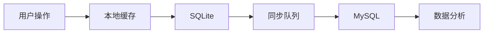

# SuoKe Life App

基于 Flutter + BLoC + get_it 开发的智能生活助手应用，集成多个专业AI助手。

## 功能特性

### AI助手团队

1. 小艾 - 生活助理
- 生活建议和解决方案
- 多维数据采集和分析
- 实时行为分析和场景识别
- LIFE频道数据管理

2. 老克 - 知识助理
- 技术架构咨询
- 专业知识库管理
- 知识图谱分析
- GraphRAG技术支持

3. 小克 - 商务助理
- 市场趋势分析
- 供应链管理
- 商业决策支持
- 农产品预制服务

## 技术架构

### 核心技术栈
- Flutter 3.16.0
- Dart 3.2.0
- BLoC 8.1.2
- get_it + injectable
- Riverpod
- Material Design 3
- GraphQL

### 数据管理架构

1. 本地数据 (用户隐私数据)
- SQLite
  - 个人信息
  - 健康记录
  - 行为数据
  - 偏好设置
- 加密存储
  - AES-256 加密
  - 安全密钥管理
  - 生物识别解锁

2. 远程数据
- MySQL 集群
  - 匿名化数据集
  - 统计分析数据
  - 知识图谱数据
  - 系统配置数据
- Redis 集群
  - 会话管理
  - 实时数据
  - 排行榜
  - 计数器

3. 数据同步策略
- 本地到远程
  - 数据脱敏
  - 增量同步
  - 批量处理
- 远程到本地
  - 按需同步
  - 差异对比
  - 版本控制

4. 缓存架构
- Redis 缓存层
  - Session 存储
  - 热点数据缓存
  - 消息队列
  - 分布式锁
- 本地缓存层
  - 内存缓存 (LRU)
  - SQLite 缓存
  - 文件缓存

### 数据流

```mermaid
graph LR
    A[用户操作] --> B[本地缓存]
    B --> C[SQLite]
    C --> D[同步队列]
    D --> E[MySQL]
    E --> F[数据分析]
```

5. 性能优化
- 索引优化
  - MySQL索引设计
  - SQLite索引优化
  - 复合索引策略
- 查询优化
  - 预编译语句
  - 批量操作
  - 延迟加载
- 连接池
  - MySQL连接池
  - HTTP连接池
  - 资源复用

### 微服务架构
1. 服务划分
- 用户服务 (User Service)
- AI助手服务 (AI Assistant Service) 
- 知识服务 (Knowledge Service)
- 健康服务 (Health Service)
- 数据分析服务 (Analytics Service)

2. 服务治理
- 服务注册与发现
- 负载均衡
- 熔断降级
- 监控告警

3. 数据流
- Event Sourcing
- CQRS模式
- 消息队列

4. 安全机制
- JWT认证
- 权限控制
- 数据加密
- 审计日志

## 项目结构

```
lib/
├── app/
│   ├── core/          # 核心功能
│   │   ├── config/    # 配置文件
│   │   ├── network/   # 网络服务
│   │   ├── storage/   # 存储服务
│   │   ├── di/        # 依赖注入
│   │   └── theme/     # 主题配置
│   ├── data/          # 数据层
│   │   ├── models/    # 数据模型
│   │   ├── repositories/ # 数据仓库
│   │   └── datasources/  # 数据源
│   ├── domain/        # 领域层
│   │   ├── entities/  # 实体
│   │   ├── usecases/  # 用例
│   │   └── repositories/ # 仓库接口
│   ├── presentation/  # 表现层
│   │   ├── pages/     # 页面
│   │   ├── widgets/   # 组件
│   │   └── blocs/     # 状态管理
│   └── services/      # 服务层
```

## 开发规范

### 代码规范
- 遵循 Effective Dart
- BLoC 设计模式
- 依赖注入
- 单一职责原则

### 测试规范
- 单元测试 (coverage > 80%)
- Widget 测试
- 集成测试
- 性能测试

### CI/CD
- GitHub Actions
- Flutter分析
- 自动化测试
- 自动发布

## 环境配置

1. 开发环境
```bash
# 安装依赖
flutter pub get

# 生成依赖注入代码
flutter pub run build_runner build

# 运行测试
flutter test --coverage

# 运行项目
flutter run
```

2. 生产环境
```bash
# 构建Release版本
flutter build apk --release
flutter build ios --release
```

## 文档

- [API文档](docs/api/README.md)
- [架构文档](docs/architecture/README.md)
- [部署指南](docs/deployment/README.md)
- [安全规范](docs/security/README.md)
- [UI设计规范](docs/ui/README.md)

## 贡献指南

1. Fork 本仓库
2. 创建特性分支
3. 提交代码
4. 发起 Pull Request

## 许可证

MIT License

## 服务层架构

### 核心服务

1. 用户服务 (UserService)
- 本地数据加密存储
- 用户信息管理
- 个人资料同步
- 隐私数据保护

2. 健康服务 (HealthService) 
- 健康记录本地存储
- 数据增量同步
- 优先级队列管理
- 离线支持

3. AI助手服务 (AIService)
- 小艾 - 生活助手
  - 实时对话
  - 上下文管理
  - 多模态交互
- 老克 - 知识助手
  - 知识图谱
  - GraphRAG分析
  - 缓存优化
- 小克 - 商务助手
  - 商业决策
  - 场景分析
  - 供应链管理

4. 知识服务 (KnowledgeService)
- 知识图谱缓存
- 按需加载
- 定期更新
- 离线访问

5. 分析服务 (AnalyticsService)
- 用户行为跟踪
- 数据本地存储
- 批量同步
- 用户洞察

6. 配置服务 (ConfigService)
- 本地优先
- 远程同步
- 动态更新
- 多环境支持

### 技术特点

1. 依赖注入
- get_it + injectable
- 单例模式
- 懒加载
- 模块化注入

2. 数据存储
- SQLite (本地数据库)
- Redis (远程缓存)
- 文件存储
- 安全加密

3. 网络通信
- RESTful API
- WebSocket
- 错误重试
- 请求拦截

4. 缓存策略
- 多级缓存
- LRU淘汰
- TTL过期
- 预加载

5. 安全机制
- AES-256加密
- 安全密钥管理
- 数据脱敏
- 访问控制

## 数据分析架构

### 匿名化数据集

1. 行为数据
- 使用模式分析
  - 功能使用频率
  - 导航流程
  - 停留时长
- 交互习惯
  - 操作序列
  - 手势偏好
  - 响应时间

2. 知识数据
- 搜索模式
  - 热门查询
  - 关联词组
  - 上下文关系
- 知识图谱
  - 主题关联
  - 知识链路
  - 兴趣分布

3. 系统数据
- 性能指标
  - 响应时间
  - 资源占用
  - 崩溃报告
- 错误模式
  - 异常类型
  - 触发条件
  - 影响范围

### 数据处理流程

1. 数据采集
- 本地原始数据
  - 用户行为
  - 操作日志
  - 性能数据
- 匿名化处理
  - 数据脱敏
  - 标识符替换
  - 聚合统计

2. 数据分析
- 行为分析
  - 使用模式识别
  - 用户画像构建
  - 功能偏好分析
- 知识分析
  - 知识图谱增强
  - 主题关联发现
  - 内容推荐优化
- 系统分析
  - 性能瓶颈识别
  - 资源利用优化
  - 异常模式预警

3. 应用优化
- 功能优化
  - 界面布局调整
  - 交互流程改进
  - 功能推荐精准化
- 知识优化
  - 知识库扩充
  - 关联关系增强
  - 搜索算法改进
- 系统优化
  - 性能调优
  - 资源调度
  - 稳定性提升
