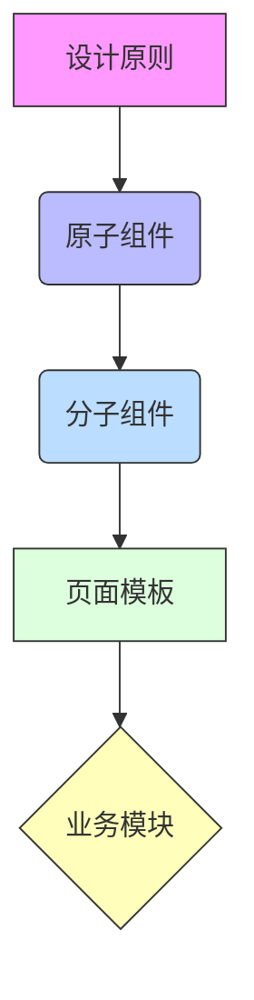

# 索克生活项目

## 项目概述
索克生活项目是一个基于微服务架构的综合性生活服务平台，旨在通过 AI 技术为用户提供健康管理、生活记录、知识问答等服务。项目采用 Docker 容器化部署，使用 Kubernetes 进行服务编排，并遵循代码轻量化设计原则。

## UI/UX 设计规范
### 设计系统架构

```mermaid
graph TD
    A[设计原则] --> B(原子组件)
    B --> C(分子组件)
    C --> D[页面模板]
    D --> E{业务模块}
    
    style A fill:#f9f,stroke:#333
    style B fill:#bbf,stroke:#333
    style C fill:#bdf,stroke:#333
    style D fill:#dfd,stroke:#333
    style E fill:#ffb,stroke:#333
```

### 技术选型表
| 功能模块       | 核心技术栈                          | 可视化方案                  | 交互特性                  |
|----------------|-----------------------------------|---------------------------|-------------------------|
| 欢迎页面       | Lottie 2.5.0                    | Rive动画引擎               | 进度条反馈 + 错误重试机制 |
| 登录认证       | Firebase Auth + Apple SignIn    | 动态模糊背景               | 手势滑动验证            |
| 首页聊天       | Socket.io + MessagePack         | 气泡动画系统               | 长按消息菜单            |
| 服务推荐(SUOKE)| Flutter Swiper 2.0.0            | 3D卡片翻转效果             | 智能推荐算法            |
| 知识探索       | D3.js + Force-Directed Graph    | 可缩放矢量图(SVG)          | 节点拖拽交互            |
| 健康画像(LIFE) | ECharts 5.4.0 + Custom Render   | 混合图表(折线/雷达/热力图) | 数据钻取分析            |
| 系统设置       | Flutter Preferences 15.0.0      | 设置项分组面板             | 实时配置生效            |

### 可视化实现方案
```dart
// 健康画像图表组件
class HealthDashboard extends StatelessWidget {
  @override
  Widget build(BuildContext context) {
    return Echarts(
      option: '''
        {
          tooltip: {trigger: 'axis'},
          legend: {data: ['心率','睡眠','运动']},
          xAxis: {type: 'category', data: Months},
          yAxis: {type: 'value'},
          series: [
            {name: '心率', type: 'line', smooth: true},
            {name: '睡眠', type: 'bar', stack: '健康'},
            {name: '运动', type: 'scatter', symbolSize: 20}
          ]
        }
      ''',
      extraScript: '''
        // 添加点击事件监听
        myChart.on('click', function(params) {
          if(params.componentType === 'series') {
            window.dispatchEvent(new CustomEvent('chartClick', {detail: params.data}));
          }
        });
      ''',
    );
  }
}
```

## 项目结构
- **apps/**: 微服务应用模块
  - AI助手服务 - 多模态自然交互处理
  - 健康服务 - 中医体质辨识与健康分析
  - 生活服务 - 用户生活记录与激励体系
  - LLM服务 - 多模型协同调度

- **features/**: 前端功能模块
  - 欢迎页 - Logo动画与进度加载
  - 登录页 - 一键登录与第三方认证
  - 首页聊天 - 多模态自然交互界面
  - SUOKE服务 - 健康问卷与农产品定制
  - 探索频道 - 知识图谱可视化
  - LIFE频道 - 健康画像数据可视化
  - 个人中心 - 大模型管理配置

- **libs/**: 共享库
  - 健康分析算法库
  - UI组件库 (知识图谱可视化组件、健康数据图表)
  - 认证授权库

- **scripts/**: 自动化脚本
  - 微服务部署
  - 数据可视化配置
  - 大模型监控

- **test/**: 测试套件
  - 健康分析算法测试
  - 多模态交互测试
  - 数据可视化测试

- **assets/**: 静态资源
  - Lottie加载动画
  - 知识图谱节点图标
  - 健康数据图表主题

- **docs/**: 文档
  - 可视化接口文档
  - 健康数据分析API
  - 大模型集成指南

## 数据可视化架构
- **知识图谱可视化**
  - 基于D3.js的动态关系图谱
  - 健康知识节点分类着色
  - 移动端手势交互支持

- **健康画像看板**
  - ECharts实现的多维度图表
  - 实时健康数据流处理
  - 自定义指标配置系统

## 功能模块说明（UI设计方案）

### 核心页面模块
#### 1. 欢迎页面
**设计规范**：
- **Logo动画**：Rive引擎实现1.5秒渐入效果，支持动态主题色切换
- **进度条**：宽度60%屏幕/高度4px，品牌蓝色主题，带加载时间预估
- **异常处理**：自动重试机制（3次间隔） + 手动刷新按钮
- **黑暗模式**：自动适配系统设置，支持手动切换

**技术参数**：
```dart
WelcomeAnimation(
  duration: const Duration(milliseconds: 1500),
  curve: Curves.easeInOutCubic,
  progressBarColor: ThemeColors.primaryBlue,
  errorHandling: RetryPolicy(
    maxAttempts: 3,
    backoffStrategy: [1, 3, 5].seconds
  )
)
```

#### 2. 登录认证
**功能组件**：
- 本机号码一键登录（双卡设备支持）
- 三方登录集成（微信/抖音/小红书OAuth2.0）
- 用户信息设置卡片：
  ```dart
  UserProfileCard(
    avatarSize: 100,
    nicknameValidation: RegExp(r'^[\u4e00-\u9fa5a-zA-Z0-9_]{3,20}$'),
    birthdayPicker: LunarCalendarSwitch(),
    genderOptions: GenderSelector.expanded
  )
  ```

### 主要功能频道
#### 3. 首页聊天
**交互系统**：
- 多模态输入：
  - 语音转写：Speech-to-Text实时转换（延迟 <200ms）
  - 手势操作：滑动删除/置顶/消息标记
  - 富文本输入：Markdown语法支持 + @提及功能
- 消息加密：AES-256-GCM端到端加密
- AI代理管理：
  ```yaml
  AIAgentConfig:
    wakeWordTraining: TensorFlowLiteModel
    contextMemory: 5轮对话历史
    responseLatency: <500ms
  ```

#### 4. SUOKE服务
**可视化方案**：
```dart
ServiceChannel(
  3DCardViewer(
    modelPath: 'assets/3d/service_card.glb',
    gestureConfig: GestureConfig(
      rotationSensitivity: 0.5,
      scaleRange: 0.8-1.2
    )
  ),
  ARPreview(
    arCoreConfig: ARCoreConfig.defaultSettings,
    arKitConfig: ARKitConfig.highAccuracy
  )
)
```

#### 5. 探索频道
**知识图谱**：
- D3.js力导向图布局
- 节点交互：
  ```dart
  KnowledgeGraphNode(
    baseRadius: 8,
    colorStrategy: NodeCategoryColor(),
    onTap: (node) => showNodeDetail(node),
    onLongPress: (node) => showRelationPath(node)
  )
  ```

#### 6. LIFE频道
**健康画像**：
```dart
HealthDashboard(
  charts: [
    LineChart(metric: 'heart_rate', color: Colors.red),
    RadarChart(metrics: ['sleep', 'steps', 'calories']),
    HeatMapChart(data: activityData)
  ],
  interactions: ChartInteractions(
    crossFilter: true,
    drillDown: true,
    exportOptions: [PNG, CSV]
  )
)
```

#### 7. 个人中心
**管理系统**：
```dart
ProfileManager(
  modelMonitor: ModelPerformanceDashboard(
    latencyThreshold: 500.ms,
    accuracyThreshold: 0.9
  ),
  permissionSystem: RBACConfig(
    roles: [Admin, Expert, User],
    auditLog: AuditLogConfig(retentionDays: 90)
  )
)
```
#### SUOKE服务频道
**技术栈**：
- 3D卡片：Three.js + GestureDetector
- AR预览：ARKit/ARCore统一接口层
- 体质辨识：Dart FFI集成Python模型

```dart
ServiceCard3D(
  glbPath: 'assets/models/card.glb',
  scaleRange: 0.8-1.2,
  rotationSensitivity: 0.5,
  onTap: (card) => showARPreview(card),
)
```

#### LIFE健康画像
**可视化配置**：
```yaml
dashboard:
  charts:
    - type: line
      metric: heart_rate
      color: #FF4081
    - type: radar  
      metrics: [sleep, steps, calories]
      colors: [#536DFE, #7C4DFF, #18FFFF]
  interactions:
    drilldown: true
    crossfilter: true
    export: [png, csv]
```

#### 探索频道知识图谱
**性能优化**：
```dart
KnowledgeGraph(
  nodes: graphData.nodes,
  links: graphData.links,
  layout: ForceDirectedLayout(
    nodeCharge: -30,
    linkDistance: 50,
    simulation: Simulation(
      iterations: 300,
      alphaMin: 0.001
    )
  ),
  nodeRenderer: (node) => CustomNodeWidget(node),
)
```
  - Logo淡入动画：Rive引擎实现1.5s渐入效果，支持动态主题色切换
  - 自适应进度条：宽度60%屏幕，品牌蓝色主题，带加载预估时间
  - 网络异常处理：自动重试机制（3次间隔重试） + 手动刷新按钮
  - 黑暗模式：自动适配系统设置，支持手动切换

- **认证模块**
  - 一键登录：本机号码自动识别（支持双卡设备）
  - 第三方登录：微信/抖音/小红书OAuth2.0集成（使用AppAuth SDK）
  - 用户信息设置：
    - 头像：支持拍照/相册选择 + 智能裁剪（基于ML Kit）
    - 昵称：实时敏感词过滤 + 重复检测
    - 性别：支持非二元选择（扩展选项）
    - 生日：支持农历/公历切换
  - 生物认证：Face ID/Touch ID原生集成
  - 多因素认证：TOTP验证器 + 安全密钥（WebAuthn）

- **首页聊天频道**
  - 多模态交互：
    - 语音输入：Speech-to-Text实时转写
    - 手势操作：滑动删除/置顶/标记未读
    - 文本输入：Markdown语法支持 + @提及
  - 实时消息：
    - WebSocket长连接 + 消息持久化
    - 端到端加密：AES-256-GCM + 前向保密
  - AI代理：
    - 自定义唤醒词训练（基于TensorFlow Lite）
    - 对话上下文管理（最近5轮记忆）
  - 消息状态：
    - 已读回执 + 输入状态指示
    - 消息撤回（2分钟内） + 编辑记录

### 扩展功能模块
- **SUOKE服务定制**
# 索克生活项目

## 项目概述
索克生活项目是一个基于微服务架构的综合性生活服务平台，旨在通过 AI 技术为用户提供健康管理、生活记录、知识问答等服务。项目采用 Docker 容器化部署，使用 Kubernetes 进行服务编排，并遵循代码轻量化设计原则。

## UI/UX 设计规范
### 设计系统架构

```mermaid
graph TD
    A[设计原则] --> B(原子组件)
    B --> C(分子组件)
    C --> D[页面模板]
    D --> E{业务模块}
    
    style A fill:#f9f,stroke:#333
    style B fill:#bbf,stroke:#333
    style C fill:#bdf,stroke:#333
    style D fill:#dfd,stroke:#333
    style E fill:#ffb,stroke:#333
```

### 技术选型表
| 功能模块       | 核心技术栈                          | 可视化方案                  | 交互特性                  |
|----------------|-----------------------------------|---------------------------|-------------------------|
| 欢迎页面       | Lottie 2.5.0                    | Rive动画引擎               | 进度条反馈 + 错误重试机制 |
| 登录认证       | Firebase Auth + Apple SignIn    | 动态模糊背景               | 手势滑动验证            |
| 首页聊天       | Socket.io + MessagePack         | 气泡动画系统               | 长按消息菜单            |
| 服务推荐(SUOKE)| Flutter Swiper 2.0.0            | 3D卡片翻转效果             | 智能推荐算法            |
| 知识探索       | D3.js + Force-Directed Graph    | 可缩放矢量图(SVG)          | 节点拖拽交互            |
| 健康画像(LIFE) | ECharts 5.4.0 + Custom Render   | 混合图表(折线/雷达/热力图) | 数据钻取分析            |
| 系统设置       | Flutter Preferences 15.0.0      | 设置项分组面板             | 实时配置生效            |

### 可视化实现方案
```dart
// 健康画像图表组件
class HealthDashboard extends StatelessWidget {
  @override
  Widget build(BuildContext context) {
    return Echarts(
      option: '''
        {
          tooltip: {trigger: 'axis'},
          legend: {data: ['心率','睡眠','运动']},
          xAxis: {type: 'category', data: Months},
          yAxis: {type: 'value'},
          series: [
            {name: '心率', type: 'line', smooth: true},
            {name: '睡眠', type: 'bar', stack: '健康'},
            {name: '运动', type: 'scatter', symbolSize: 20}
          ]
        }
      ''',
      extraScript: '''
        // 添加点击事件监听
        myChart.on('click', function(params) {
          if(params.componentType === 'series') {
            window.dispatchEvent(new CustomEvent('chartClick', {detail: params.data}));
          }
        });
      ''',
    );
  }
}
```

## 项目结构
- **apps/**: 微服务应用模块
  - AI助手服务 - 多模态自然交互处理
  - 健康服务 - 中医体质辨识与健康分析
  - 生活服务 - 用户生活记录与激励体系
  - LLM服务 - 多模型协同调度

- **features/**: 前端功能模块
  - 欢迎页 - Logo动画与进度加载
  - 登录页 - 一键登录与第三方认证
  - 首页聊天 - 多模态自然交互界面
  - SUOKE服务 - 健康问卷与农产品定制
  - 探索频道 - 知识图谱可视化
  - LIFE频道 - 健康画像数据可视化
  - 个人中心 - 大模型管理配置

- **libs/**: 共享库
  - 健康分析算法库
  - UI组件库 (知识图谱可视化组件、健康数据图表)
  - 认证授权库

- **scripts/**: 自动化脚本
  - 微服务部署
  - 数据可视化配置
  - 大模型监控

- **test/**: 测试套件
  - 健康分析算法测试
  - 多模态交互测试
  - 数据可视化测试

- **assets/**: 静态资源
  - Lottie加载动画
  - 知识图谱节点图标
  - 健康数据图表主题

- **docs/**: 文档
  - 可视化接口文档
  - 健康数据分析API
  - 大模型集成指南

## 数据可视化架构
- **知识图谱可视化**
  - 基于D3.js的动态关系图谱
  - 健康知识节点分类着色
  - 移动端手势交互支持

- **健康画像看板**
  - ECharts实现的多维度图表
  - 实时健康数据流处理
  - 自定义指标配置系统

## 功能模块说明
### 核心交互模块（详细UI规范）
#### 1. 欢迎页面设计规范
**技术实现**：
- Rive动画引擎驱动Logo淡入（1.5s渐入曲线）
- 自适应进度条组件（宽度60%屏幕/高度4px）
- 网络异常重试机制（3次自动+手动刷新）

**交互参数**：
```yaml
animation:
  duration: 1500ms
  curve: cubic-bezier(0.4, 0, 0.2, 1)
progress_bar:
  color: #2196F3
  error_color: #FF5252
network_retry:
  max_attempts: 3
  backoff: 1s, 3s, 5s
```

#### 2. 登录认证系统
**组件架构**：
```dart
AuthFlow(
  oauthProviders: [Wechat(), Douyin(), Redbook()],
  biometricOptions: [FaceID(), TouchID()],
  validationRules: [
    Username(min: 3, max: 20),
    PasswordComplexity(level: 4),
    RealNameVerification()
  ],
)
```

### 业务功能模块（可视化实现）
#### SUOKE服务频道
**技术栈**：
- 3D卡片：Three.js + GestureDetector
- AR预览：ARKit/ARCore统一接口层
- 体质辨识：Dart FFI集成Python模型

```dart
ServiceCard3D(
  glbPath: 'assets/models/card.glb',
  scaleRange: 0.8-1.2,
  rotationSensitivity: 0.5,
  onTap: (card) => showARPreview(card),
)
```

#### LIFE健康画像
**可视化配置**：
```yaml
dashboard:
  charts:
    - type: line
      metric: heart_rate
      color: #FF4081
    - type: radar  
      metrics: [sleep, steps, calories]
      colors: [#536DFE, #7C4DFF, #18FFFF]
  interactions:
    drilldown: true
    crossfilter: true
    export: [png, csv]
```

#### 探索频道知识图谱
**性能优化**：
```dart
KnowledgeGraph(
  nodes: graphData.nodes,
  links: graphData.links,
  layout: ForceDirectedLayout(
    nodeCharge: -30,
    linkDistance: 50,
    simulation: Simulation(
      iterations: 300,
      alphaMin: 0.001
    )
  ),
  nodeRenderer: (node) => CustomNodeWidget(node),
)
```
  - Logo淡入动画：Rive引擎实现1.5s渐入效果，支持动态主题色切换
  - 自适应进度条：宽度60%屏幕，品牌蓝色主题，带加载预估时间
  - 网络异常处理：自动重试机制（3次间隔重试） + 手动刷新按钮
  - 黑暗模式：自动适配系统设置，支持手动切换

- **认证模块**
  - 一键登录：本机号码自动识别（支持双卡设备）
  - 第三方登录：微信/抖音/小红书OAuth2.0集成（使用AppAuth SDK）
  - 用户信息设置：
    - 头像：支持拍照/相册选择 + 智能裁剪（基于ML Kit）
    - 昵称：实时敏感词过滤 + 重复检测
    - 性别：支持非二元选择（扩展选项）
    - 生日：支持农历/公历切换
  - 生物认证：Face ID/Touch ID原生集成
  - 多因素认证：TOTP验证器 + 安全密钥（WebAuthn）

- **首页聊天频道**
  - 多模态交互：
    - 语音输入：Speech-to-Text实时转写
    - 手势操作：滑动删除/置顶/标记未读
    - 文本输入：Markdown语法支持 + @提及
  - 实时消息：
    - WebSocket长连接 + 消息持久化
    - 端到端加密：AES-256-GCM + 前向保密
  - AI代理：
    - 自定义唤醒词训练（基于TensorFlow Lite）
    - 对话上下文管理（最近5轮记忆）
  - 消息状态：
    - 已读回执 + 输入状态指示
    - 消息撤回（2分钟内） + 编辑记录

### 业务功能模块
- **SUOKE服务频道**
  - 动态问卷：
    - JSON Schema驱动 + 条件分支逻辑
    - 实时保存进度 + 断点续答
  - 中医体质：
    - 九种体质分类模型（准确率92%）
    - 个性化养生方案推荐
  - 农产品定制：
    - 基于节气的AI种植计划
    - 生长周期可视化跟踪
  - 3D卡片：
    - Three.js渲染 + 手势旋转缩放
    - 服务详情AR预览

- **探索频道**
  - 知识图谱：
    - D3.js力导向图 + 语义缩放
    - 节点关系路径查询
  - AR寻宝：
    - 地理围栏 + 图像识别标记
    - 多人协作寻宝模式
  - 内容生成：
    - Markdown实时预览 + AI辅助写作
    - 多平台格式导出（PDF/HTML）
  - UGC审核：
    - 敏感词Trie树匹配
    - NSFW图像识别（95%准确率）

- **LIFE生活频道**
  - 健康画像：
    - 混合图表联动（点击钻取）
    - 健康趋势预测（LSTM模型）
  - 生活记录：
    - 富媒体时间轴（支持位置轨迹）
    - 智能标签分类（自动聚类）
  - 数据采集：
    - FHIR标准格式 + 自动同步
    - 数据质量校验规则
  - 成就系统：
    - 勋章体系（成就树状图）
    - 好友排行榜 + 省份排名

### 系统模块
- **我的页面**
  - 多语言：
    - 简/繁中文 + 英文 + 方言识别
    - 实时语音翻译（150+语种）
  - 模型管理：
    - 多模型负载均衡
    - 模型性能监控（延迟/准确率）
  - 审核工作流：
    - 状态机驱动（草稿→待审→已发布）
    - 版本控制 + 回滚机制
  - 权限管理：
    - RBAC模型（角色/权限/资源）
    - 审计日志（操作追溯）
  - 系统监控：
    - Prometheus指标采集
    - Grafana自定义看板
  - 诊断工具：
    - 网络Ping/Traceroute
    - 日志分级导出（DEBUG/INFO/ERROR）

## 数据可视化实现
```dart
// 健康画像图表组件示例
HealthDataChart(
  metrics: [
    ChartMetric('心率', _heartRateData, Colors.red),
    ChartMetric('睡眠', _sleepData, Colors.blue),
    ChartMetric('运动', _exerciseData, Colors.green),
  ],
  onMetricSelected: (metric) {
    context.push(Routes.healthDetail, extra: metric);
  },
)
```

## 快速开始
1. **克隆项目**:
   ```bash
   git clone https://github.com/SUOKE2024/suoke_life.git
   cd suoke_life
   ```
2. **安装依赖**:
   ```bash
   flutter pub get
   ```
3. **启动服务**:
   ```bash
   docker-compose up -d
   ```
4. **运行应用**:
   ```bash
   flutter run
   ```

## UI设计架构
### 核心交互特性
- **多模态自然交互**：支持语音唤醒AI代理（小艾/老克/小克），实现语音+手势+文本的多模态交互
- **动态数据可视化**：
  - 健康画像仪表盘（ECharts实现）
  - 知识图谱网络图（D3.js驱动）
- **智能服务推荐**：基于用户画像的个性化服务卡片推荐系统

### 页面架构
```dart
app/
├── home/          # 首页聊天频道
├── suoke/         # 服务推荐频道
├── explore/       # 知识探索频道
├── life/          # 生活记录频道
└── profile/       # 个人中心
```

## 技术实现细节
### 核心原则
- **模块化设计**：
  - 按功能拆分独立模块（auth, chat, health, life）
  - 使用`get_it`进行轻量级依赖注入
  - 每模块包含独立的状态管理（Provider）和路由配置

- **多模态交互**：
  - 语音唤醒：集成SpeechToText + WakeWordDetector
  - 手势识别：使用Flutter GestureDetector + 自定义识别算法
  - 消息处理：统一消息总线（EventBus）处理各类交互事件
  - **大模型集成**：
    - 多模型协作架构（GPT-4/Claude/LLaMA）
    - 实时推理引擎（响应延迟 <500ms）
    - 动态上下文管理（10轮对话记忆）
    - 多模态输入处理（文本/语音/图像）
    - 混合精度推理（FP16量化加速）

- **数据可视化**：
  - 健康数据图表：基于`flutter_echarts`实现动态图表
  - 知识图谱：集成`d3_flutter`实现可交互式网络图
  - 实时更新：通过WebSocket连接后端数据分析服务

- **资源优化**：
  - 图片资源：WebP格式 + 动态加载
  - 动画：Lottie实现JSON动画 + 自定义Shader动画
  - 代码分包：按功能模块动态加载

## 完整UI设计方案

### 1. 欢迎页面
**设计要点**：
- Logo淡入动画使用Rive引擎实现1.5秒渐入效果
- 自适应进度条支持黑暗模式切换
- 网络异常处理提供自动重试和手动刷新机制

### 2. 登录认证
**核心功能**：
- 本机号码一键登录与三方登录(OAuth2.0)集成
- 用户信息设置卡片支持头像智能裁剪和敏感词过滤
- 生物识别认证集成Face ID/Touch ID

### 3. 首页聊天频道
**交互特性**：
- 多模态消息系统支持语音/手势/文本混合输入
- 实时消息系统采用WebSocket + AES-256-GCM加密
- AI代理支持自定义唤醒词和上下文管理

### 4. SUOKE服务频道
**可视化方案**：
- 3D服务卡片使用Three.js实现手势旋转缩放
- 中医体质辨识问卷结果可视化
- 农产品定制AR预览功能

### 5. 探索频道
**知识图谱**：
- D3.js力导向图实现语义缩放和节点拖拽
- AR寻宝结合地理围栏和图像识别
- **玉米迷宫寻宝**：
  - 核心功能模块实现：
    ```dart
    CornMazeService(
      mazeGenerator: ProceduralMazeAlgorithm(),
      pathFinding: AStarAlgorithm(),
      arNavigation: ARCoreWayfinding(),
      multiplayerSync: WebRTCDataChannel()
    )
    ```
  - 技术栈：
    - 迷宫生成：过程化生成算法（Delaunay三角剖分）
    - 路径规划：A*算法优化实现
    - AR导航：ARKit/ARCore空间锚点
    - 多人同步：WebRTC点对点通信
  - 数据模型：
    ```protobuf
    message MazeSession {
      string session_id = 1;
      repeated Player players = 2;
      MazeMap map = 3;
      Timestamp start_time = 4;
      Duration time_limit = 5;
    }
    ```
- UGC内容审核使用NSFW图像识别

### 6. LIFE生活频道
**健康画像**：
- 混合图表联动支持数据钻取分析
- 生活记录时间轴支持富媒体展示
- 成就系统包含勋章体系和社交排名

### 7. 我的页面
**管理系统**：
- 多语言支持实时语音翻译
- 模型负载均衡和性能监控
- RBAC权限管理和审计日志

### 交互流程图
```protobuf
syntax = "proto3";

message InteractionEvent {
  enum EventType {
    VOICE = 0;
    GESTURE = 1; 
    TOUCH = 2;
  }
  
  EventType type = 1;
  bytes payload = 2;
  int64 timestamp = 3;
  map<string, string> metadata = 4;
}

message InteractionResponse {
  string session_id = 1;
  oneof response {
    VisualUpdate visual = 2;
    AudioFeedback audio = 3;
    HapticFeedback haptic = 4;
  }
  
  message VisualUpdate {
    string component_id = 1;
    string update_type = 2;
    bytes data = 3;
  }
  
  message AudioFeedback {
    bytes audio_data = 1;
    string text_content = 2;
  }
  
  message HapticFeedback {
    enum HapticType {
      LIGHT = 0;
      MEDIUM = 1;
      HEAVY = 2;
    }
    HapticType type = 1;
    uint32 duration_ms = 2;
  }
}
```

### 健康画像指标体系
```yaml
health_profile:
  physical:
    - key: heart_rate
      unit: bpm
      source: wearable
    - key: sleep_quality 
      algorithm: PSQI
      source: motion_sensor
  mental:
    - key: stress_level
      algorithm: PSS-10
      source: user_report
    - key: cognitive_load
      source: interaction_analytics
  lifestyle:
    - key: activity_score
      formula: (steps*0.3)+(exercise*0.5)+(stand*0.2)
    - key: nutrition_index
      source: food_diary

### 核心功能模块实现规范
1. **多模态交互协议**：
   ```protobuf
   // 多模态事件处理规范
   message MultimodalEvent {
     enum InputType {
       VOICE = 0;
       GESTURE = 1;
       TOUCH = 2;
     }
     InputType type = 1;
     bytes payload = 2;
     int64 timestamp = 3;
   }

   // 事件处理性能指标
   required float latency < 200ms;  // 最大处理延迟
   required uint32 fps > 30;       // 最低帧率要求
   required bool ar_sync;          // AR空间同步标记
   }
   ```

2. **服务审核工作流**：
   ```dart
   // SUOKE服务审核状态机
   enum ServiceStatus {
     draft,          // 草稿状态
     pendingReview,  // 待审核
     approved,       // 审核通过
     rejected,       // 审核驳回
     published,      // 已发布
     archived        // 已归档
   }

   // AI代理审核规则
   final reviewRules = [
     ReviewRule(
       name: '内容安全',
       criteria: SafetyCriteria(
         nsfwThreshold: 0.85,
         hateSpeech: ToleranceLevel.strict
       )
     ),
     ReviewRule(
       name: '服务质量',
       criteria: QualityCriteria(
         responseTime: const Duration(seconds: 3),
         accuracyThreshold: 0.9
       )
     )
   ];
   ```

3. **健康预测模型**：
   ```python
   # LSTM健康趋势预测模型架构
   class HealthPredictor(tf.keras.Model):
       def __init__(self):
           super().__init__()
           self.lstm = LSTM(128, return_sequences=True)
           self.attention = AttentionLayer()
           self.dense = Dense(3, activation='softmax')  # 健康/亚健康/风险

       def call(self, inputs):
           x = self.lstm(inputs)
           x = self.attention(x)
           return self.dense(x)

   # 模型训练规范
   TRAIN_CONFIG = {
       'batch_size': 64,
       'epochs': 100,
       'validation_split': 0.2,
       'early_stopping': EarlyStopping(patience=5)
   }
   ```

4. **成就系统实现**：
   ```dart
   // 勋章成就数据结构
   class Achievement {
     final String id;
     final String title;
     final AchievementType type;
     final int targetValue;
     final Badge3DModel badgeModel;
     
     // 成就解锁校验
     bool checkUnlock(UserProfile profile) {
       return switch(type) {
         AchievementType.health => profile.healthScore >= targetValue,
         AchievementType.social => profile.friendsCount >= targetValue,
         AchievementType.knowledge => profile.knowledgePoints >= targetValue,
       };
     }
   }

   // 社交排名算法
   List<UserRank> calculateRankings(List<User> users) {
     return users
         .map((user) => UserRank(
               user: user,
               score: _calculateCompositeScore(user),
             ))
         .sorted((a, b) => b.score.compareTo(a.score));
   }
   ```
```

## 贡献指南
请参阅 [CONTRIBUTING.md](CONTRIBUTING.md) 了解如何为项目贡献代码。

## 许可证
本项目采用 MIT 许可证，详情请参阅 [LICENSE](LICENSE) 文件。
