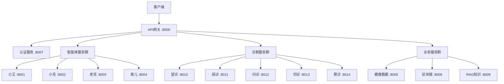

# 索克生活 API 文档总览

## 微服务架构概述

索克生活采用微服务架构，包含以下核心服务：

## 智能体服务群

### 1. 小艾智能体服务 (xiaoai-service)
- **功能**: 健康助手 & 首页聊天频道版主
- **端口**: 8001
- **文档**: [xiaoai-service API](./agent-services_xiaoai-service.md)

### 2. 小克智能体服务 (xiaoke-service)  
- **功能**: 健康数据分析师 & 个人健康档案管理员
- **端口**: 8002
- **文档**: [xiaoke-service API](./agent-services_xiaoke-service.md)

### 3. 老克智能体服务 (laoke-service)
- **功能**: 中医专家 & 辨证论治决策支持
- **端口**: 8003
- **文档**: [laoke-service API](./agent-services_laoke-service.md)

### 4. 索儿智能体服务 (soer-service)
- **功能**: 生活方式顾问 & 健康行为引导师
- **端口**: 8004
- **文档**: [soer-service API](./agent-services_soer-service.md)

## 核心业务服务

### 5. 健康数据服务 (health-data-service)
- **功能**: 健康数据存储和管理
- **端口**: 8005
- **文档**: [health-data-service API](./health-data-service.md)

### 6. 区块链服务 (blockchain-service)
- **功能**: 健康数据区块链存储和验证
- **端口**: 8006
- **文档**: [blockchain-service API](./blockchain-service.md)

### 7. 认证服务 (auth-service)
- **功能**: 用户认证和授权管理
- **端口**: 8007
- **文档**: [auth-service API](./auth-service.md)

### 8. API网关 (api-gateway)
- **功能**: 统一API入口和路由管理
- **端口**: 8000
- **文档**: [api-gateway API](./api-gateway.md)

### 9. RAG知识服务 (rag-service)
- **功能**: 知识检索和生成
- **端口**: 8009
- **文档**: [rag-service API](./rag-service.md)

## 诊断服务群

### 10. 望诊服务 (look-service)
- **功能**: 面部和舌象分析
- **端口**: 8010
- **文档**: [look-service API](./diagnostic-services_look-service.md)

### 11. 闻诊服务 (listen-service)
- **功能**: 语音和呼吸分析
- **端口**: 8011
- **文档**: [listen-service API](./diagnostic-services_listen-service.md)

### 12. 问诊服务 (inquiry-service)
- **功能**: 症状询问和分析
- **端口**: 8012
- **文档**: [inquiry-service API](./diagnostic-services_inquiry-service.md)

### 13. 切诊服务 (palpation-service)
- **功能**: 脉象分析
- **端口**: 8013
- **文档**: [palpation-service API](./diagnostic-services_palpation-service.md)

### 14. 算诊服务 (calculation-service)
- **功能**: 综合诊断计算
- **端口**: 8014
- **文档**: [calculation-service API](./diagnostic-services_calculation-service.md)

## 支撑服务

### 15. 医疗资源服务 (medical-resource-service)
- **功能**: 医疗资源管理
- **端口**: 8015
- **文档**: [medical-resource-service API](./medical-resource-service.md)

### 16. 消息总线 (message-bus)
- **功能**: 服务间消息通信
- **端口**: 8016
- **文档**: [message-bus API](./message-bus.md)

### 17. 用户服务 (user-service)
- **功能**: 用户信息管理
- **端口**: 8017
- **文档**: [user-service API](./user-service.md)

## API 调用流程



## 通用规范

### 请求格式
- **Content-Type**: `application/json`
- **认证方式**: `Bearer Token`
- **字符编码**: `UTF-8`

### 响应格式
```json
{
  "code": 200,
  "message": "success",
  "data": {},
  "timestamp": "2025-06-06T13:00:00Z"
}
```

### 错误处理
所有服务遵循统一的错误码规范：
- `200`: 成功
- `400`: 请求参数错误
- `401`: 未授权
- `403`: 权限不足
- `404`: 资源不存在
- `500`: 服务器错误

## 开发指南

### 环境配置
```bash
# 启动所有服务
docker-compose up -d

# 查看服务状态
docker-compose ps

# 查看日志
docker-compose logs -f [service-name]
```

### 测试工具
- **Postman集合**: [下载链接](./postman/suoke-life-api.json)
- **Swagger UI**: http://localhost:8000/docs
- **健康检查**: http://localhost:8000/health

## 更新日志

- **2025-06-06**: 初始版本发布
- **版本**: v1.0.0
- **维护团队**: 索克生活技术团队

