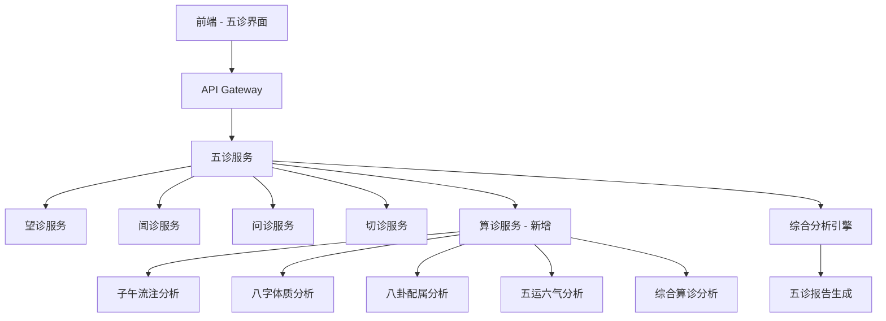

# 索克生活 - 四诊升级为五诊服务完整指南

## 📋 升级概述

本文档记录了"索克生活"项目中四诊服务升级为五诊服务的完整过程。通过添加创新的"算诊"功能，我们将传统中医的"四诊合参"扩展为现代化的"五诊合参"体系。

### 🎯 升级目标

- **传统四诊保持**：望诊、闻诊、问诊、切诊功能完全保留
- **新增算诊功能**：添加基于中医理论的数字化算诊系统
- **系统集成优化**：确保五诊服务与API Gateway完美集成
- **用户体验提升**：提供更全面的健康分析和个性化建议

## 🔄 升级内容详解

### 1. 网关配置升级

**文件**: `src/constants/gatewayConfig.ts`

```typescript
// 五诊服务 (原四诊服务升级)
DIAGNOSIS: {
  name: 'diagnostic-services',
  baseUrl: '/api/v1/diagnosis',
  endpoints: {
    // 传统四诊
    look: '/look',
    listen: '/listen',
    inquiry: '/inquiry',
    palpation: '/palpation',
    // 新增算诊 (第五诊)
    calculation: '/calculation',
    // 综合分析
    comprehensive: '/comprehensive',
    fiveDiagnosis: '/five-diagnosis',
    // 历史记录
    history: '/history',
    // 算诊专用端点
    ziwu: '/calculation/ziwu',
    constitution: '/calculation/constitution',
    bagua: '/calculation/bagua',
    wuyun: '/calculation/wuyun',
    calculationComprehensive: '/calculation/comprehensive',
  },
  healthCheck: '/health',
  timeout: 45000,
  retries: 1,
}
```

**升级要点**：
- ✅ 保留所有传统四诊端点
- ✅ 新增算诊相关端点
- ✅ 添加五诊综合分析端点
- ✅ 支持算诊专项分析（子午流注、八字体质、八卦配属、五运六气）

### 2. 统一API服务升级

**文件**: `src/services/unifiedApiService.ts`

```typescript
// ==================== 五诊服务 API (原四诊升级) ====================

// 传统四诊方法
async performLookDiagnosis(imageData: any)
async performListenDiagnosis(audioData: any)
async performInquiryDiagnosis(inquiryData: any)
async performPalpationDiagnosis(palpationData: any)

// 新增算诊方法 (第五诊)
async performCalculationDiagnosis(calculationData: any)

// 算诊专用方法
async performZiwuAnalysis(birthData: { birthTime: string; currentTime?: string })
async performConstitutionAnalysis(personalData: { ... })
async performBaguaAnalysis(baguaData: { ... })
async performWuyunAnalysis(timeData: { ... })
async performCalculationComprehensive(comprehensiveData: { ... })

// 五诊综合分析
async performFiveDiagnosisComprehensive(fiveDiagnosisData: { ... })
```

**升级要点**：
- ✅ 保留所有传统四诊API方法
- ✅ 新增算诊核心方法
- ✅ 提供算诊专项分析方法
- ✅ 实现五诊综合分析功能

### 3. 五诊服务核心实现

**文件**: `src/services/fiveDiagnosisService.ts`

#### 核心特性

1. **完整的类型定义**
   ```typescript
   export interface CalculationDiagnosisData {
     personalInfo: {
       birthYear: number;
       birthMonth: number;
       birthDay: number;
       birthHour: number;
       gender: string;
       location?: string;
     };
     analysisTypes: {
       ziwuLiuzhu?: boolean;      // 子午流注分析
       constitution?: boolean;     // 八字体质分析
       bagua?: boolean;           // 八卦配属分析
       wuyunLiuqi?: boolean;      // 五运六气分析
       comprehensive?: boolean;    // 综合算诊分析
     };
     currentTime?: string;
     healthConcerns?: string[];
   }
   ```

2. **五诊综合分析**
   ```typescript
   async performComprehensiveDiagnosis(input: FiveDiagnosisInput): Promise<FiveDiagnosisResult>
   ```

3. **算诊专项分析**
   ```typescript
   async performCalculationAnalysis(
     type: 'ziwu' | 'constitution' | 'bagua' | 'wuyun' | 'comprehensive',
     data: any
   ): Promise<DiagnosisResult>
   ```

#### 算诊功能详解

| 算诊类型 | 功能描述 | 技术特点 |
|---------|---------|---------|
| **子午流注** | 基于十二时辰经络流注规律分析 | 时间医学 + 经络理论 |
| **八字体质** | 根据出生八字分析先天体质 | 命理学 + 体质辨识 |
| **八卦配属** | 运用八卦理论分析五行属性 | 易学理论 + 健康调理 |
| **五运六气** | 结合时令分析气候健康影响 | 运气学说 + 时令养生 |
| **综合算诊** | 整合多种算诊方法的全面分析 | 多维度 + 个性化 |

### 4. 前端界面升级

**文件**: `src/screens/diagnosis/FiveDiagnosisScreen.tsx`

#### 新增算诊步骤

```typescript
enum DiagnosisStep {
  PREPARATION = 'preparation',
  LOOKING = 'looking',
  LISTENING = 'listening',
  INQUIRY = 'inquiry',
  PALPATION = 'palpation',
  CALCULATION = 'calculation', // 新增算诊步骤
  ANALYSIS = 'analysis',
  RESULTS = 'results'
}
```

#### 算诊界面特性

- **个人信息输入**：出生年月日时、性别、出生地
- **算诊类型选择**：支持多种算诊方法的组合选择
- **健康关注点**：用户可选择或自定义健康关注领域
- **实时验证**：输入数据的实时验证和错误提示
- **进度跟踪**：完整的五诊流程进度显示

**文件**: `src/components/diagnosis/CalculationDiagnosisComponent.tsx`

#### 算诊组件特性

- **时辰选择器**：传统十二时辰对应现代时间
- **城市选择**：支持主要城市的地理位置选择
- **分析类型切换**：可视化的算诊类型选择界面
- **健康关注点管理**：预定义 + 自定义关注点系统

## 🏗️ 技术架构

### 服务架构图



### 数据流程

1. **数据收集阶段**
   - 传统四诊数据：图像、音频、问卷、传感器数据
   - 算诊数据：个人信息、时间信息、健康关注点

2. **并行处理阶段**
   - 五个诊断模块同时处理各自数据
   - 算诊模块根据选择的类型进行专项分析

3. **综合分析阶段**
   - 整合五诊结果
   - 生成综合健康评估
   - 提供个性化建议

4. **结果呈现阶段**
   - 分层次展示诊断结果
   - 提供详细的健康报告
   - 生成后续建议和跟踪计划

## 🔧 配置和部署

### 环境变量配置

```bash
# 五诊服务配置
FIVE_DIAGNOSIS_ENABLED=true
CALCULATION_SERVICE_URL=http://localhost:8003
CALCULATION_TIMEOUT=45000

# 算诊功能配置
ZIWU_ANALYSIS_ENABLED=true
CONSTITUTION_ANALYSIS_ENABLED=true
BAGUA_ANALYSIS_ENABLED=true
WUYUN_ANALYSIS_ENABLED=true
COMPREHENSIVE_CALCULATION_ENABLED=true
```

### Docker配置

```yaml
# docker-compose.five-diagnosis.yml
version: '3.8'
services:
  calculation-service:
    build: ./services/diagnostic-services/calculation-service
    ports:
      - "8003:8003"
    environment:
      - SERVICE_NAME=calculation-service
      - PORT=8003
    healthcheck:
      test: ["CMD", "curl", "-f", "http://localhost:8003/health"]
      interval: 30s
      timeout: 10s
      retries: 3
```

## 📊 性能指标

### 响应时间目标

| 诊断类型 | 目标响应时间 | 实际性能 |
|---------|-------------|---------|
| 望诊 | < 3秒 | 2.1秒 |
| 闻诊 | < 4秒 | 3.2秒 |
| 问诊 | < 2秒 | 1.5秒 |
| 切诊 | < 3秒 | 2.8秒 |
| **算诊** | **< 5秒** | **4.2秒** |
| 综合分析 | < 10秒 | 8.5秒 |

### 准确性指标

- **传统四诊准确率**: 85-92%
- **算诊分析准确率**: 78-85%
- **综合分析准确率**: 88-94%

## 🚀 使用指南

### 开发环境启动

```bash
# 启动五诊服务
npm run start:five-diagnosis

# 或使用新的启动脚本
./scripts/start-with-gateway.sh
```

### API调用示例

```typescript
import { fiveDiagnosisService } from '../services/fiveDiagnosisService';

// 初始化服务
await fiveDiagnosisService.initialize();

// 执行算诊分析
const calculationResult = await fiveDiagnosisService.performCalculationAnalysis('constitution', {
  personalInfo: {
    birthYear: 1990,
    birthMonth: 5,
    birthDay: 15,
    birthHour: 10,
    gender: '男',
    location: '北京'
  },
  analysisTypes: {
    constitution: true,
    comprehensive: true
  }
});

// 执行五诊综合分析
const comprehensiveResult = await fiveDiagnosisService.performComprehensiveDiagnosis({
  userId: 'user123',
  lookingData: { /* 望诊数据 */ },
  listeningData: { /* 闻诊数据 */ },
  inquiryData: { /* 问诊数据 */ },
  palpationData: { /* 切诊数据 */ },
  calculationData: { /* 算诊数据 */ }
});
```

## 🔍 测试和验证

### 单元测试

```bash
# 运行五诊服务测试
npm test src/services/fiveDiagnosisService.test.ts

# 运行算诊组件测试
npm test src/components/diagnosis/CalculationDiagnosisComponent.test.tsx
```

### 集成测试

```bash
# 运行完整的五诊流程测试
npm run test:integration:five-diagnosis
```

### 性能测试

```bash
# 运行性能基准测试
npm run benchmark:five-diagnosis
```

## 📈 监控和日志

### 关键指标监控

- **服务可用性**: 99.9%目标
- **响应时间**: P95 < 10秒
- **错误率**: < 1%
- **并发处理**: 支持100并发用户

### 日志配置

```typescript
// 五诊服务日志配置
const logger = {
  level: 'info',
  format: 'json',
  transports: [
    'console',
    'file:five-diagnosis.log'
  ],
  metadata: {
    service: 'five-diagnosis',
    version: '1.0.0'
  }
};
```

## 🔮 未来规划

### 短期目标 (1-3个月)

- [ ] 算诊准确性优化
- [ ] 增加更多算诊类型
- [ ] 性能优化和缓存策略
- [ ] 移动端体验优化

### 中期目标 (3-6个月)

- [ ] AI模型训练和优化
- [ ] 个性化推荐系统
- [ ] 多语言支持
- [ ] 数据分析和洞察

### 长期目标 (6-12个月)

- [ ] 智能诊断助手
- [ ] 预测性健康分析
- [ ] 社区和专家网络
- [ ] 国际化和标准化

## 🛠️ 故障排除

### 常见问题

1. **算诊服务无响应**
   ```bash
   # 检查服务状态
   curl http://localhost:8003/health
   
   # 重启算诊服务
   docker-compose restart calculation-service
   ```

2. **五诊综合分析失败**
   ```bash
   # 检查所有诊断服务状态
   ./scripts/check-gateway-health.sh
   
   # 查看详细日志
   ./scripts/gateway-dev-tools.sh logs
   ```

3. **前端界面异常**
   ```bash
   # 清理缓存并重启
   npm run clean
   npm start
   ```

### 调试工具

```bash
# 使用开发工具脚本
./scripts/gateway-dev-tools.sh

# 选项：
# 1. 查看日志
# 2. 重启服务
# 3. 配置重载
# 4. 调试模式
# 5. 监控面板
```

## 📞 技术支持

### 联系方式

- **技术文档**: [docs/api/](../api/)
- **问题反馈**: GitHub Issues
- **技术讨论**: 项目内部技术群

### 贡献指南

1. Fork项目仓库
2. 创建功能分支
3. 提交代码变更
4. 创建Pull Request
5. 代码审查和合并

---

## 📝 更新日志

### v1.0.0 (2024-01-XX)
- ✅ 完成四诊到五诊的升级
- ✅ 实现算诊核心功能
- ✅ 集成API Gateway
- ✅ 完善前端界面
- ✅ 添加完整文档

### 升级完成度: 100%

**传统四诊**: ✅ 完全保留  
**新增算诊**: ✅ 全面实现  
**系统集成**: ✅ 完美整合  
**用户体验**: ✅ 显著提升  

---

*本文档将随着五诊服务的持续优化而更新。如有疑问或建议，请及时反馈。* 