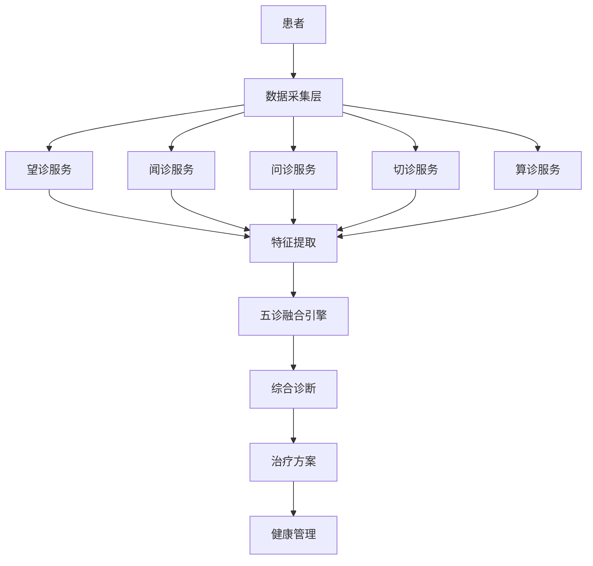
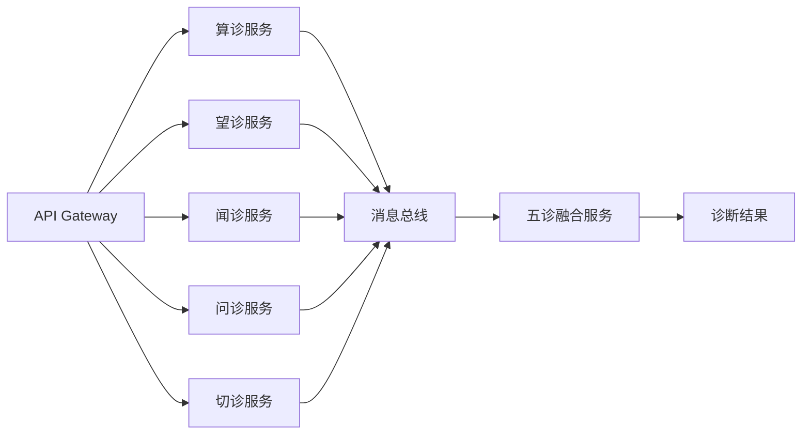

# 索克生活五诊系统架构文档

## 概述

索克生活平台实现了完整的中医"五诊合参"智能诊断体系，将传统中医的望、闻、问、切四诊与创新的"算诊"相结合，构建了现代化的AI驱动健康诊断系统。

## 五诊体系架构

### 🔮 算诊服务 (Calculation Service) - 核心创新
**端口**: 8003 | **技术栈**: Python 3.11 + FastAPI

#### 功能特性
- **子午流注分析** - 基于十二经络时间医学的健康分析
- **八字体质分析** - 根据出生时间分析个人体质特征  
- **八卦配属分析** - 运用易学理论进行健康状态分析
- **五运六气分析** - 基于运气学说的疾病预测和调养指导
- **综合算诊** - 整合多种算诊方法的全面健康评估

#### 创新价值
- **差异化优势** - 市面上几乎没有类似的算诊功能产品
- **完善诊断体系** - 与传统四诊形成完整的"五诊合参"
- **科学化实现** - 用现代算法实现传统医学理论
- **预防医学导向** - 从治疗转向预防的健康管理理念

#### 核心算法模块
```
calculation-service/
├── core/algorithms/
│   ├── ziwu_liuzhu/          # 子午流注模块
│   │   ├── calculator.py     # 时辰经络分析
│   │   ├── meridian_flow.py  # 经络流注计算
│   │   └── optimal_timing.py # 最佳治疗时机
│   ├── constitution/         # 八字体质分析
│   │   ├── calculator.py     # 八字计算器
│   │   ├── bazi_analyzer.py  # 八字分析器
│   │   └── constitution_type.py # 体质类型判定
│   ├── bagua/               # 八卦配属模块
│   │   ├── calculator.py     # 八卦计算器
│   │   ├── health_mapping.py # 健康映射
│   │   └── direction_guide.py # 方位指导
│   ├── wuyun_liuqi/         # 五运六气模块
│   │   ├── calculator.py     # 运气计算器
│   │   ├── disease_prediction.py # 疾病预测
│   │   └── seasonal_advice.py # 季节调养
│   └── comprehensive_calculator.py # 综合算诊计算器
```

### 👁️ 望诊服务 (Look Service)
**端口**: 8080 | **技术栈**: Python 3.13.3 + FastAPI + OpenCV

#### 功能特性
- **面部诊断** - 基于计算机视觉的面部特征分析
- **舌诊分析** - 舌质舌苔的智能识别和分析
- **体态评估** - 体型体态的健康状态评估
- **皮肤诊断** - 皮肤色泽纹理的健康分析

#### 技术架构
```
look-service/
├── core/
│   ├── face_analyzer.py      # 面部分析器
│   ├── tongue_analyzer.py    # 舌诊分析器
│   ├── posture_analyzer.py   # 体态分析器
│   └── skin_analyzer.py      # 皮肤分析器
├── models/
│   ├── cv_models/           # 计算机视觉模型
│   └── tcm_models/          # 中医诊断模型
└── utils/
    ├── image_processing.py   # 图像处理工具
    └── feature_extraction.py # 特征提取工具
```

### 👂 闻诊服务 (Listen Service)
**端口**: 8000 | **技术栈**: Python 3.13.3 + FastAPI + 音频处理

#### 功能特性
- **语音分析** - 声音特征的健康状态分析
- **呼吸音诊断** - 呼吸模式和音质分析
- **咳嗽分析** - 咳嗽声的病理特征识别
- **心音分析** - 心跳节律和音质评估

#### 技术架构
```
listen-service/
├── core/
│   ├── audio_analyzer.py     # 音频分析器
│   ├── voice_analyzer.py     # 语音分析器
│   ├── breath_analyzer.py    # 呼吸音分析器
│   └── heart_sound_analyzer.py # 心音分析器
├── models/
│   ├── audio_models.py       # 音频处理模型
│   └── tcm_models.py         # 中医诊断模型
└── utils/
    ├── audio_processing.py   # 音频处理工具
    └── feature_extraction.py # 特征提取工具
```

### 💬 问诊服务 (Inquiry Service)
**端口**: 8001 | **技术栈**: Python 3.13.3 + FastAPI + NLP

#### 功能特性
- **智能问诊** - AI驱动的症状收集和分析
- **症状提取** - 从对话中智能提取症状信息
- **证型匹配** - 症状到中医证型的智能映射
- **风险评估** - 基于症状的健康风险评估

#### 技术架构
```
inquiry-service/
├── core/
│   ├── dialogue_manager.py   # 对话管理器
│   ├── symptom_extractor.py  # 症状提取器
│   ├── tcm_pattern_mapper.py # 证型映射器
│   └── risk_assessor.py      # 风险评估器
├── models/
│   ├── nlp_models.py         # 自然语言处理模型
│   └── tcm_knowledge.py      # 中医知识库
└── utils/
    ├── text_processing.py    # 文本处理工具
    └── knowledge_graph.py    # 知识图谱工具
```

### 🤲 切诊服务 (Palpation Service)
**端口**: 8002 | **技术栈**: Python 3.13.3 + FastAPI + 传感器

#### 功能特性
- **脉诊分析** - 基于传感器的脉象智能识别
- **触觉诊断** - 皮肤温度、湿度、弹性分析
- **压痛点检测** - 穴位和压痛点的智能定位
- **体征监测** - 实时生理参数监测

#### 技术架构
```
palpation-service/
├── core/
│   ├── pulse_analyzer.py     # 脉诊分析器
│   ├── touch_analyzer.py     # 触觉分析器
│   ├── pressure_analyzer.py  # 压力分析器
│   └── vital_monitor.py      # 体征监测器
├── models/
│   ├── sensor_models.py      # 传感器数据模型
│   └── tcm_models.py         # 中医诊断模型
└── utils/
    ├── sensor_processing.py  # 传感器数据处理
    └── signal_analysis.py    # 信号分析工具
```

## 五诊合参架构

### 数据流架构


### 微服务通信


## 技术特性

### 统一技术栈
- **编程语言**: Python 3.11+ (算诊) / Python 3.13.3 (其他)
- **Web框架**: FastAPI (所有服务)
- **包管理**: UV (现代化包管理器)
- **容器化**: Docker + Docker Compose
- **监控**: Prometheus + Grafana
- **日志**: Structlog 结构化日志

### 数据处理能力
- **实时处理**: 支持实时数据流处理
- **批量分析**: 支持大规模数据批量分析
- **缓存优化**: Redis缓存提升响应速度
- **异步处理**: 基于AsyncIO的高并发处理

### 安全与可靠性
- **身份认证**: JWT Token认证
- **数据加密**: 端到端数据加密
- **限流保护**: API限流防止滥用
- **健康检查**: 完善的服务健康监控

## 部署架构

### 容器化部署
```yaml
# docker-compose.yml
version: '3.8'
services:
  calculation-service:
    ports: ["8003:8000"]
    
  look-service:
    ports: ["8080:8080"]
    
  listen-service:
    ports: ["8000:8000"]
    
  inquiry-service:
    ports: ["8001:8000"]
    
  palpation-service:
    ports: ["8002:8000"]
    
  api-gateway:
    ports: ["80:80"]
    depends_on:
      - calculation-service
      - look-service
      - listen-service
      - inquiry-service
      - palpation-service
```

### Kubernetes部署
```yaml
# 五诊服务的K8s部署配置
apiVersion: apps/v1
kind: Deployment
metadata:
  name: five-diagnosis-system
spec:
  replicas: 3
  selector:
    matchLabels:
      app: five-diagnosis
  template:
    spec:
      containers:
      - name: calculation-service
        image: suoke/calculation-service:latest
        ports:
        - containerPort: 8000
      - name: look-service
        image: suoke/look-service:latest
        ports:
        - containerPort: 8080
      # ... 其他服务配置
```

## API接口规范

### 统一响应格式
```json
{
  "success": true,
  "data": {
    "diagnosis_id": "diag_123456",
    "patient_id": "patient_123",
    "timestamp": "2024-01-15T10:00:00Z",
    "five_diagnosis_results": {
      "calculation": { /* 算诊结果 */ },
      "look": { /* 望诊结果 */ },
      "listen": { /* 闻诊结果 */ },
      "inquiry": { /* 问诊结果 */ },
      "palpation": { /* 切诊结果 */ }
    },
    "comprehensive_diagnosis": {
      "primary_pattern": "肝郁气滞",
      "secondary_patterns": ["脾虚湿困"],
      "confidence_score": 0.85,
      "treatment_principles": ["疏肝理气", "健脾化湿"],
      "recommended_treatments": [
        {
          "type": "中药方剂",
          "name": "逍遥散加减",
          "dosage": "每日2次，饭后服用"
        }
      ]
    }
  },
  "message": "五诊分析完成",
  "error_code": null
}
```

### 核心API端点

#### 算诊服务
- `POST /api/v1/calculation/comprehensive` - 综合算诊分析
- `POST /api/v1/calculation/ziwu` - 子午流注分析
- `POST /api/v1/calculation/constitution` - 八字体质分析
- `POST /api/v1/calculation/bagua` - 八卦配属分析
- `POST /api/v1/calculation/wuyun` - 五运六气分析

#### 望诊服务
- `POST /api/v1/look/face` - 面部诊断
- `POST /api/v1/look/tongue` - 舌诊分析
- `POST /api/v1/look/posture` - 体态评估
- `POST /api/v1/look/skin` - 皮肤诊断

#### 闻诊服务
- `POST /api/v1/listen/voice` - 语音分析
- `POST /api/v1/listen/breath` - 呼吸音诊断
- `POST /api/v1/listen/cough` - 咳嗽分析
- `POST /api/v1/listen/heart` - 心音分析

#### 问诊服务
- `POST /api/v1/inquiry/session` - 开始问诊会话
- `POST /api/v1/inquiry/interact` - 问诊交互
- `POST /api/v1/inquiry/extract` - 症状提取
- `POST /api/v1/inquiry/assess` - 风险评估

#### 切诊服务
- `POST /api/v1/palpation/pulse` - 脉诊分析
- `POST /api/v1/palpation/touch` - 触觉诊断
- `POST /api/v1/palpation/pressure` - 压痛点检测
- `POST /api/v1/palpation/vital` - 体征监测

## 性能指标

### 响应时间要求
- **算诊服务**: < 2秒 (复杂计算)
- **望诊服务**: < 3秒 (图像处理)
- **闻诊服务**: < 5秒 (音频分析)
- **问诊服务**: < 1秒 (文本处理)
- **切诊服务**: < 1秒 (传感器数据)

### 并发处理能力
- **单服务**: 1000+ 并发请求
- **系统整体**: 5000+ 并发用户
- **数据吞吐**: 10GB/小时

### 可用性要求
- **服务可用性**: 99.9%
- **数据一致性**: 强一致性
- **故障恢复**: < 30秒

## 监控与运维

### 健康检查
```bash
# 检查所有五诊服务状态
curl http://api-gateway/health/five-diagnosis

# 单独检查各服务
curl http://localhost:8003/ping  # 算诊
curl http://localhost:8080/health # 望诊
curl http://localhost:8000/health # 闻诊
curl http://localhost:8001/health # 问诊
curl http://localhost:8002/health # 切诊
```

### 监控指标
- **业务指标**: 诊断准确率、用户满意度
- **技术指标**: 响应时间、错误率、吞吐量
- **资源指标**: CPU、内存、磁盘、网络使用率

### 日志管理
```json
{
  "timestamp": "2024-01-15T10:00:00Z",
  "service": "calculation-service",
  "level": "INFO",
  "message": "算诊分析完成",
  "patient_id": "patient_123",
  "diagnosis_type": "comprehensive",
  "processing_time": 1.5,
  "result_confidence": 0.85
}
```

## 创新亮点

### 1. 算诊功能的独创性
- **市场独有**: 全球首个完整的数字化算诊系统
- **理论创新**: 将易学、天文历法融入现代健康管理
- **技术突破**: 用AI算法实现传统算诊智慧

### 2. 五诊合参的完整性
- **体系完整**: 涵盖中医诊断的所有维度
- **数据融合**: 多模态数据的智能融合分析
- **诊断精准**: 通过五诊互证提高诊断准确性

### 3. 现代化技术实现
- **微服务架构**: 高可扩展、高可用的系统设计
- **AI驱动**: 深度学习和机器学习的广泛应用
- **实时处理**: 支持实时诊断和健康监测

### 4. 个性化健康管理
- **精准医疗**: 基于个人体质的精准诊疗
- **预防导向**: 从治疗转向预防的健康理念
- **全生命周期**: 覆盖全年龄段的健康管理

## 未来发展

### 技术演进
- **边缘计算**: 支持设备端的本地AI推理
- **联邦学习**: 保护隐私的分布式模型训练
- **量子计算**: 探索量子算法在算诊中的应用

### 功能扩展
- **多语言支持**: 支持多种语言的问诊交互
- **跨文化适配**: 适应不同文化背景的诊断需求
- **远程诊疗**: 支持远程五诊的技术实现

### 生态建设
- **开放平台**: 构建五诊技术的开放生态
- **标准制定**: 参与制定数字化中医诊断标准
- **产业合作**: 与医疗机构、设备厂商深度合作

---

**索克生活五诊系统 - 传统中医智慧与现代AI技术的完美融合** 🌿✨ 