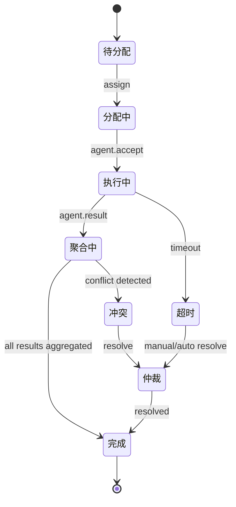

# 索克生活多智能体协作协议与状态机

## 1. 协作目标
- 支持小艾、小克、老克、索儿四智能体分布式自主协作。
- 实现任务分配、状态同步、冲突仲裁、事件驱动协作。
- 支持横向扩展、异步解耦、人工介入。

---

## 2. 多Agent任务分配协议
- 任务由AgentCoordinator或事件总线发起，包含任务类型、优先级、目标Agent、上下文等。
- 支持单Agent/多Agent并行分配（requiredAgents字段）。
- 任务分配流程：
  1. 任务创建（用户/系统/外部事件触发）。
  2. 协调器根据能力、负载、健康状态选择Agent。
  3. 通过事件总线发布`agent.task.assign`事件，目标Agent订阅并响应。
  4. Agent执行任务，发布`agent.task.result`事件。
  5. 协调器聚合结果，处理冲突，输出最终结果。

---

## 3. 协作状态机说明



- 主要状态：待分配、分配中、执行中、聚合中、冲突、仲裁、完成、超时。
- 支持自动/人工仲裁，支持部分成功/失败。

---

## 4. 事件驱动与分布式协作
- 所有任务、状态、结果、冲突等均通过事件总线（Kafka/RabbitMQ）驱动：
  - `agent.task.assign`：任务分配
  - `agent.task.accept`：Agent接收任务
  - `agent.task.result`：任务结果
  - `agent.task.conflict`：冲突检测
  - `agent.task.resolved`：冲突解决
  - `agent.state.sync`：状态同步
- 支持横向扩展（多实例Agent订阅同一topic），异步解耦。

---

## 5. 冲突解决策略
- **自动投票**：多Agent结果不一致时，按多数/置信度/权重投票。
- **优先级仲裁**：按Agent优先级、任务紧急度自动决策。
- **人工介入**：关键任务或多次失败时，推送人工仲裁事件。
- **可扩展策略**：支持自定义冲突处理插件。

---

## 6. 多Agent协作框架建议
- 推荐引入开源多Agent框架（如[JADE](https://jade.tilab.com/)、[SPADE](https://spade-mas.readthedocs.io/)、[aiomas](https://aiomas.readthedocs.io/)），或自定义协议层：
  - 支持Agent注册、发现、消息路由、生命周期管理。
  - 支持分布式事件流、任务调度、状态同步。
  - 可与现有事件总线集成，实现分布式多Agent协作。
- 协议层可定义：任务分配、状态同步、冲突仲裁、健康检查、能力发现等标准消息格式与流程。

---

## 7. 示例事件格式
```json
{
  "type": "agent.task.assign",
  "taskId": "task-123",
  "taskType": "diagnosis",
  "priority": "high",
  "requiredAgents": ["xiaoai", "xiaoke"],
  "context": {"userId": "u001", "data": {...}},
  "timestamp": "2024-05-30T12:00:00Z"
}
```

---

## 8. 参考与扩展
- 可结合区块链、ZKP等机制实现任务/结果不可抵赖与合规审计。
- 支持多语言、多平台Agent协作。
- 持续优化协议与状态机，适应业务演进。 