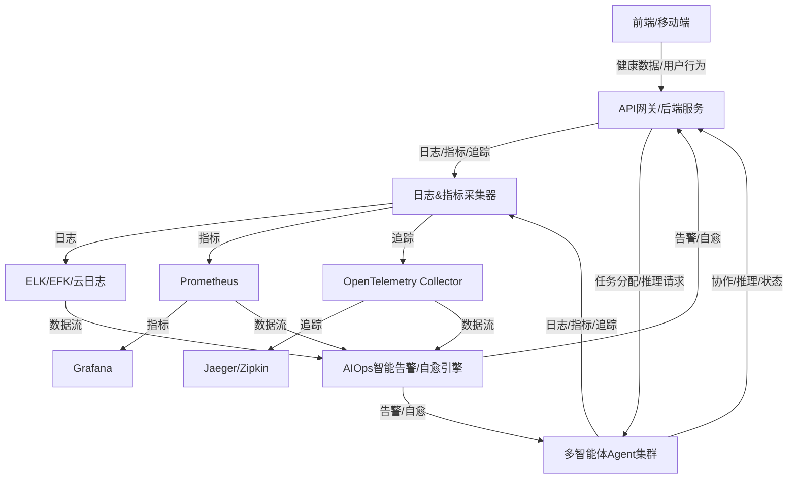

# 索克生活可观测性与智能运维设计方案

## 1. 设计目标
- 实现全链路日志、指标、分布式追踪，覆盖前端、后端、微服务、Agent消息流。
- 支持AI驱动的智能告警与自愈，保障健康数据与AI推理等关键链路的高可用。
- 兼容多智能体分布式架构，支持横向扩展与异构环境。

---

## 2. 日志体系
- 统一日志格式（JSON），前后端、各微服务、Agent均需接入。
- 推荐技术：Python/Node日志库 + ELK/EFK/云原生日志服务。
- 关键链路（健康数据流、AI推理、Agent协作）需埋点详细日志。
- 日志采集、聚合、分析、告警一体化。

---

## 3. 指标体系
- 后端服务集成Prometheus导出器，前端埋点关键用户行为与性能指标。
- 监控健康数据流、AI推理延迟、Agent状态、服务健康等。
- 推荐技术：Prometheus + Grafana。
- 配置Grafana仪表盘，实时可视化。

---

## 4. 分布式追踪
- 引入OpenTelemetry，贯穿前端、后端、微服务、Agent消息流。
- 支持全链路追踪，定位性能瓶颈与异常。
- 推荐技术：OpenTelemetry + Jaeger/Zipkin。

---

## 5. 智能运维（AIOps）
- 结合AI/ML模型，对日志、指标、追踪数据进行异常检测。
- 自动触发告警，支持多渠道（邮件、IM、短信等）。
- 关键场景（如Agent失联、健康数据异常）自动执行自愈脚本（如重启、降级、切换Agent等）。
- 推荐技术：Prometheus Alertmanager、AI异常检测服务、自动化运维脚本（Python/Bash）。

---

## 6. 落地建议
- 制定日志、指标、追踪埋点规范，纳入开发流程。
- 关键链路优先实现全链路可观测性。
- 持续完善AIOps能力，结合业务场景优化自愈策略。
- 定期评估与演进可观测性体系，适应多智能体与健康数据业务发展。

---

## 7. 参考架构图
