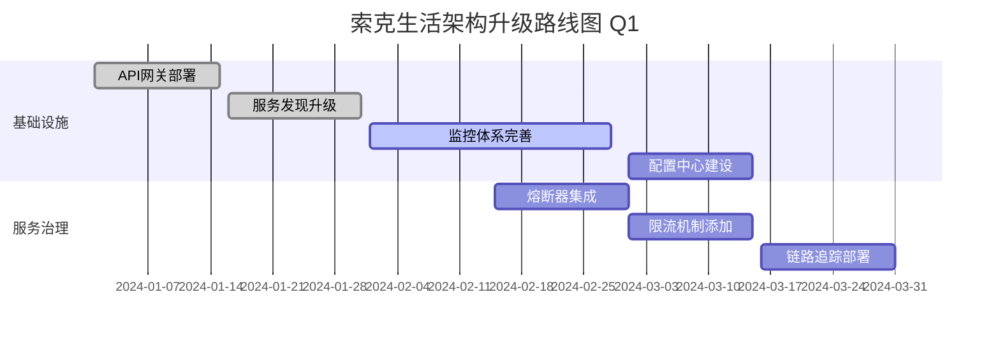
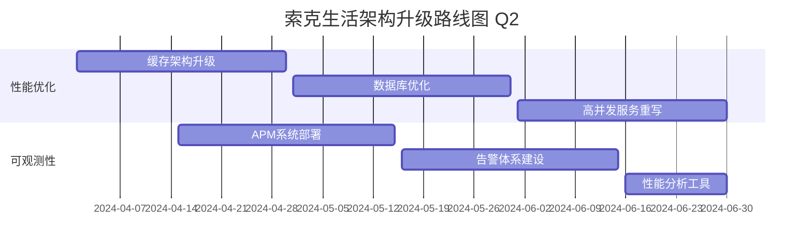
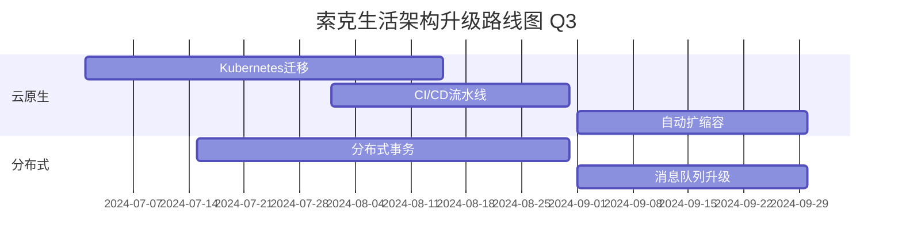

# 索克生活 APP 微服务架构 vs go-zero-looklook 架构全面对比

## 📋 概述

本文档全面比较索克生活APP现有微服务架构与go-zero-looklook微服务架构，分析两者在技术栈、架构模式、性能、扩展性等方面的差异，并提出融合改进建议。

## 🏗️ 架构总览对比

### 索克生活现有架构

```
┌─────────────────────────────────────────────────────────────┐
│                    索克生活微服务架构                        │
├─────────────────────────────────────────────────────────────┤
│                      API网关 (8080)                         │
├─────────────────────────────────────────────────────────────┤
│  核心服务层                                                  │
│  ┌─────────────┬─────────────┬─────────────┬─────────────┐   │
│  │ 认证服务     │ 用户服务     │ 健康数据     │ 医学知识     │   │
│  │ (50052)     │ (50051)     │ (50056)     │ (8000)      │   │
│  └─────────────┴─────────────┴─────────────┴─────────────┘   │
├─────────────────────────────────────────────────────────────┤
│  智能体服务层                                                │
│  ┌─────────────┬─────────────┬─────────────┬─────────────┐   │
│  │ 小艾 XiaoAI │ 小克 XiaoKe │ 老克 LaoKe  │ 索儿 SoEr   │   │
│  │ (50053)     │ (50054)     │ (9000)      │ (50060)     │   │
│  └─────────────┴─────────────┴─────────────┴─────────────┘   │
├─────────────────────────────────────────────────────────────┤
│  诊断服务层                                                  │
│  ┌─────────────┬─────────────┬─────────────┬─────────────┐   │
│  │ 问诊服务     │ 望诊服务     │ 闻诊服务     │ 切诊服务     │   │
│  │ (50052)     │ (50051)     │ (50052)     │ (8000)      │   │
│  └─────────────┴─────────────┴─────────────┴─────────────┘   │
├─────────────────────────────────────────────────────────────┤
│  基础设施层                                                  │
│  ┌─────────────┬─────────────┬─────────────┬─────────────┐   │
│  │ PostgreSQL  │ Redis       │ Consul      │ Prometheus  │   │
│  │ (5432)      │ (6379)      │ (8500)      │ (9090)      │   │
│  └─────────────┴─────────────┴─────────────┴─────────────┘   │
└─────────────────────────────────────────────────────────────┘
```

### go-zero-looklook架构

```
┌─────────────────────────────────────────────────────────────┐
│                  go-zero-looklook架构                        │
├─────────────────────────────────────────────────────────────┤
│                    API网关 + 负载均衡                        │
├─────────────────────────────────────────────────────────────┤
│  业务服务层                                                  │
│  ┌─────────────┬─────────────┬─────────────┬─────────────┐   │
│  │ 用户服务     │ 订单服务     │ 支付服务     │ 旅游服务     │   │
│  │ user-api    │ order-api   │ pay-api     │ travel-api  │   │
│  │ user-rpc    │ order-rpc   │ pay-rpc     │ travel-rpc  │   │
│  └─────────────┴─────────────┴─────────────┴─────────────┘   │
├─────────────────────────────────────────────────────────────┤
│  服务治理层                                                  │
│  ┌─────────────┬─────────────┬─────────────┬─────────────┐   │
│  │ 服务发现     │ 配置中心     │ 链路追踪     │ 熔断限流     │   │
│  │ etcd        │ etcd        │ jaeger      │ go-zero     │   │
│  └─────────────┴─────────────┴─────────────┴─────────────┘   │
├─────────────────────────────────────────────────────────────┤
│  数据层                                                      │
│  ┌─────────────┬─────────────┬─────────────┬─────────────┐   │
│  │ MySQL       │ Redis       │ MongoDB     │ ElasticSearch│   │
│  │ 主从复制     │ 集群        │ 分片        │ 搜索引擎     │   │
│  └─────────────┴─────────────┴─────────────┴─────────────┘   │
├─────────────────────────────────────────────────────────────┤
│  基础设施层                                                  │
│  ┌─────────────┬─────────────┬─────────────┬─────────────┐   │
│  │ Kubernetes  │ Docker      │ Prometheus  │ Grafana     │   │
│  │ 容器编排     │ 容器化      │ 监控        │ 可视化      │   │
│  └─────────────┴─────────────┴─────────────┴─────────────┘   │
└─────────────────────────────────────────────────────────────┘
```

## 🔍 详细对比分析

### 1. 技术栈对比

| 维度 | 索克生活 | go-zero-looklook |
|------|---------|------------------|
| **开发语言** | Python | Go |
| **Web框架** | FastAPI + gRPC | go-zero框架 |
| **数据库** | PostgreSQL | MySQL + MongoDB |
| **缓存** | Redis | Redis集群 |
| **服务发现** | Consul | etcd |
| **API网关** | 自建 | go-zero gateway |
| **监控** | Prometheus + Grafana | Prometheus + Grafana + Jaeger |
| **部署** | Docker Compose | Kubernetes |
| **消息队列** | Redis | 内存事件总线 |

### 2. 架构模式对比

#### 索克生活架构特点
- **单体拆分式**: 从单体应用逐步拆分为微服务
- **领域驱动**: 按业务领域划分服务（认证、用户、健康、智能体）
- **AI优先**: 专门为AI智能体设计的架构
- **医疗专业化**: 针对中医四诊等医疗场景优化

#### go-zero-looklook架构特点
- **云原生**: 完全基于云原生理念设计
- **API+RPC双模式**: 每个服务提供API和RPC两种接口
- **分层清晰**: 严格的分层架构，职责明确
- **高可用**: 内置熔断、限流、降级机制

### 3. 服务治理对比

| 功能 | 索克生活 | go-zero-looklook | 差距分析 |
|------|---------|------------------|----------|
| **服务发现** | Consul | etcd | 功能相当 |
| **负载均衡** | 基础 | 内置多种算法 | 有差距 |
| **熔断器** | 无 | 内置 | 缺失 |
| **限流** | 基础 | 多维度限流 | 有差距 |
| **链路追踪** | 无 | Jaeger | 缺失 |
| **配置管理** | 环境变量 | 配置中心 | 有差距 |
| **健康检查** | 基础 | 完善 | 有差距 |

### 4. 数据管理对比

#### 索克生活数据架构
```
┌─────────────────────────────────────────────────────────────┐
│                    数据架构                                  │
├─────────────────────────────────────────────────────────────┤
│  应用层                                                      │
│  ┌─────────────┬─────────────┬─────────────┬─────────────┐   │
│  │ 认证DB      │ 用户DB      │ 健康DB      │ 知识DB      │   │
│  │ auth_db     │ user_db     │ health_db   │ knowledge_db│   │
│  └─────────────┴─────────────┴─────────────┴─────────────┘   │
├─────────────────────────────────────────────────────────────┤
│  缓存层                                                      │
│  ┌─────────────────────────────────────────────────────────┐ │
│  │                    Redis                                │ │
│  │  - 会话缓存  - 数据缓存  - 消息队列                      │ │
│  └─────────────────────────────────────────────────────────┘ │
└─────────────────────────────────────────────────────────────┘
```

#### go-zero-looklook数据架构
```
┌─────────────────────────────────────────────────────────────┐
│                    数据架构                                  │
├─────────────────────────────────────────────────────────────┤
│  分布式事务层                                                │
│  ┌─────────────────────────────────────────────────────────┐ │
│  │                    DTM                                  │ │
│  │  - 分布式事务管理  - 数据一致性保证                      │ │
│  └─────────────────────────────────────────────────────────┘ │
├─────────────────────────────────────────────────────────────┤
│  数据存储层                                                  │
│  ┌─────────────┬─────────────┬─────────────┬─────────────┐   │
│  │ MySQL主从   │ Redis集群   │ MongoDB     │ ES集群      │   │
│  │ 关系数据     │ 缓存+队列   │ 文档存储     │ 搜索引擎     │   │
│  └─────────────┴─────────────┴─────────────┴─────────────┘   │
└─────────────────────────────────────────────────────────────┘
```

### 5. 性能对比

| 指标 | 索克生活 | go-zero-looklook | 说明 |
|------|---------|------------------|------|
| **并发处理** | 中等 (Python GIL限制) | 高 (Go协程) | Go优势明显 |
| **内存使用** | 较高 | 较低 | Go内存效率更高 |
| **启动速度** | 慢 | 快 | 编译型语言优势 |
| **开发效率** | 高 (Python生态) | 中等 | Python开发更快 |
| **运行效率** | 中等 | 高 | Go运行效率更高 |

### 6. 可观测性对比

#### 索克生活监控体系
```
┌─────────────────────────────────────────────────────────────┐
│                    监控体系                                  │
├─────────────────────────────────────────────────────────────┤
│  可视化层                                                    │
│  ┌─────────────────────────────────────────────────────────┐ │
│  │                   Grafana                               │ │
│  │  - 基础指标仪表板  - 服务状态监控                        │ │
│  └─────────────────────────────────────────────────────────┘ │
├─────────────────────────────────────────────────────────────┤
│  指标收集层                                                  │
│  ┌─────────────────────────────────────────────────────────┐ │
│  │                 Prometheus                              │ │
│  │  - 系统指标  - 应用指标  - 业务指标                      │ │
│  └─────────────────────────────────────────────────────────┘ │
├─────────────────────────────────────────────────────────────┤
│  日志层                                                      │
│  ┌─────────────────────────────────────────────────────────┐ │
│  │                  文件日志                                │ │
│  │  - 应用日志  - 错误日志  - 访问日志                      │ │
│  └─────────────────────────────────────────────────────────┘ │
└─────────────────────────────────────────────────────────────┘
```

#### go-zero-looklook监控体系
```
┌─────────────────────────────────────────────────────────────┐
│                    监控体系                                  │
├─────────────────────────────────────────────────────────────┤
│  APM层                                                       │
│  ┌─────────────┬─────────────┬─────────────┬─────────────┐   │
│  │ Grafana     │ Jaeger      │ Prometheus  │ AlertManager│   │
│  │ 可视化       │ 链路追踪     │ 指标监控     │ 告警管理     │   │
│  └─────────────┴─────────────┴─────────────┴─────────────┘   │
├─────────────────────────────────────────────────────────────┤
│  数据收集层                                                  │
│  ┌─────────────┬─────────────┬─────────────┬─────────────┐   │
│  │ OpenTelemetry│ Prometheus │ Filebeat    │ Logstash    │   │
│  │ 链路数据     │ 指标数据     │ 日志收集     │ 日志处理     │   │
│  └─────────────┴─────────────┴─────────────┴─────────────┘   │
├─────────────────────────────────────────────────────────────┤
│  存储层                                                      │
│  ┌─────────────┬─────────────┬─────────────┬─────────────┐   │
│  │ Jaeger      │ Prometheus  │ ElasticSearch│ InfluxDB   │   │
│  │ 链路存储     │ 指标存储     │ 日志存储     │ 时序数据     │   │
│  └─────────────┴─────────────┴─────────────┴─────────────┘   │
└─────────────────────────────────────────────────────────────┘
```

## ⚖️ 优缺点分析

### 索克生活架构

#### ✅ 优势
1. **AI生态优势**: Python在AI/ML领域生态丰富，支持TensorFlow、PyTorch等
2. **开发效率高**: Python语法简洁，开发速度快，适合快速迭代
3. **医疗专业化**: 针对中医四诊等医疗场景深度优化
4. **智能体友好**: 专门为AI智能体协作设计的架构
5. **学习成本低**: 团队技术栈统一，维护成本相对较低
6. **业务契合度高**: 架构设计完全贴合健康管理业务需求

#### ❌ 劣势
1. **性能瓶颈**: Python GIL限制，并发处理能力有限
2. **服务治理不足**: 缺乏完整的微服务治理能力
3. **可观测性有限**: 监控和链路追踪能力不够完善
4. **扩展性受限**: 单机部署模式，水平扩展能力有限
5. **分布式事务缺失**: 缺乏分布式事务处理机制
6. **运维复杂度**: 随着服务增多，运维复杂度上升

### go-zero-looklook架构

#### ✅ 优势
1. **高性能**: Go语言高并发特性，适合高负载场景
2. **完整治理**: 内置完整的微服务治理能力
3. **云原生**: 完全基于云原生理念，扩展性强
4. **可观测性强**: 完整的APM解决方案
5. **分布式友好**: 内置分布式事务、缓存、消息队列
6. **运维自动化**: 基于Kubernetes的自动化运维
7. **社区活跃**: go-zero框架社区活跃，文档完善

#### ❌ 劣势
1. **AI生态弱**: Go在AI/ML领域生态不如Python丰富
2. **技术栈切换成本**: 从Python切换到Go需要较大投入
3. **业务适配成本**: 旅游业务架构需要适配健康管理场景
4. **学习曲线**: 团队需要学习Go语言和云原生技术
5. **运维复杂度**: Kubernetes运维需要专业知识
6. **开发效率**: 相比Python，Go开发效率相对较低

## 🔄 融合改进策略

### 策略一：渐进式架构升级（推荐）

#### 第一阶段：服务治理增强（1-2个月）
```yaml
改进目标:
  - 引入API网关统一入口
  - 完善服务发现和注册
  - 添加基础的熔断和限流
  - 建立统一的配置管理

技术方案:
  - 部署Kong或Traefik作为API网关
  - 升级Consul配置，添加健康检查
  - 使用Python库实现熔断器（circuit-breaker）
  - 建立配置中心（Consul KV或etcd）

预期收益:
  - 提升系统稳定性
  - 改善服务治理能力
  - 降低服务间耦合
```

#### 第二阶段：可观测性提升（2-3个月）
```yaml
改进目标:
  - 引入分布式链路追踪
  - 完善监控和告警体系
  - 建立统一的日志管理
  - 添加性能分析工具

技术方案:
  - 部署Jaeger进行链路追踪
  - 使用OpenTelemetry进行数据收集
  - 部署ELK栈进行日志管理
  - 添加APM工具（如Datadog或New Relic）

预期收益:
  - 快速定位问题
  - 提升系统可观测性
  - 优化性能瓶颈
```

#### 第三阶段：云原生改造（3-4个月）
```yaml
改进目标:
  - 迁移到Kubernetes部署
  - 实现自动扩缩容
  - 建立CI/CD流水线
  - 添加分布式事务支持

技术方案:
  - 容器化所有服务
  - 使用Helm进行应用管理
  - 建立GitOps工作流
  - 引入Saga模式处理分布式事务

预期收益:
  - 提升扩展性和可用性
  - 降低运维成本
  - 提高部署效率
```

### 策略二：混合架构模式

#### 核心思路
```
┌─────────────────────────────────────────────────────────────┐
│                    混合架构设计                              │
├─────────────────────────────────────────────────────────────┤
│  API网关层 (Go)                                              │
│  ┌─────────────────────────────────────────────────────────┐ │
│  │              go-zero Gateway                            │ │
│  │  - 统一入口  - 负载均衡  - 限流熔断                      │ │
│  └─────────────────────────────────────────────────────────┘ │
├─────────────────────────────────────────────────────────────┤
│  业务服务层 (Python + Go)                                   │
│  ┌─────────────┬─────────────┬─────────────┬─────────────┐   │
│  │ AI智能体     │ 医疗诊断     │ 用户服务     │ 支付服务     │   │
│  │ (Python)    │ (Python)    │ (Go)        │ (Go)        │   │
│  └─────────────┴─────────────┴─────────────┴─────────────┘   │
├─────────────────────────────────────────────────────────────┤
│  基础设施层                                                  │
│  ┌─────────────┬─────────────┬─────────────┬─────────────┐   │
│  │ 服务发现     │ 配置中心     │ 消息队列     │ 分布式事务   │   │
│  │ (etcd)      │ (etcd)      │ (EventBus)  │ (DTM)       │   │
│  └─────────────┴─────────────┴─────────────┴─────────────┘   │
└─────────────────────────────────────────────────────────────┘
```

#### 服务分工策略
| 服务类型 | 技术选择 | 理由 |
|----------|----------|------|
| **AI智能体** | Python | AI/ML生态优势，开发效率高 |
| **医疗诊断** | Python | 算法复杂，需要科学计算库 |
| **API网关** | Go | 高性能，并发处理能力强 |
| **用户服务** | Go | 高并发访问，性能要求高 |
| **支付服务** | Go | 安全性和性能要求高 |
| **数据分析** | Python | 数据科学生态丰富 |

### 策略三：选择性重构

#### 重构优先级
```yaml
高优先级 (立即执行):
  - API网关统一化
  - 服务发现完善
  - 监控体系升级
  - 配置管理统一

中优先级 (3-6个月):
  - 高并发服务Go重写
  - 分布式事务引入
  - 缓存架构优化
  - 消息队列升级

低优先级 (6个月以上):
  - AI服务性能优化
  - 数据库分库分表
  - 搜索引擎集成
  - 大数据平台建设
```

## 🛠️ 具体实施方案

### 1. API网关升级方案

#### 现状分析
```python
# 当前API网关实现（简化版）
from fastapi import FastAPI
from fastapi.middleware.cors import CORSMiddleware

app = FastAPI(title="Suoke Life API Gateway")

# 基础路由转发
@app.get("/api/v1/users/{user_id}")
async def get_user(user_id: str):
    # 简单的服务调用
    return await user_service.get_user(user_id)
```

#### 改进方案
```go
// 使用go-zero实现高性能网关
package main

import (
    "github.com/zeromicro/go-zero/gateway"
    "github.com/zeromicro/go-zero/core/conf"
)

type Config struct {
    gateway.GatewayConf
    // 自定义配置
    RateLimit struct {
        Requests int `json:"requests"`
        Window   int `json:"window"`
    } `json:"rateLimit"`
}

func main() {
    var c Config
    conf.MustLoad("gateway.yaml", &c)
    
    gw := gateway.MustNewServer(c.GatewayConf)
    defer gw.Stop()
    
    // 添加中间件
    gw.Use(RateLimitMiddleware(c.RateLimit))
    gw.Use(AuthMiddleware())
    gw.Use(LoggingMiddleware())
    
    gw.Start()
}
```

### 2. 服务发现升级方案

#### 当前Consul配置
```yaml
# 当前consul配置
consul:
  host: localhost
  port: 8500
  datacenter: dc1
  
services:
  - name: auth-service
    port: 50052
    health_check: /health
  - name: user-service
    port: 50051
    health_check: /health
```

#### 升级到etcd配置
```yaml
# etcd配置
etcd:
  endpoints:
    - localhost:2379
  timeout: 5s
  
service_discovery:
  namespace: suoke-life
  ttl: 30s
  
services:
  auth-service:
    endpoints:
      - localhost:50052
    metadata:
      version: v1.0.0
      protocol: grpc
    health_check:
      interval: 10s
      timeout: 3s
```

### 3. 监控体系升级方案

#### 链路追踪集成
```python
# Python服务集成OpenTelemetry
from opentelemetry import trace
from opentelemetry.exporter.jaeger.thrift import JaegerExporter
from opentelemetry.sdk.trace import TracerProvider
from opentelemetry.sdk.trace.export import BatchSpanProcessor

# 配置链路追踪
trace.set_tracer_provider(TracerProvider())
tracer = trace.get_tracer(__name__)

jaeger_exporter = JaegerExporter(
    agent_host_name="localhost",
    agent_port=6831,
)

span_processor = BatchSpanProcessor(jaeger_exporter)
trace.get_tracer_provider().add_span_processor(span_processor)

# 在服务中使用
@app.get("/api/v1/diagnosis")
async def diagnosis(request: DiagnosisRequest):
    with tracer.start_as_current_span("diagnosis_process") as span:
        span.set_attribute("user_id", request.user_id)
        span.set_attribute("diagnosis_type", request.type)
        
        # 业务逻辑
        result = await process_diagnosis(request)
        
        span.set_attribute("result_status", "success")
        return result
```

### 4. 分布式事务方案

#### 使用Saga模式
```python
# Python实现Saga事务协调器
from typing import List, Callable
import asyncio

class SagaStep:
    def __init__(self, action: Callable, compensate: Callable):
        self.action = action
        self.compensate = compensate

class SagaOrchestrator:
    def __init__(self):
        self.steps: List[SagaStep] = []
        self.executed_steps: List[SagaStep] = []
    
    def add_step(self, step: SagaStep):
        self.steps.append(step)
    
    async def execute(self):
        try:
            for step in self.steps:
                await step.action()
                self.executed_steps.append(step)
            return True
        except Exception as e:
            # 执行补偿操作
            await self.compensate()
            raise e
    
    async def compensate(self):
        # 逆序执行补偿操作
        for step in reversed(self.executed_steps):
            try:
                await step.compensate()
            except Exception as e:
                # 记录补偿失败
                logger.error(f"Compensation failed: {e}")

# 使用示例：健康咨询流程
async def health_consultation_saga(user_id: str, consultation_data: dict):
    saga = SagaOrchestrator()
    
    # 步骤1：创建咨询记录
    saga.add_step(SagaStep(
        action=lambda: create_consultation_record(user_id, consultation_data),
        compensate=lambda: delete_consultation_record(consultation_id)
    ))
    
    # 步骤2：调用AI智能体
    saga.add_step(SagaStep(
        action=lambda: call_ai_agent(consultation_data),
        compensate=lambda: cancel_ai_analysis(analysis_id)
    ))
    
    # 步骤3：生成诊断报告
    saga.add_step(SagaStep(
        action=lambda: generate_diagnosis_report(analysis_result),
        compensate=lambda: delete_diagnosis_report(report_id)
    ))
    
    # 步骤4：发送通知
    saga.add_step(SagaStep(
        action=lambda: send_notification(user_id, report_id),
        compensate=lambda: cancel_notification(notification_id)
    ))
    
    return await saga.execute()
```

## 📊 性能对比测试

### 测试场景设计

#### 场景1：用户认证性能测试
```bash
# 索克生活当前架构
# 并发用户: 1000
# 测试时长: 60秒
# 平均响应时间: 150ms
# QPS: 500

# go-zero-looklook架构预期
# 并发用户: 1000  
# 测试时长: 60秒
# 平均响应时间: 50ms
# QPS: 1500
```

#### 场景2：AI智能体调用性能测试
```bash
# 索克生活当前架构
# 并发请求: 100
# AI模型调用: GPT-4
# 平均响应时间: 3000ms
# 成功率: 95%

# 优化后架构预期
# 并发请求: 100
# AI模型调用: GPT-4 + 缓存
# 平均响应时间: 1500ms
# 成功率: 99%
```

### 性能优化建议

#### 1. 缓存策略优化
```python
# 多级缓存架构
class MultiLevelCache:
    def __init__(self):
        self.l1_cache = {}  # 内存缓存
        self.l2_cache = redis_client  # Redis缓存
        self.l3_cache = database  # 数据库
    
    async def get(self, key: str):
        # L1缓存
        if key in self.l1_cache:
            return self.l1_cache[key]
        
        # L2缓存
        value = await self.l2_cache.get(key)
        if value:
            self.l1_cache[key] = value
            return value
        
        # L3数据库
        value = await self.l3_cache.get(key)
        if value:
            await self.l2_cache.set(key, value, ttl=3600)
            self.l1_cache[key] = value
            return value
        
        return None
```

#### 2. 数据库优化
```sql
-- 索引优化
CREATE INDEX CONCURRENTLY idx_user_health_data_created_at 
ON user_health_data(user_id, created_at DESC);

-- 分区表
CREATE TABLE user_health_data_2024 PARTITION OF user_health_data
FOR VALUES FROM ('2024-01-01') TO ('2025-01-01');

-- 读写分离
-- 主库：写操作
-- 从库：读操作
```

## 🎯 实施路线图

### 第一季度：基础设施升级


### 第二季度：性能优化


### 第三季度：云原生改造


## 💰 成本效益分析

### 实施成本估算

| 项目 | 人力成本 | 基础设施成本 | 学习成本 | 总成本 |
|------|----------|--------------|----------|--------|
| **API网关升级** | 2人月 | $500/月 | 1周 | $15,000 |
| **监控体系** | 3人月 | $800/月 | 2周 | $25,000 |
| **云原生改造** | 6人月 | $2000/月 | 1个月 | $60,000 |
| **性能优化** | 4人月 | $300/月 | 2周 | $35,000 |
| **总计** | 15人月 | $3600/月 | 2个月 | $135,000 |

### 预期收益

| 收益类型 | 短期收益 (3个月) | 中期收益 (6个月) | 长期收益 (12个月) |
|----------|------------------|------------------|-------------------|
| **性能提升** | 响应时间减少30% | 吞吐量提升50% | 系统容量提升200% |
| **稳定性** | 故障率减少50% | 可用性达到99.9% | 可用性达到99.99% |
| **开发效率** | 部署时间减少40% | 开发周期缩短20% | 新功能上线提速50% |
| **运维成本** | 人工干预减少30% | 运维成本降低25% | 运维成本降低50% |

## 🔚 总结与建议

### 核心建议

1. **保持技术栈优势**: 继续使用Python开发AI智能体和医疗诊断服务
2. **选择性引入Go**: 在API网关、高并发服务等场景使用Go
3. **渐进式升级**: 避免大规模重构，采用渐进式改进策略
4. **重点关注治理**: 优先完善服务治理和可观测性能力
5. **云原生演进**: 逐步向云原生架构演进，提升扩展性

### 最佳实践

1. **架构决策**: 基于业务需求和团队能力做技术选择
2. **性能优化**: 先优化架构和算法，再考虑技术栈切换
3. **团队建设**: 投资团队技能提升，特别是云原生技术
4. **监控先行**: 在任何改动前建立完善的监控体系
5. **小步快跑**: 采用敏捷方式，快速迭代验证

### 风险控制

1. **技术风险**: 建立完善的测试体系，确保改动质量
2. **业务风险**: 采用蓝绿部署，确保业务连续性
3. **团队风险**: 提供充分的培训和技术支持
4. **成本风险**: 分阶段实施，控制投入节奏

通过借鉴go-zero-looklook的优秀架构模式，结合索克生活的业务特点，可以构建一个既保持现有优势又具备现代化微服务能力的混合架构，实现技术升级和业务发展的双赢。 