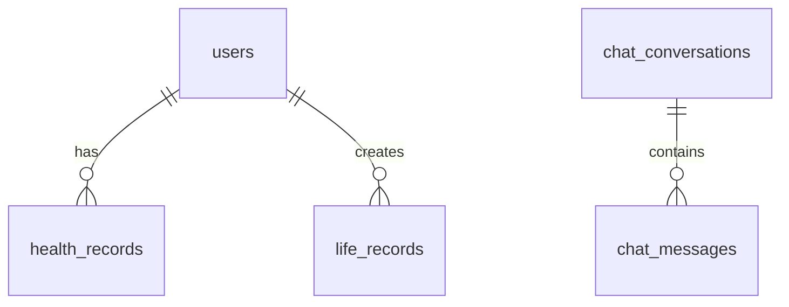

# Database Schema

This document outlines the database schema for the Suoke Life application.

## Local Database (SQLite)

### chat_history

| Column | Type    | Description                               |
| ------ | ------- | ----------------------------------------- |
| id     | INTEGER | Primary key, auto-incremented             |
| text   | TEXT    | The text of the chat message              |
| isUser | INTEGER | 1 if the message is from the user, 0 otherwise |

## Remote Database (Redis)

Redis is used for caching and session management. The following keys are used:

- **user_sessions:** Stores user session data.
- **cache:** Stores cached data.

## Remote Database (MySQL)

MySQL is used for storing structured data. The following tables are used:

### users

| Column | Type    | Description                               |
| ------ | ------- | ----------------------------------------- |
| id     | INTEGER | Primary key, auto-incremented             |
| name   | VARCHAR | The name of the user                      |
| email  | VARCHAR | The email of the user                     |
| password | VARCHAR | The password of the user                  |
| created_at | TIMESTAMP | The time the user was created |
| updated_at | TIMESTAMP | The time the user was updated |

### health_records

| Column | Type    | Description                               |
| ------ | ------- | ----------------------------------------- |
| id     | INTEGER | Primary key, auto-incremented             |
| user_id | INTEGER | The ID of the user who owns the record |
| heart_rate | INTEGER | The heart rate of the user |
| sleep_patterns | TEXT | The sleep patterns of the user |
| created_at | TIMESTAMP | The time the record was created |
| updated_at | TIMESTAMP | The time the record was updated |

### life_records

| Column | Type    | Description                               |
| ------ | ------- | ----------------------------------------- |
| id     | INTEGER | Primary key, auto-incremented             |
| user_id | INTEGER | The ID of the user who owns the record |
| activity | TEXT | The activity of the user |
| location | TEXT | The location of the user |
| created_at | TIMESTAMP | The time the record was created |
| updated_at | TIMESTAMP | The time the record was updated |

### knowledge_base

| Column | Type    | Description                               |
| ------ | ------- | ----------------------------------------- |
| id     | INTEGER | Primary key, auto-incremented             |
| title | VARCHAR | The title of the knowledge |
| content | TEXT | The content of the knowledge |
| created_at | TIMESTAMP | The time the knowledge was created |
| updated_at | TIMESTAMP | The time the knowledge was updated |

## 表结构设计

### users 用户表
```sql
CREATE TABLE users (
  id TEXT PRIMARY KEY,
  username TEXT NOT NULL,
  email TEXT UNIQUE,
  phone TEXT,
  avatar_url TEXT,
  settings JSON,
  created_at TIMESTAMP NOT NULL,
  updated_at TIMESTAMP NOT NULL
);
```

### chat_conversations 对话表
```sql
CREATE TABLE chat_conversations (
  id INTEGER PRIMARY KEY AUTOINCREMENT,
  title TEXT NOT NULL,
  model TEXT NOT NULL,
  avatar TEXT,
  created_at TIMESTAMP NOT NULL,
  updated_at TIMESTAMP NOT NULL
);
```

### chat_messages 消息表
```sql
CREATE TABLE chat_messages (
  id TEXT PRIMARY KEY,
  conversation_id INTEGER NOT NULL,
  content TEXT NOT NULL,
  type TEXT NOT NULL,
  sender_id TEXT NOT NULL,
  sender_avatar TEXT,
  created_at TIMESTAMP NOT NULL,
  is_read INTEGER DEFAULT 0,
  FOREIGN KEY (conversation_id) REFERENCES chat_conversations (id)
);
```

### health_records 健康记录表
```sql
CREATE TABLE health_records (
  id TEXT PRIMARY KEY,
  user_id TEXT NOT NULL,
  height REAL,
  weight REAL,
  blood_pressure TEXT,
  heart_rate INTEGER,
  recorded_at TIMESTAMP NOT NULL,
  FOREIGN KEY (user_id) REFERENCES users (id)
);
```

### life_records 生活记录表
```sql
CREATE TABLE life_records (
  id TEXT PRIMARY KEY,
  user_id TEXT NOT NULL,
  type TEXT NOT NULL,
  title TEXT NOT NULL,
  content TEXT,
  images TEXT,
  tags TEXT,
  location TEXT,
  created_at TIMESTAMP NOT NULL,
  updated_at TIMESTAMP NOT NULL,
  FOREIGN KEY (user_id) REFERENCES users (id)
);
```

### feedback 反馈表
```sql
CREATE TABLE feedback (
  id TEXT PRIMARY KEY,
  type TEXT NOT NULL,
  content TEXT NOT NULL,
  contact TEXT,
  images TEXT,
  status TEXT NOT NULL DEFAULT 'pending',
  created_at TIMESTAMP NOT NULL
);
```

## 索引设计

### users 表索引
```sql
CREATE INDEX idx_users_email ON users(email);
CREATE INDEX idx_users_phone ON users(phone);
```

### chat_messages 表索引
```sql
CREATE INDEX idx_messages_conversation ON chat_messages(conversation_id);
CREATE INDEX idx_messages_created_at ON chat_messages(created_at);
```

### health_records 表索引
```sql
CREATE INDEX idx_health_user_date ON health_records(user_id, recorded_at);
```

### life_records 表索引
```sql
CREATE INDEX idx_life_user_type ON life_records(user_id, type);
CREATE INDEX idx_life_created_at ON life_records(created_at);
```

## 数据关系



## 数据迁移

### 版本控制
使用 SQLite 版本表记录数据库版本:

```sql
CREATE TABLE versions (
  id INTEGER PRIMARY KEY AUTOINCREMENT,
  version TEXT NOT NULL,
  applied_at TIMESTAMP NOT NULL
);
```

### 迁移脚本
迁移脚本位于 `lib/app/data/migrations/` 目录:

- V1__create_initial_tables.sql
- V2__add_feedback_table.sql
- V3__add_message_indexes.sql

## 数据备份

### 备份策略
- 每日增量备份
- 每周全量备份
- 本地备份 + 云端备份

### 备份内容
- 数据库文件
- 用户上传文件
- 应用配置

## 安全措施

### 数据加密
- 敏感字段加密存储
- 使用 AES-256 加密算法
- 密钥安全管理

### 访问控制
- 基于角色的权限控制
- SQL 注入防护
- 参数化查询

## 性能优化

### 查询优化
- 合理使用索引
- 避免大表全表扫描
- 优化 JOIN 查询

### 存储优化
- 定期清理过期数据
- 大字段分表存储
- 合理设置字段类型 