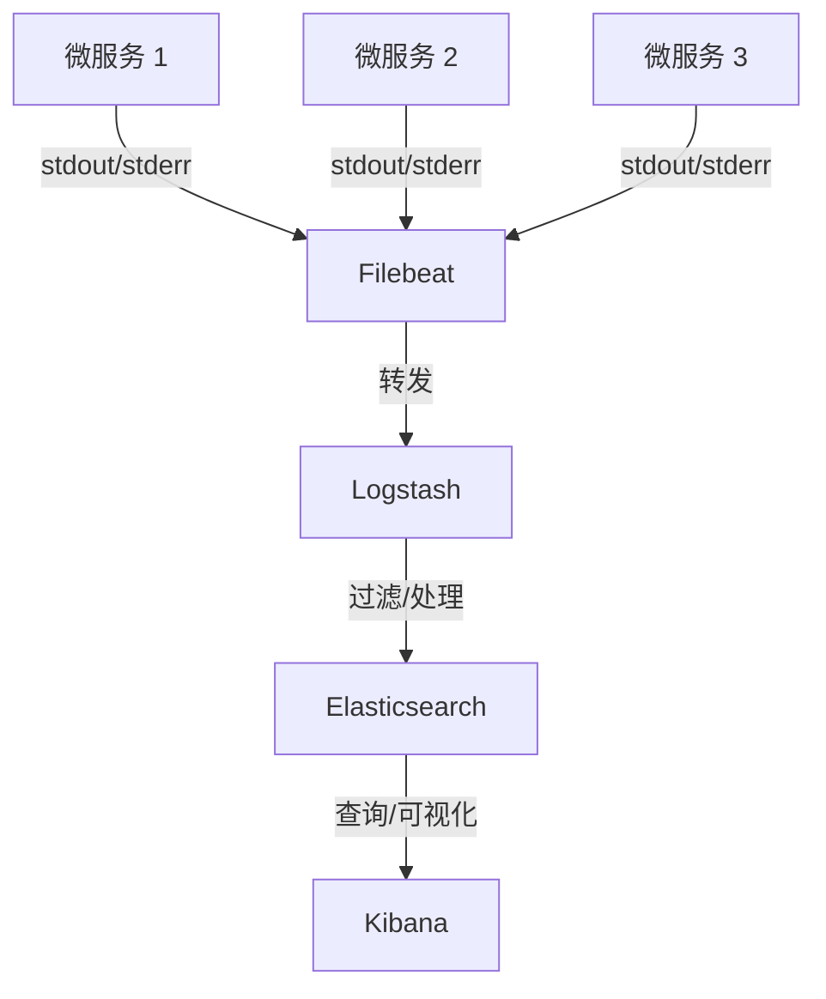

# 索克生活APP微服务可观测性指南

## 目录

- [可观测性概述](#可观测性概述)
- [指标收集](#指标收集)
- [日志管理](#日志管理)
- [分布式追踪](#分布式追踪)
- [告警与通知](#告警与通知)
- [可视化与监控面板](#可视化与监控面板)
- [基础设施监控](#基础设施监控)
- [健康检查](#健康检查)
- [可观测性最佳实践](#可观测性最佳实践)

## 可观测性概述

可观测性是理解系统内部状态的能力，通过外部可观察的输出。索克生活APP微服务架构的可观测性体系建立在三大支柱上：

1. **指标（Metrics）**：系统行为的数值表示
2. **日志（Logs）**：系统生成的详细事件记录
3. **追踪（Traces）**：请求在分布式系统中的流转路径

### 可观测性目标

索克生活APP的可观测性体系旨在达成以下目标：

1. **实时了解系统健康状态**
2. **快速定位并解决问题**
3. **分析性能瓶颈并优化**
4. **预测并防范潜在问题**
5. **验证系统变更的影响**
6. **确保服务质量达到SLA要求**

### 可观测性架构


索克生活APP采用以下可观测性技术栈：

- **指标收集**：Prometheus
- **日志管理**：ELK Stack (Elasticsearch, Logstash, Kibana)
- **分布式追踪**：Jaeger
- **告警系统**：Alertmanager
- **可视化**：Grafana
- **服务网格监控**：Kiali (基于Istio)

## 指标收集

### 核心指标类型

每个微服务必须收集以下四类核心指标（RED方法+资源使用）：

1. **请求率（Rate）**：每秒接收的请求数
2. **错误率（Errors）**：失败的请求百分比
3. **持续时间（Duration）**：请求处理时间
4. **资源使用（Resources）**：CPU、内存、磁盘、网络使用率

### 服务特定指标

除了通用指标外，各类服务应收集特定领域指标：

| 服务类型 | 指标类别 | 具体指标 |
|---------|---------|---------|
| 认证服务 | 安全指标 | 认证成功率、认证失败率、令牌刷新率、异常登录检测 |
| 智能体服务 | AI指标 | 推理延迟、模型加载时间、AI请求队列长度、上下文长度 |
| 数据存储服务 | 存储指标 | 查询延迟、缓存命中率、连接池利用率、数据库IOPS |
| 消息队列服务 | 队列指标 | 队列长度、消息处理率、消费滞后量、DLQ消息数 |
| API网关 | 流量指标 | 路由耗时、限流触发次数、请求大小分布、上游超时数 |

### Prometheus指标收集

每个微服务必须暴露Prometheus格式的指标端点：

```python
from prometheus_client import Counter, Histogram, Gauge, Summary, start_http_server
import time
import random

# 创建指标
REQUEST_COUNT = Counter('app_request_count_total', 'Total count of requests', ['method', 'endpoint', 'status'])
REQUEST_LATENCY = Histogram('app_request_latency_seconds', 'Request latency in seconds', ['method', 'endpoint'])
ACTIVE_REQUESTS = Gauge('app_active_requests', 'Number of active requests')
REQUEST_SIZE = Summary('app_request_size_bytes', 'Request size in bytes')

# 启动指标HTTP服务器
start_http_server(8000)

# 请求处理中间件示例
class PrometheusMiddleware:
    def __init__(self, app):
        self.app = app
    
    async def __call__(self, scope, receive, send):
        if scope["type"] != "http":
            return await self.app(scope, receive, send)
        
        method = scope["method"]
        path = scope["path"]
        
        ACTIVE_REQUESTS.inc()
        request_start = time.time()
        
        # 记录请求大小
        request_body = await receive()
        REQUEST_SIZE.observe(len(request_body.get("body", b"")))
        
        status_code = "500"  # 默认值，如果处理失败
        
        try:
            # 处理请求
            await self.app(scope, receive, send)
            # 提取状态码（简化示例）
            status_code = "200"
        except Exception as ex:
            status_code = "500"
            raise
        finally:
            request_latency = time.time() - request_start
            REQUEST_LATENCY.labels(method=method, endpoint=path).observe(request_latency)
            REQUEST_COUNT.labels(method=method, endpoint=path, status=status_code).inc()
            ACTIVE_REQUESTS.dec()
```

### 自定义服务指标

智能体服务示例指标：

```python
# 智能体服务特定指标
AI_INFERENCE_TIME = Histogram(
    'ai_inference_time_seconds', 
    'Time spent on AI inference',
    ['model', 'agent_type']
)
AI_TOKEN_COUNT = Histogram(
    'ai_token_count_total',
    'Number of tokens processed',
    ['direction', 'agent_type']  # direction: input/output
)
AI_ERROR_COUNT = Counter(
    'ai_error_count_total',
    'Number of AI processing errors',
    ['error_type', 'agent_type']
)
AI_CACHE_HIT = Counter(
    'ai_cache_hit_total',
    'Number of AI cache hits',
    ['agent_type']
)
AI_CACHE_MISS = Counter(
    'ai_cache_miss_total',
    'Number of AI cache misses',
    ['agent_type']
)
AI_AGENT_STATE = Gauge(
    'ai_agent_state',
    'Current state of AI agent',
    ['agent_id', 'agent_type']  # 0: idle, 1: processing, 2: error
)

# 使用示例
def process_agent_request(agent_type, model_name, prompt):
    AI_AGENT_STATE.labels(agent_id="agent-123", agent_type=agent_type).set(1)
    
    try:
        # 检查缓存
        cache_key = hash(prompt)
        cached_response = ai_cache.get(cache_key)
        
        if cached_response:
            AI_CACHE_HIT.labels(agent_type=agent_type).inc()
            return cached_response
        
        AI_CACHE_MISS.labels(agent_type=agent_type).inc()
        
        # 记录输入token数
        input_tokens = count_tokens(prompt)
        AI_TOKEN_COUNT.labels(direction="input", agent_type=agent_type).observe(input_tokens)
        
        # 推理计时
        start_time = time.time()
        response = ai_model.generate(prompt)
        inference_time = time.time() - start_time
        
        AI_INFERENCE_TIME.labels(model=model_name, agent_type=agent_type).observe(inference_time)
        
        # 记录输出token数
        output_tokens = count_tokens(response)
        AI_TOKEN_COUNT.labels(direction="output", agent_type=agent_type).observe(output_tokens)
        
        # 缓存结果
        ai_cache.set(cache_key, response)
        
        AI_AGENT_STATE.labels(agent_id="agent-123", agent_type=agent_type).set(0)
        return response
        
    except Exception as e:
        AI_ERROR_COUNT.labels(error_type=type(e).__name__, agent_type=agent_type).inc()
        AI_AGENT_STATE.labels(agent_id="agent-123", agent_type=agent_type).set(2)
        raise
```

### 指标命名规范

所有指标应遵循以下命名规范：

1. **格式**：`{服务名}_{指标名}_{单位}` (例如 `auth_request_latency_seconds`)
2. **服务名前缀**：每个服务使用唯一前缀，如`auth_`、`agent_`、`health_`
3. **指标类型后缀**：
   - 计数器：`_total` (例如 `auth_login_attempts_total`)
   - 状态快照：无后缀 (例如 `auth_active_sessions`)
   - 直方图/概要：使用单位后缀 (例如 `auth_password_hash_duration_seconds`)

### Prometheus抓取配置

在Kubernetes环境中配置Prometheus自动发现和抓取服务指标：

```yaml
apiVersion: v1
kind: ConfigMap
metadata:
  name: prometheus-config
data:
  prometheus.yml: |
    global:
      scrape_interval: 15s
      evaluation_interval: 15s
    
    scrape_configs:
      - job_name: 'kubernetes-pods'
        kubernetes_sd_configs:
          - role: pod
        relabel_configs:
          - source_labels: [__meta_kubernetes_pod_annotation_prometheus_io_scrape]
            action: keep
            regex: true
          - source_labels: [__meta_kubernetes_pod_annotation_prometheus_io_path]
            action: replace
            target_label: __metrics_path__
            regex: (.+)
          - source_labels: [__address__, __meta_kubernetes_pod_annotation_prometheus_io_port]
            action: replace
            regex: ([^:]+)(?::\d+)?;(\d+)
            replacement: $1:$2
            target_label: __address__
          - action: labelmap
            regex: __meta_kubernetes_pod_label_(.+)
          - source_labels: [__meta_kubernetes_namespace]
            action: replace
            target_label: kubernetes_namespace
          - source_labels: [__meta_kubernetes_pod_name]
            action: replace
            target_label: kubernetes_pod_name
```

为服务添加Prometheus抓取注解：

```yaml
apiVersion: apps/v1
kind: Deployment
metadata:
  name: auth-service
spec:
  template:
    metadata:
      annotations:
        prometheus.io/scrape: "true"
        prometheus.io/port: "8000"
        prometheus.io/path: "/metrics"
```

## 日志管理

### 日志级别定义

明确定义各日志级别的使用场景：

| 级别 | 使用场景 | 示例 |
|-----|---------|------|
| ERROR | 需要立即干预的错误 | 服务无法连接数据库、身份验证系统失败 |
| WARNING | 潜在问题，暂不影响功能 | 性能下降、重试成功、配置次优 |
| INFO | 重要业务事件和状态变化 | 服务启动/关闭、用户登录/注销、主要操作完成 |
| DEBUG | 详细的技术信息 | 函数调用参数、中间计算结果、详细处理步骤 |
| TRACE | 最详细的诊断信息 | 循环迭代、低级库调用、协议细节 |

### 结构化日志格式

所有服务必须使用统一的JSON结构化日志格式：

```json
{
  "timestamp": "2023-11-10T08:22:43.432Z",
  "level": "INFO",
  "service": "auth-service",
  "instance": "auth-service-5d4f89bc84-2xzpl",
  "trace_id": "d8f025c076ef4e13b372e71c62c0d4e7",
  "span_id": "af81b7246f918ab4",
  "user_id": "usr_123456",
  "request_id": "req_abcdef123456",
  "message": "用户登录成功",
  "method": "POST",
  "path": "/api/v1/auth/login",
  "status_code": 200,
  "duration_ms": 45,
  "client_ip": "10.0.0.1",
  "user_agent": "Mozilla/5.0...",
  "context": {
    "auth_method": "password",
    "user_roles": ["user", "premium"]
  }
}
```

### Python日志配置

使用Python的结构化日志实现：

```python
import json
import logging
import time
from datetime import datetime
import uuid
from pythonjsonlogger import jsonlogger
import contextvars

# 创建上下文变量
request_id_var = contextvars.ContextVar('request_id', default=None)
trace_id_var = contextvars.ContextVar('trace_id', default=None)
span_id_var = contextvars.ContextVar('span_id', default=None)
user_id_var = contextvars.ContextVar('user_id', default=None)

class CustomJsonFormatter(jsonlogger.JsonFormatter):
    """自定义JSON日志格式化器"""
    
    def add_fields(self, log_record, record, message_dict):
        super().add_fields(log_record, record, message_dict)
        
        # 添加标准字段
        log_record['timestamp'] = datetime.utcnow().isoformat() + 'Z'
        log_record['level'] = record.levelname
        log_record['service'] = 'auth-service'  # 使用服务名称
        log_record['instance'] = os.environ.get('HOSTNAME', 'unknown')
        
        # 添加上下文字段
        request_id = request_id_var.get()
        if request_id:
            log_record['request_id'] = request_id
        
        trace_id = trace_id_var.get()
        if trace_id:
            log_record['trace_id'] = trace_id
        
        span_id = span_id_var.get()
        if span_id:
            log_record['span_id'] = span_id
        
        user_id = user_id_var.get()
        if user_id:
            log_record['user_id'] = user_id

def configure_logging(level=logging.INFO):
    """配置全局日志设置"""
    logger = logging.getLogger()
    logger.setLevel(level)
    
    # 移除默认处理器
    for handler in logger.handlers:
        logger.removeHandler(handler)
    
    # 添加JSON处理器
    handler = logging.StreamHandler()
    formatter = CustomJsonFormatter('%(timestamp)s %(level)s %(service)s %(message)s')
    handler.setFormatter(formatter)
    logger.addHandler(handler)
    
    return logger

# 请求中间件示例，用于设置请求上下文
class LoggingMiddleware:
    """将请求信息添加到日志上下文的中间件"""
    
    def __init__(self, app):
        self.app = app
        self.logger = logging.getLogger()
    
    async def __call__(self, scope, receive, send):
        if scope["type"] != "http":
            return await self.app(scope, receive, send)
        
        # 生成请求ID
        request_id = str(uuid.uuid4())
        request_id_var.set(request_id)
        
        # 提取trace ID和span ID (从请求头)
        headers = dict(scope.get("headers", []))
        trace_id = headers.get(b"x-trace-id", b"").decode("utf-8") or str(uuid.uuid4())
        span_id = headers.get(b"x-span-id", b"").decode("utf-8") or str(uuid.uuid4())
        trace_id_var.set(trace_id)
        span_id_var.set(span_id)
        
        # 记录请求开始
        start_time = time.time()
        path = scope.get("path", "")
        method = scope.get("method", "")
        
        self.logger.info(
            f"Request started: {method} {path}",
            extra={
                "method": method,
                "path": path,
                "remote_addr": dict(scope.get("client", ()))
            }
        )
        
        # 处理请求
        try:
            await self.app(scope, receive, send)
        except Exception as e:
            # 记录异常
            self.logger.error(
                f"Request failed: {str(e)}",
                extra={
                    "method": method,
                    "path": path,
                    "error": str(e),
                    "error_type": type(e).__name__,
                    "duration_ms": int((time.time() - start_time) * 1000)
                },
                exc_info=True
            )
            raise
        finally:
            # 记录请求完成
            duration_ms = int((time.time() - start_time) * 1000)
            self.logger.info(
                f"Request completed: {method} {path}",
                extra={
                    "method": method,
                    "path": path,
                    "duration_ms": duration_ms
                }
            )
```

### 日志聚合架构

使用ELK Stack (Elasticsearch, Logstash, Kibana) 实现日志聚合：



Filebeat配置示例：

```yaml
filebeat.inputs:
- type: container
  paths:
    - /var/lib/docker/containers/*/*.log
  processors:
    - add_kubernetes_metadata:
        host: ${NODE_NAME}
        matchers:
        - logs_path:
            logs_path: "/var/lib/docker/containers/"

processors:
  - decode_json_fields:
      fields: ["message"]
      target: ""
      overwrite_keys: true

output.logstash:
  hosts: ["logstash:5044"]
```

Logstash配置示例：

```
input {
  beats {
    port => 5044
  }
}

filter {
  if [kubernetes][namespace] {
    # 添加服务名称标签
    mutate {
      add_field => {
        "service" => "%{[kubernetes][labels][app]}"
      }
    }

    # 确保时间戳正确解析
    date {
      match => [ "timestamp", "ISO8601" ]
      target => "@timestamp"
    }

    # 清理日志层次结构
    if [kubernetes][labels][app] {
      mutate {
        rename => { "[kubernetes][labels][app]" => "app" }
      }
    }
  }
}

output {
  elasticsearch {
    hosts => ["elasticsearch:9200"]
    index => "logs-%{+YYYY.MM.dd}"
  }
}
```

### 敏感数据处理

处理日志中的敏感信息：

```python
import re

class SensitiveDataMasker:
    """敏感数据脱敏器"""
    
    PATTERNS = {
        'password': re.compile(r'"password"\s*:\s*"[^"]*"'),
        'token': re.compile(r'"(access_token|refresh_token|id_token)"\s*:\s*"[^"]+"'),
        'credit_card': re.compile(r'\b(\d{4}[-\s]?){3}\d{4}\b'),
        'phone': re.compile(r'\b1[3-9]\d{9}\b'),
        'id_card': re.compile(r'\b\d{17}[\dXx]\b')
    }
    
    @classmethod
    def mask_sensitive_data(cls, log_data):
        """脱敏日志数据"""
        if isinstance(log_data, dict):
            return cls._mask_dict(log_data)
        elif isinstance(log_data, str):
            return cls._mask_string(log_data)
        return log_data
    
    @classmethod
    def _mask_dict(cls, data_dict):
        """递归脱敏字典数据"""
        result = {}
        for key, value in data_dict.items():
            if key.lower() in ['password', 'token', 'access_token', 'refresh_token', 'secret']:
                result[key] = '*** MASKED ***'
            elif isinstance(value, dict):
                result[key] = cls._mask_dict(value)
            elif isinstance(value, list):
                result[key] = [cls.mask_sensitive_data(item) for item in value]
            elif isinstance(value, str):
                result[key] = cls._mask_string(value)
            else:
                result[key] = value
        return result
    
    @classmethod
    def _mask_string(cls, text):
        """脱敏字符串"""
        for pattern_name, pattern in cls.PATTERNS.items():
            if pattern_name == 'password' or pattern_name == 'token':
                text = pattern.sub(f'"{pattern_name}":"*** MASKED ***"', text)
            else:
                text = pattern.sub('*** MASKED ***', text)
        return text

# 使用示例
class SensitiveDataFilter(logging.Filter):
    """日志敏感数据过滤器"""
    
    def filter(self, record):
        if isinstance(record.msg, dict):
            record.msg = SensitiveDataMasker.mask_sensitive_data(record.msg)
        elif hasattr(record, 'args') and record.args:
            if isinstance(record.args, dict):
                record.args = SensitiveDataMasker.mask_sensitive_data(record.args)
            elif isinstance(record.args, tuple):
                args_list = list(record.args)
                for i, arg in enumerate(args_list):
                    if isinstance(arg, (dict, str)):
                        args_list[i] = SensitiveDataMasker.mask_sensitive_data(arg)
                record.args = tuple(args_list)
        
        if isinstance(record.msg, str):
            record.msg = SensitiveDataMasker.mask_sensitive_data(record.msg)
        
        return True
```

### 关键事件日志

定义必须记录的关键业务事件：

| 服务 | 事件类型 | 日志级别 | 必须包含的字段 |
|-----|---------|---------|-------------|
| 认证服务 | 用户注册 | INFO | user_id, registration_method, success |
| 认证服务 | 用户登录 | INFO | user_id, auth_method, success, ip_address |
| 认证服务 | 权限变更 | INFO | user_id, old_permissions, new_permissions, admin_id |
| 认证服务 | 认证失败 | WARNING | auth_method, failure_reason, ip_address, attempt_count |
| 用户服务 | 资料更新 | INFO | user_id, updated_fields |
| 健康服务 | 健康数据记录 | INFO | user_id, data_type, data_source |
| 智能体服务 | 对话开始 | INFO | user_id, agent_id, session_id |
| 智能体服务 | 对话结束 | INFO | user_id, agent_id, session_id, message_count, duration |
| 区块链服务 | 数据上链 | INFO | user_id, data_hash, transaction_id |
| 所有服务 | 异常错误 | ERROR | error_type, error_message, stack_trace, affected_entity |
| 所有服务 | 服务启动 | INFO | version, config_summary |
| 所有服务 | 服务关闭 | INFO | shutdown_reason, uptime |