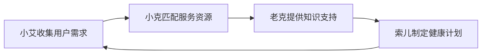

# 索克生活四智能体功能特性矩阵

## 智能体能力对比总览

| 功能领域 | 小艾 (xiaoai) | 小克 (xiaoke) | 老克 (laoke) | 索儿 (soer) |
|---------|---------------|---------------|--------------|-------------|
| **核心定位** | 智能交互入口 | 服务资源整合 | 知识管理专家 | 生活健康管家 |
| **主要用户** | 所有用户 | 需要医疗服务的用户 | 学习型用户 | 健康管理用户 |
| **技术特色** | 多模态AI | 推荐算法+区块链 | 知识图谱+RAG | 数据融合+行为科学 |

## 详细功能特性矩阵

### 🎯 交互能力

| 特性 | 小艾 | 小克 | 老克 | 索儿 |
|------|------|------|------|------|
| 语音识别 | ✅ 多语种+方言 | ✅ 基础语音 | ✅ 基础语音 | ✅ 基础语音 |
| 图像识别 | ✅ 医学图像分析 | ❌ | ✅ 内容识别 | ✅ 生活场景识别 |
| 手语识别 | ✅ 实时手语翻译 | ❌ | ❌ | ❌ |
| 情感分析 | ✅ 语音情感检测 | ✅ 文本情感 | ✅ 社区情感 | ✅ 健康情绪 |
| 多模态融合 | ✅ 视听触融合 | ✅ 文本+数据 | ✅ 文本+图像 | ✅ 传感器数据融合 |

### 🏥 医疗健康能力

| 特性 | 小艾 | 小克 | 老克 | 索儿 |
|------|------|------|------|------|
| 中医诊断 | ✅ 五诊全覆盖 | ❌ | ✅ 理论指导 | ✅ 体质分析 |
| 专家匹配 | ❌ | ✅ 智能匹配算法 | ❌ | ❌ |
| 健康监测 | ✅ 基础监测 | ❌ | ❌ | ✅ 全面监测 |
| 风险评估 | ✅ 初步评估 | ✅ 服务风险 | ❌ | ✅ 深度风险分析 |
| 干预建议 | ✅ 即时建议 | ✅ 服务推荐 | ✅ 知识指导 | ✅ 个性化干预 |

### 📚 知识管理能力

| 特性 | 小艾 | 小克 | 老克 | 索儿 |
|------|------|------|------|------|
| 知识图谱 | ✅ 基础医学知识 | ✅ 服务知识库 | ✅ 完整中医知识图谱 | ✅ 健康知识库 |
| RAG检索 | ✅ 基础检索 | ✅ 服务检索 | ✅ 高级语义检索 | ✅ 个性化检索 |
| 内容生成 | ✅ 对话生成 | ✅ 推荐内容 | ✅ 教育内容 | ✅ 健康报告 |
| 学习路径 | ❌ | ❌ | ✅ 个性化学习规划 | ✅ 健康改善路径 |
| 知识更新 | ✅ 实时更新 | ✅ 服务信息更新 | ✅ 社区驱动更新 | ✅ 数据驱动更新 |

### 🛍️ 服务管理能力

| 特性 | 小艾 | 小克 | 老克 | 索儿 |
|------|------|------|------|------|
| 服务推荐 | ❌ | ✅ 智能推荐系统 | ✅ 内容推荐 | ✅ 健康服务推荐 |
| 预约管理 | ❌ | ✅ 完整预约系统 | ❌ | ❌ |
| 订阅管理 | ❌ | ✅ 灵活订阅模式 | ❌ | ✅ 健康计划订阅 |
| 支付集成 | ❌ | ✅ 多种支付方式 | ❌ | ❌ |
| 售后服务 | ❌ | ✅ 完整售后体系 | ❌ | ❌ |

### 🔗 区块链能力

| 特性 | 小艾 | 小克 | 老克 | 索儿 |
|------|------|------|------|------|
| 数据溯源 | ❌ | ✅ 产品全链溯源 | ✅ 知识来源追踪 | ✅ 健康数据溯源 |
| 智能合约 | ❌ | ✅ 自动化合约执行 | ❌ | ❌ |
| 去中心化存储 | ❌ | ✅ 分布式产品数据 | ✅ 分布式知识库 | ✅ 隐私保护存储 |
| 数字身份 | ✅ 用户身份验证 | ✅ 商家认证 | ✅ 专家认证 | ✅ 健康身份 |
| 激励机制 | ❌ | ❌ | ✅ 代币激励 | ✅ 健康积分 |

### 👥 社区管理能力

| 特性 | 小艾 | 小克 | 老克 | 索儿 |
|------|------|------|------|------|
| 内容审核 | ❌ | ✅ 服务内容审核 | ✅ 智能内容审核 | ❌ |
| 用户激励 | ❌ | ✅ 服务评价激励 | ✅ 完整激励体系 | ✅ 健康目标激励 |
| 社交功能 | ✅ 基础聊天 | ✅ 服务社交 | ✅ 知识社区 | ✅ 健康社群 |
| 排行榜 | ❌ | ✅ 服务排行 | ✅ 贡献排行 | ✅ 健康排行 |
| 活动组织 | ❌ | ✅ 服务活动 | ✅ 学习活动 | ✅ 健康挑战 |

### 📊 数据分析能力

| 特性 | 小艾 | 小克 | 老克 | 索儿 |
|------|------|------|------|------|
| 用户画像 | ✅ 交互偏好分析 | ✅ 服务偏好分析 | ✅ 学习行为分析 | ✅ 健康行为分析 |
| 行为预测 | ✅ 交互预测 | ✅ 购买预测 | ✅ 学习预测 | ✅ 健康风险预测 |
| 趋势分析 | ❌ | ✅ 市场趋势 | ✅ 知识趋势 | ✅ 健康趋势 |
| 异常检测 | ✅ 交互异常 | ✅ 服务异常 | ✅ 内容异常 | ✅ 健康异常 |
| 报告生成 | ✅ 交互报告 | ✅ 服务报告 | ✅ 学习报告 | ✅ 健康报告 |

### 🔧 技术集成能力

| 特性 | 小艾 | 小克 | 老克 | 索儿 |
|------|------|------|------|------|
| API集成 | ✅ 多种AI API | ✅ 第三方服务API | ✅ 知识库API | ✅ 健康设备API |
| 实时处理 | ✅ 毫秒级响应 | ✅ 秒级响应 | ✅ 秒级响应 | ✅ 实时数据流 |
| 批量处理 | ✅ 语音批处理 | ✅ 订单批处理 | ✅ 内容批处理 | ✅ 数据批分析 |
| 缓存优化 | ✅ 多层缓存 | ✅ 服务缓存 | ✅ 知识缓存 | ✅ 数据缓存 |
| 负载均衡 | ✅ 智能分发 | ✅ 服务分发 | ✅ 查询分发 | ✅ 计算分发 |

## 智能体协作模式

### 🔄 数据流转

### 🤝 功能互补

| 场景 | 主导智能体 | 协作智能体 | 协作方式 |
|------|------------|------------|----------|
| 用户首次咨询 | 小艾 | 老克 | 小艾收集信息，老克提供知识背景 |
| 专家预约 | 小克 | 小艾 | 小艾辅助沟通，小克处理预约流程 |
| 健康教育 | 老克 | 索儿 | 老克提供理论，索儿提供实践指导 |
| 健康监测 | 索儿 | 小艾 | 索儿分析数据，小艾提供交互反馈 |

### 📈 性能指标对比

| 指标 | 小艾 | 小克 | 老克 | 索儿 |
|------|------|------|------|------|
| 响应时间 | < 100ms | < 200ms | < 300ms | < 500ms |
| 并发处理 | 10,000+ | 5,000+ | 8,000+ | 3,000+ |
| 准确率 | 95%+ | 90%+ | 92%+ | 88%+ |
| 可用性 | 99.9% | 99.8% | 99.9% | 99.7% |

## 部署资源需求

### 💻 计算资源

| 智能体 | CPU核心 | 内存 | GPU | 存储 |
|--------|---------|------|-----|------|
| 小艾 | 8核 | 16GB | 1x V100 | 500GB |
| 小克 | 4核 | 8GB | - | 200GB |
| 老克 | 6核 | 12GB | 1x T4 | 1TB |
| 索儿 | 8核 | 16GB | 1x T4 | 800GB |

### 🌐 网络要求

| 智能体 | 带宽需求 | 延迟要求 | 连接数 |
|--------|----------|----------|--------|
| 小艾 | 100Mbps | < 50ms | 10,000+ |
| 小克 | 50Mbps | < 100ms | 5,000+ |
| 老克 | 80Mbps | < 80ms | 8,000+ |
| 索儿 | 60Mbps | < 200ms | 3,000+ |

## 安全等级

### 🔒 数据安全

| 安全特性 | 小艾 | 小克 | 老克 | 索儿 |
|----------|------|------|------|------|
| 数据加密 | AES-256 | AES-256 | AES-256 | AES-256 |
| 访问控制 | RBAC | RBAC | RBAC | RBAC |
| 审计日志 | ✅ | ✅ | ✅ | ✅ |
| 隐私保护 | 差分隐私 | 数据脱敏 | 匿名化 | 联邦学习 |

### 🛡️ 合规认证

| 认证标准 | 小艾 | 小克 | 老克 | 索儿 |
|----------|------|------|------|------|
| ISO 27001 | ✅ | ✅ | ✅ | ✅ |
| HIPAA | ✅ | ✅ | ❌ | ✅ |
| GDPR | ✅ | ✅ | ✅ | ✅ |
| 等保三级 | ✅ | ✅ | ✅ | ✅ |

## 总结

四个智能体各有专长，形成了完整的健康管理生态：

- **小艾**: 作为用户交互的第一入口，提供最自然、最智能的人机交互体验
- **小克**: 连接用户与优质医疗资源，确保服务质量和产品安全
- **老克**: 构建知识传播平台，推动中医文化的数字化传承
- **索儿**: 深入用户日常生活，提供个性化的健康管理服务

通过微服务架构的松耦合设计，四个智能体既能独立运行，又能协同工作，为用户提供全方位、个性化的健康管理服务。 