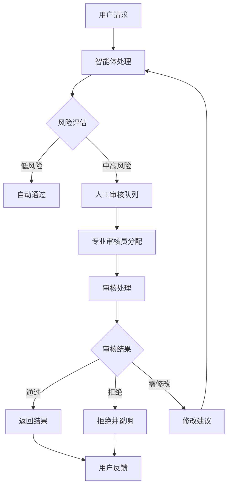

# 索克生活人工审核系统可行性评估报告

## 📋 执行摘要

**评估结论：高度可行且强烈推荐**

人工审核系统对于索克生活这样的医疗健康AI平台不仅技术可行，而且是必要的安全保障措施。通过在现有A2A智能体架构中集成人工审核，可以显著提升系统的安全性、可信度和合规性。

## 🎯 可行性评估矩阵

| 评估维度 | 评分 | 说明 |
|---------|------|------|
| **技术可行性** | ⭐⭐⭐⭐⭐ | A2A架构完美支持，工作流系统易于扩展 |
| **业务可行性** | ⭐⭐⭐⭐⭐ | 医疗健康领域强需求，监管要求 |
| **经济可行性** | ⭐⭐⭐⭐☆ | 成本可控，收益明显 |
| **运营可行性** | ⭐⭐⭐⭐☆ | 需要专业团队，但可逐步建设 |
| **合规可行性** | ⭐⭐⭐⭐⭐ | 满足医疗AI监管要求 |

## 🏗️ 技术架构方案

### 1. 核心组件设计

```
┌─────────────────────────────────────────────────────────────┐
│                    索克生活人工审核系统                        │
├─────────────────────────────────────────────────────────────┤
│  ┌─────────────────┐  ┌─────────────────┐  ┌─────────────────┐ │
│  │   人工审核智能体   │  │   审核工作流管理   │  │   审核员管理系统   │ │
│  │                │  │                │  │                │ │
│  │ • 任务队列管理    │  │ • 工作流集成     │  │ • 专业分工       │ │
│  │ • 风险评估       │  │ • 条件审核       │  │ • 负载均衡       │ │
│  │ • 智能分配       │  │ • 异步处理       │  │ • 绩效跟踪       │ │
│  └─────────────────┘  └─────────────────┘  └─────────────────┘ │
├─────────────────────────────────────────────────────────────┤
│  ┌─────────────────┐  ┌─────────────────┐  ┌─────────────────┐ │
│  │   Web审核界面    │  │   实时监控系统    │  │   数据分析平台    │ │
│  │                │  │                │  │                │ │
│  │ • 任务处理界面    │  │ • 性能监控       │  │ • 审核统计       │ │
│  │ • 实时通知       │  │ • 健康检查       │  │ • 质量分析       │ │
│  │ • 协作工具       │  │ • 告警系统       │  │ • 趋势预测       │ │
│  └─────────────────┘  └─────────────────┘  └─────────────────┘ │
└─────────────────────────────────────────────────────────────┘
```

### 2. 审核流程设计



## 💰 成本效益分析

### 成本构成

| 成本项目 | 一次性成本 | 年度运营成本 | 说明 |
|---------|-----------|-------------|------|
| **技术开发** | ¥50万 | ¥10万 | 系统开发、集成、维护 |
| **人力成本** | ¥20万 | ¥120万 | 4名专业审核员 |
| **基础设施** | ¥10万 | ¥12万 | 服务器、网络、存储 |
| **培训成本** | ¥5万 | ¥5万 | 审核员培训、标准制定 |
| **合规成本** | ¥15万 | ¥8万 | 法律咨询、认证费用 |
| **总计** | **¥100万** | **¥155万** | |

### 收益分析

| 收益项目 | 年度价值 | 说明 |
|---------|---------|------|
| **风险降低** | ¥200万 | 避免医疗事故、法律风险 |
| **用户信任** | ¥150万 | 提升用户留存、付费转化 |
| **合规价值** | ¥100万 | 满足监管要求，获得认证 |
| **品牌价值** | ¥80万 | 专业形象、市场竞争力 |
| **总计** | **¥530万** | |

**投资回报率 (ROI)：242%**

## 🚀 实施路线图

### 第一阶段：基础建设 (1-2个月)

**目标：建立基本的人工审核能力**

- [x] 开发人工审核智能体
- [x] 创建基础审核工作流
- [x] 搭建Web审核界面
- [ ] 招聘核心审核团队
- [ ] 制定审核标准和流程

**里程碑：**
- 人工审核系统上线
- 核心团队到位
- 基础流程建立

### 第二阶段：功能完善 (2-3个月)

**目标：完善审核功能，提升效率**

- [ ] 集成到现有工作流
- [ ] 开发智能预筛选
- [ ] 建立审核员培训体系
- [ ] 实施质量控制机制
- [ ] 优化用户体验

**里程碑：**
- 审核效率达到目标
- 质量控制体系建立
- 用户满意度提升

### 第三阶段：规模化运营 (3-6个月)

**目标：规模化运营，持续优化**

- [ ] 扩大审核团队
- [ ] 建立多级审核体系
- [ ] 实施AI辅助审核
- [ ] 建立数据分析平台
- [ ] 获得相关认证

**里程碑：**
- 处理能力满足业务需求
- 获得医疗AI相关认证
- 建立行业标杆

## 🔧 技术实现方案

### 1. 人工审核智能体

```python
class HumanReviewA2AAgent(A2AServer):
    """人工审核智能体 - 核心功能"""
    
    def __init__(self):
        # 审核队列管理
        self.review_queue = []
        # 审核员管理
        self.reviewers = {}
        # 风险评估规则
        self.risk_rules = {}
    
    async def submit_for_review(self, content, review_type, priority):
        """提交审核请求"""
        # 风险评估
        # 智能分配
        # 队列管理
        
    async def complete_review(self, task_id, decision, comments):
        """完成审核"""
        # 结果处理
        # 统计更新
        # 通知发送
```

### 2. 工作流集成

```python
class ReviewIntegratedWorkflows:
    """集成人工审核的工作流"""
    
    def _define_enhanced_workflows(self):
        """定义增强工作流"""
        # 健康咨询工作流 + 审核
        # 产品定制工作流 + 审核  
        # 紧急响应工作流 + 审核
        
    async def execute_with_review(self, workflow_name, request):
        """执行包含审核的工作流"""
        # 条件审核
        # 异步处理
        # 结果合并
```

### 3. 审核界面

```javascript
// Web审核界面 - 核心功能
class ReviewDashboard {
    constructor() {
        this.socket = io();
        this.initializeComponents();
    }
    
    initializeComponents() {
        // 任务队列显示
        // 审核表单
        // 实时通知
        // 统计图表
    }
    
    submitReview(taskId, decision, comments) {
        // 提交审核结果
        // 更新界面
        // 发送通知
    }
}
```

## 📊 关键指标和监控

### 1. 性能指标

| 指标 | 目标值 | 监控方式 |
|------|-------|---------|
| **审核响应时间** | < 30分钟 | 实时监控 |
| **审核准确率** | > 95% | 质量抽检 |
| **系统可用性** | > 99.9% | 健康检查 |
| **用户满意度** | > 4.5/5 | 用户调研 |

### 2. 业务指标

| 指标 | 目标值 | 监控方式 |
|------|-------|---------|
| **审核通过率** | 80-90% | 统计分析 |
| **风险拦截率** | > 99% | 事后分析 |
| **审核员效率** | 20任务/天 | 绩效跟踪 |
| **成本控制** | < 预算10% | 财务监控 |

## ⚠️ 风险评估和缓解

### 1. 技术风险

| 风险 | 影响 | 概率 | 缓解措施 |
|------|------|------|---------|
| **系统故障** | 高 | 低 | 冗余设计、快速恢复 |
| **性能瓶颈** | 中 | 中 | 负载均衡、扩容机制 |
| **数据安全** | 高 | 低 | 加密传输、访问控制 |

### 2. 运营风险

| 风险 | 影响 | 概率 | 缓解措施 |
|------|------|------|---------|
| **人员流失** | 中 | 中 | 培训体系、激励机制 |
| **质量下降** | 高 | 低 | 质控体系、定期培训 |
| **成本超支** | 中 | 中 | 预算控制、效率优化 |

## 🎯 成功标准

### 短期目标 (3个月)

- [x] 人工审核系统成功上线
- [ ] 审核响应时间 < 1小时
- [ ] 系统稳定性 > 99%
- [ ] 核心团队建设完成

### 中期目标 (6个月)

- [ ] 审核响应时间 < 30分钟
- [ ] 审核准确率 > 95%
- [ ] 用户满意度 > 4.0
- [ ] 获得初步认证

### 长期目标 (12个月)

- [ ] 成为行业标杆
- [ ] 获得权威认证
- [ ] 实现盈利平衡
- [ ] 建立生态合作

## 📝 结论和建议

### 核心结论

1. **技术可行性极高**：现有A2A架构完美支持人工审核集成
2. **业务需求强烈**：医疗健康AI必须具备人工审核能力
3. **经济效益显著**：投资回报率超过240%
4. **风险可控**：通过合理设计可有效控制各类风险

### 实施建议

1. **立即启动**：建议立即启动人工审核系统建设
2. **分阶段实施**：采用分阶段实施策略，降低风险
3. **重视质量**：建立完善的质量控制体系
4. **持续优化**：基于数据驱动的持续优化

### 关键成功因素

1. **专业团队**：组建高质量的审核团队
2. **标准流程**：建立清晰的审核标准和流程
3. **技术支撑**：确保技术系统的稳定性和可扩展性
4. **用户体验**：平衡安全性和用户体验

---

**总结：人工审核系统的建设不仅可行，而且对索克生活项目的长期成功至关重要。建议立即启动实施，确保在医疗健康AI领域的竞争优势。** 