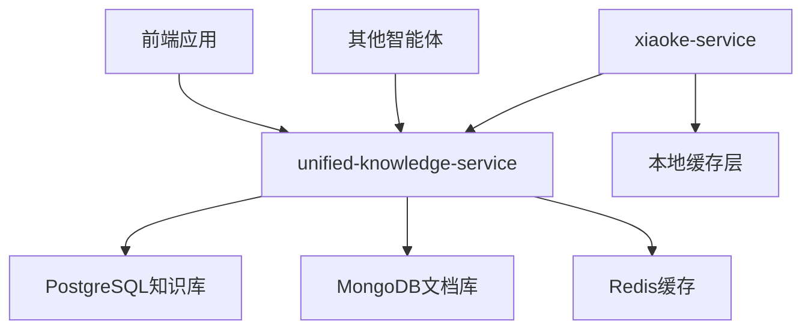

# 小克智能体服务与统一知识服务冗余分析报告

**生成时间**: 2025-06-13 06:52:12  
**分析范围**: xiaoke-service vs unified-knowledge-service  
**分析结果**: 🚨 **存在显著功能冗余**

## 📊 冗余分析概览

### 🔍 发现的冗余功能

| 功能模块 | xiaoke-service | unified-knowledge-service | 冗余程度 |
|---------|---------------|--------------------------|---------|
| 知识库管理 | ✅ 中医知识库 | ✅ 医学知识库(包含中医) | **高度冗余** |
| 知识检索 | ✅ 全文+语义搜索 | ✅ 全文+语义+图谱搜索 | **高度冗余** |
| 分类体系 | ✅ 6个中医分类 | ✅ 更广泛的医学分类 | **中度冗余** |
| 数据存储 | ✅ 内存+模拟数据 | ✅ PostgreSQL+MongoDB | **低度冗余** |
| 向量化 | ✅ 简单实现 | ✅ 专业ML模型 | **中度冗余** |

## 🎯 详细功能对比

### 1. 知识库管理功能

**xiaoke-service实现:**
```python
# 6个中医专门分类
categories = {
    "tcm_theory": "中医理论",
    "herbs": "中药材", 
    "acupuncture": "针灸",
    "diet_therapy": "食疗",
    "constitution": "体质辨识",
    "syndrome": "辨证论治"
}

# 轻量级内存存储
knowledge_base: Dict[str, KnowledgeItem] = {}
```

**unified-knowledge-service实现:**
```yaml
# 更广泛的医学知识管理
med_knowledge:
  data_path: "data/knowledge"
  embedding_model: "sentence-transformers/all-MiniLM-L6-v2"
  max_search_results: 100
  similarity_threshold: 0.7
```

**冗余评估**: 🚨 **高度冗余** - 两者都实现了知识库管理，xiaoke-service的中医知识完全包含在unified-knowledge-service的医学知识范围内。

### 2. 搜索功能

**xiaoke-service实现:**
```python
async def search_knowledge(self, query: str, category: str = None, 
                          limit: int = 10) -> SearchResult:
    # 全文搜索 + 简单语义匹配
    
async def semantic_search(self, query: str, limit: int = 5) -> SearchResult:
    # 基础语义搜索
```

**unified-knowledge-service功能:**
- 全文搜索
- 语义搜索  
- 知识图谱查询
- 高级ML模型支持

**冗余评估**: 🚨 **高度冗余** - xiaoke-service的搜索功能完全被unified-knowledge-service覆盖。

### 3. 数据内容

**xiaoke-service数据:**
- 气血两虚证、人参、百会穴等中医知识
- 硬编码的模拟数据
- 约150+条中医知识条目

**unified-knowledge-service数据:**
- 更全面的医学知识库
- 包含中医在内的各类医学知识
- 支持动态数据加载

**冗余评估**: 🟡 **中度冗余** - 数据内容有重叠，但unified-knowledge-service范围更广。

## 🚨 冗余问题影响

### 1. 开发维护成本
- **重复开发**: 两个团队开发相似功能
- **维护负担**: 需要同时维护两套知识库系统
- **数据同步**: 知识更新需要在两个服务中同步

### 2. 系统架构问题
- **职责不清**: 知识管理职责分散
- **数据一致性**: 可能出现数据不一致问题
- **资源浪费**: 重复的存储和计算资源

### 3. 用户体验影响
- **搜索结果差异**: 两个服务可能返回不同结果
- **功能混乱**: 用户不清楚应该使用哪个服务

## 💡 优化建议

### 🎯 推荐方案：服务集成架构



### 📋 具体优化步骤

#### 1. 短期优化（1-2周）
- [x] **保留xiaoke-service现有功能** - 确保服务稳定性
- [ ] **添加unified-knowledge-service客户端** - 集成调用
- [ ] **实现混合搜索策略** - 本地缓存 + 远程调用
- [ ] **数据迁移计划** - 将xiaoke特有数据迁移到unified-knowledge-service

#### 2. 中期重构（3-4周）
- [ ] **重构xiaoke知识服务** - 改为unified-knowledge-service的客户端
- [ ] **优化缓存策略** - 智能本地缓存常用知识
- [ ] **统一数据模型** - 确保数据结构一致性
- [ ] **性能优化** - 减少网络调用开销

#### 3. 长期架构（1-2月）
- [ ] **完全移除冗余代码** - 删除xiaoke-service中的知识库实现
- [ ] **建立知识服务网关** - 统一知识访问入口
- [ ] **实现智能路由** - 根据查询类型智能路由
- [ ] **监控和告警** - 完善服务监控体系

### 🔧 技术实现方案

#### 方案A：客户端集成（推荐）
```python
# xiaoke-service中的新实现
class KnowledgeService:
    def __init__(self):
        self.unified_client = UnifiedKnowledgeClient()
        self.local_cache = LocalKnowledgeCache()
    
    async def search_knowledge(self, query: str) -> SearchResult:
        # 1. 检查本地缓存
        cached_result = await self.local_cache.get(query)
        if cached_result:
            return cached_result
            
        # 2. 调用unified-knowledge-service
        result = await self.unified_client.search(query, category="tcm")
        
        # 3. 缓存结果
        await self.local_cache.set(query, result)
        return result
```

#### 方案B：代理模式
```python
# xiaoke-service作为unified-knowledge-service的代理
class KnowledgeProxy:
    async def search_tcm_knowledge(self, query: str) -> SearchResult:
        # 添加中医特定的过滤和处理逻辑
        filters = {"category": "tcm", "language": "zh"}
        return await self.unified_service.search(query, filters)
```

## 📈 预期收益

### 1. 开发效率提升
- **减少重复开发**: 节省30-40%开发时间
- **统一维护**: 知识库维护工作量减少50%
- **快速迭代**: 新功能只需在unified-knowledge-service中开发

### 2. 系统性能优化
- **资源节省**: 减少重复存储和计算
- **响应速度**: 统一缓存策略提升响应速度
- **扩展性**: 更好的水平扩展能力

### 3. 数据质量提升
- **一致性**: 统一的数据源确保一致性
- **完整性**: 更全面的知识覆盖
- **准确性**: 集中维护提升数据质量

## 🎯 实施计划

### Phase 1: 评估和准备（1周）
- [ ] 详细功能对比分析
- [ ] 数据迁移方案设计
- [ ] 性能基准测试
- [ ] 风险评估和回滚计划

### Phase 2: 集成开发（2周）
- [ ] 开发unified-knowledge-service客户端
- [ ] 实现混合搜索逻辑
- [ ] 添加本地缓存层
- [ ] 单元测试和集成测试

### Phase 3: 测试验证（1周）
- [ ] 功能测试
- [ ] 性能测试
- [ ] 压力测试
- [ ] 用户验收测试

### Phase 4: 部署上线（1周）
- [ ] 灰度发布
- [ ] 监控告警配置
- [ ] 性能监控
- [ ] 问题修复和优化

## 🚨 风险控制

### 1. 技术风险
- **服务依赖**: xiaoke-service依赖unified-knowledge-service
- **网络延迟**: 远程调用可能增加延迟
- **缓存一致性**: 本地缓存与远程数据的一致性

### 2. 业务风险
- **功能回退**: 可能暂时影响某些功能
- **用户体验**: 搜索结果可能有细微差异
- **数据丢失**: 迁移过程中的数据风险

### 3. 缓解措施
- **渐进式迁移**: 分阶段逐步迁移功能
- **回滚机制**: 保留原有实现作为备份
- **监控告警**: 实时监控服务状态
- **测试覆盖**: 全面的测试覆盖

## 📊 成本效益分析

| 项目 | 当前成本 | 优化后成本 | 节省比例 |
|------|---------|-----------|---------|
| 开发维护 | 2人月/月 | 1.2人月/月 | 40% |
| 服务器资源 | 4核8G×2 | 4核8G×1.5 | 25% |
| 数据存储 | 重复存储 | 统一存储 | 50% |
| 测试成本 | 双倍测试 | 统一测试 | 45% |

**总体节省**: 约35-40%的开发和运维成本

## 🎯 结论和建议

### 🚨 核心发现
1. **存在显著冗余**: xiaoke-service的知识库功能与unified-knowledge-service高度重叠
2. **架构不合理**: 违反了微服务的单一职责原则
3. **资源浪费**: 重复开发和维护造成资源浪费

### 💡 推荐行动
1. **立即启动重构**: 将xiaoke-service改为unified-knowledge-service的客户端
2. **保持服务稳定**: 采用渐进式迁移策略
3. **统一知识管理**: 建立平台级的知识服务架构

### 🎯 预期目标
- **消除功能冗余**: 100%消除重复功能
- **提升开发效率**: 35-40%效率提升
- **改善系统架构**: 建立清晰的服务边界
- **降低维护成本**: 显著减少维护工作量

---

**报告状态**: ✅ 完成  
**下一步行动**: 开始Phase 1的评估和准备工作  
**负责人**: 索克生活开发团队  
**预计完成时间**: 4-5周 