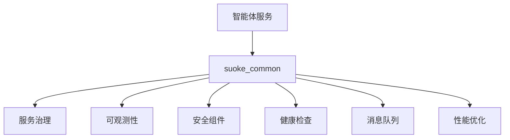

# 索克生活通用组件库 (Suoke Common)

为索克生活健康管理平台的四个智能体（小艾、小克、老克、索儿）提供统一的基础设施支持和通用组件。

## 🎯 核心价值

- **统一标准**: 为所有微服务提供一致的基础设施组件
- **高可用性**: 内置断路器、限流、重试等服务治理功能
- **可观测性**: 完整的监控、日志、追踪解决方案
- **安全保障**: 企业级安全组件和加密功能
- **性能优化**: 缓存、异步处理、数据库优化
- **易于使用**: 简洁的API和丰富的文档

## 📦 主要模块

### 🔧 服务治理 (Governance)
```python
from suoke_common import get_circuit_breaker, get_components

# 获取断路器
circuit_breaker = await get_circuit_breaker()

# 使用断路器保护服务调用
@circuit_breaker.protect
async def call_external_service():
    # 外部服务调用
    pass
```

### 📊 可观测性 (Observability)
```python
from suoke_common import get_metrics_collector

# 获取指标收集器
metrics = await get_metrics_collector()

# 记录业务指标
metrics.counter("user_login_count").inc()
metrics.histogram("request_duration").observe(0.5)
```

### 🔒 安全组件 (Security)
```python
from suoke_common import EncryptionManager, JWTManager

# 数据加密
encryption = EncryptionManager()
encrypted_data = encryption.encrypt("敏感健康数据")

# JWT令牌管理
jwt_manager = JWTManager()
token = jwt_manager.create_token({"user_id": "123", "role": "patient"})
```

### 💾 缓存优化 (Performance)
```python
from suoke_common import CacheOptimizer

cache = CacheOptimizer()

# 缓存用户健康数据
await cache.set("user:123:health_data", health_data, expire=3600)
health_data = await cache.get("user:123:health_data")
```

### 📨 消息队列 (Messaging)
```python
from suoke_common import KafkaClient, EventBus

# Kafka消息发送
kafka = KafkaClient()
await kafka.send("health_events", {"user_id": "123", "event": "blood_pressure_measured"})

# 事件总线
event_bus = EventBus()
await event_bus.publish("user_health_updated", {"user_id": "123"})
```

## 🚀 快速开始

### 1. 安装依赖
```bash
cd services/common
pip install -e .
```

### 2. 基本使用
```python
import asyncio
from suoke_common import get_components

async def main():
    # 初始化组件
    components = await get_components({
        "health": {"check_interval": 30},
        "observability": {
            "metrics": {"port": 8080},
            "logging": {"level": "INFO"}
        },
        "security": {
            "encryption": {"algorithm": "AES-256"},
            "jwt": {"secret": "your-secret-key"}
        }
    })
    
    # 使用组件
    health_checker = components.get_component("health_checker")
    status = await health_checker.check()
    print(f"健康状态: {status}")
    
    # 关闭组件
    await components.shutdown()

if __name__ == "__main__":
    asyncio.run(main())
```

### 3. 在微服务中使用
```python
# 在智能体服务中
from suoke_common import get_components, get_health_checker

class XiaoaiService:
    def __init__(self):
        self.components = None
    
    async def initialize(self):
        # 初始化通用组件
        self.components = await get_components({
            "service_name": "xiaoai-service",
            "health": {"check_interval": 30},
            "governance": {
                "circuit_breaker": {"failure_threshold": 5},
                "rate_limiter": {"requests_per_second": 100}
            }
        })
    
    async def health_check(self):
        health_checker = await get_health_checker()
        return await health_checker.check()
```

## 🏗️ 架构设计

### 组件层次结构
```
suoke_common/
├── governance/          # 服务治理
│   ├── circuit_breaker.py
│   ├── rate_limiter.py
│   └── load_balancer.py
├── observability/       # 可观测性
│   ├── metrics.py
│   ├── logging.py
│   └── tracing.py
├── security/           # 安全组件
│   ├── encryption.py
│   └── auth.py
├── health/             # 健康检查
│   ├── health_checker.py
│   └── health_monitor.py
├── messaging/          # 消息队列
│   ├── kafka_client.py
│   └── rabbitmq_client.py
└── performance/        # 性能优化
    ├── cache_optimization.py
    └── async_optimization.py
```

### 依赖关系


## 🔧 配置管理

### 配置文件示例
```yaml
# config/common.yaml
suoke_common:
  health:
    check_interval: 30
    timeout: 10
  
  observability:
    metrics:
      port: 8080
      path: "/metrics"
    logging:
      level: "INFO"
      format: "json"
    tracing:
      enabled: true
      endpoint: "http://jaeger:14268/api/traces"
  
  governance:
    circuit_breaker:
      failure_threshold: 5
      recovery_timeout: 60
    rate_limiter:
      requests_per_second: 100
      burst_size: 200
  
  security:
    encryption:
      algorithm: "AES-256"
      key_rotation_interval: 86400
    jwt:
      secret: "${JWT_SECRET}"
      expiration: 3600
  
  messaging:
    kafka:
      bootstrap_servers: "kafka:9092"
      group_id: "suoke-services"
    rabbitmq:
      url: "amqp://rabbitmq:5672"
```

## 🧪 测试

### 运行测试
```bash
# 运行所有测试
cd services/common
python -m pytest tests/

# 运行特定模块测试
python -m pytest tests/test_health.py

# 运行集成测试
python -m pytest tests/integration/
```

### 测试覆盖率
```bash
# 生成覆盖率报告
python -m pytest --cov=suoke_common --cov-report=html tests/
```

## 📈 监控和指标

### 内置指标
- `suoke_common_component_status`: 组件状态
- `suoke_common_health_check_duration`: 健康检查耗时
- `suoke_common_circuit_breaker_state`: 断路器状态
- `suoke_common_cache_hit_rate`: 缓存命中率

### Grafana仪表板
导入 `monitoring/grafana/suoke-common-dashboard.json` 获取预配置的监控仪表板。

## 🔍 故障排除

### 常见问题

1. **组件导入失败**
   ```python
   # 检查依赖是否安装
   pip install -r requirements.txt
   
   # 检查Python路径
   import sys
   print(sys.path)
   ```

2. **健康检查失败**
   ```python
   # 检查服务状态
   health_checker = await get_health_checker()
   status = await health_checker.detailed_check()
   print(status)
   ```

3. **性能问题**
   ```python
   # 启用性能分析
   from suoke_common import get_metrics_collector
   metrics = await get_metrics_collector()
   metrics.enable_profiling()
   ```

## 🤝 贡献指南

### 开发环境设置
```bash
# 克隆仓库
git clone https://github.com/SUOKE2024/suoke_life.git
cd suoke_life/services/common

# 创建虚拟环境
python -m venv venv
source venv/bin/activate  # Linux/Mac
# 或 venv\Scripts\activate  # Windows

# 安装开发依赖
pip install -e ".[dev]"

# 运行预提交检查
pre-commit install
```

### 代码规范
- 使用 `black` 进行代码格式化
- 使用 `flake8` 进行代码检查
- 使用 `mypy` 进行类型检查
- 测试覆盖率需达到 90% 以上

### 提交流程
1. 创建功能分支: `git checkout -b feature/new-component`
2. 编写代码和测试
3. 运行测试: `python -m pytest`
4. 提交代码: `git commit -m "feat: 添加新组件"`
5. 推送分支: `git push origin feature/new-component`
6. 创建Pull Request

## 📄 许可证

本项目采用 MIT 许可证 - 详见 [LICENSE](LICENSE) 文件。

## 📞 支持

- 📧 邮箱: tech@suoke.life
- 💬 微信群: 索克生活技术交流群
- 📖 文档: https://docs.suoke.life
- 🐛 问题反馈: https://github.com/SUOKE2024/suoke_life/issues

---

**索克生活** - 让健康管理更智能，让生活更美好！ 🌿💊🤖 