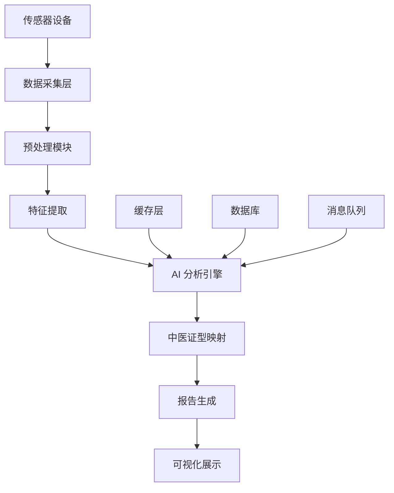

# 索克生活触诊服务 (Palpation Service)

[](https://github.com/SUOKE2024/suoke_life/actions/workflows/ci.yml)
[](https://codecov.io/gh/suokelife/suoke_life)
[](https://www.python.org/downloads/release/python-3133/)
[](https://opensource.org/licenses/MIT)
[](https://github.com/astral-sh/ruff)

> 基于AI的中医触诊智能分析微服务，融合传统中医智慧与现代传感技术

## 🌟 特性

- **🔬 多模态传感器融合**: 集成压力、温度、纹理等多种传感器数据
- **🧠 AI 智能分析**: 基于深度学习的触诊模式识别和分析
- **📊 实时数据处理**: 高性能的实时传感器数据采集和处理
- **🏥 中医证型映射**: 将现代传感器数据映射到传统中医证型
- **📈 可视化报告**: 生成直观的触诊分析报告和趋势图表
- **🔄 微服务架构**: 基于 FastAPI 的现代化微服务设计
- **📡 异步处理**: 支持高并发的异步数据处理
- **🔒 安全可靠**: 完整的身份验证、授权和数据加密

## 🏗️ 架构概览



## 🚀 快速开始

### 环境要求

- Python 3.13.3+
- UV 0.6.16+
- PostgreSQL 16+
- Redis 7+

### 安装

1. **克隆项目**
   ```bash
   git clone https://github.com/SUOKE2024/suoke_life.git
   cd suoke_life/services/diagnostic-services/palpation-service
   ```

2. **安装依赖**
   ```bash
   # 检查环境
   make check-deps
   
   # 安装开发依赖
   make install-dev
   ```

3. **配置环境**
   ```bash
   # 复制环境变量配置
   cp env.example .env
   
   # 编辑配置文件
   vim .env
   ```

4. **数据库迁移**
   ```bash
   make migrate
   ```

5. **启动服务**
   ```bash
   # 开发模式
   make dev
   
   # 或者生产模式
   make run
   ```

### Docker 部署

```bash
# 构建镜像
make docker-build

# 运行容器
make docker-run

# 或使用 Docker Compose
make docker-compose-up
```

## 📖 使用指南

### CLI 工具

触诊服务提供了强大的命令行工具：

```bash
# 查看帮助
uv run palpation-service --help

# 启动服务
uv run palpation-service serve --host 0.0.0.0 --port 8000

# 健康检查
uv run palpation-service health

# 检查配置
uv run palpation-service check-config
```

### API 使用

#### 启动触诊会话

```bash
curl -X POST "http://localhost:8000/api/v1/sessions" \
  -H "Content-Type: application/json" \
  -d '{
    "patient_id": "patient_123",
    "device_id": "suoke_wp100",
    "session_type": "pulse_diagnosis"
  }'
```

#### 上传传感器数据

```bash
curl -X POST "http://localhost:8000/api/v1/sessions/{session_id}/data" \
  -H "Content-Type: application/json" \
  -d '{
    "timestamp": "2024-01-01T12:00:00Z",
    "pressure": [0.1, 0.2, 0.15],
    "temperature": 36.5,
    "texture_features": {...}
  }'
```

#### 获取分析结果

```bash
curl "http://localhost:8000/api/v1/sessions/{session_id}/analysis"
```

### Python SDK

```python
from palpation_service.client import PalpationClient

# 创建客户端
client = PalpationClient(base_url="http://localhost:8000")

# 创建会话
session = await client.create_session(
    patient_id="patient_123",
    device_id="suoke_wp100"
)

# 上传数据
await client.upload_sensor_data(
    session_id=session.id,
    data=sensor_data
)

# 获取分析结果
analysis = await client.get_analysis(session_id=session.id)
print(f"诊断结果: {analysis.tcm_pattern}")
```

## 🧪 开发

### 代码质量

```bash
# 代码检查和格式化
make lint

# 仅检查（不修复）
make lint-check

# 安全检查
make security-check
```

### 测试

```bash
# 运行所有测试
make test

# 单元测试
make test-unit

# 集成测试
make test-integration

# 端到端测试
make test-e2e

# 生成覆盖率报告
make coverage
```

### 文档

```bash
# 生成文档
make docs

# 启动文档服务器
make docs-serve
```

### 性能测试

```bash
# 运行性能测试
make benchmark
```

## 📊 监控

### 健康检查

- **基础健康检查**: `GET /health`
- **详细健康检查**: `GET /health/detailed`
- **就绪检查**: `GET /ready`

### 指标监控

服务暴露 Prometheus 指标在 `/metrics` 端点：

- `palpation_sessions_total`: 总会话数
- `palpation_analysis_duration_seconds`: 分析耗时
- `palpation_sensor_data_points_total`: 传感器数据点总数
- `palpation_errors_total`: 错误总数

### 日志

结构化日志输出，支持多种格式：

```json
{
  "timestamp": "2024-01-01T12:00:00Z",
  "level": "INFO",
  "service": "palpation-service",
  "message": "Session created",
  "session_id": "sess_123",
  "patient_id": "patient_123"
}
```

## 🔧 配置

### 环境变量

主要配置项：

| 变量名 | 描述 | 默认值 |
|--------|------|--------|
| `DATABASE_URL` | 数据库连接URL | `postgresql://localhost:5432/palpation` |
| `REDIS_URL` | Redis连接URL | `redis://localhost:6379/0` |
| `LOG_LEVEL` | 日志级别 | `INFO` |
| `MOCK_SENSORS` | 是否使用模拟传感器 | `true` |

### 配置文件

详细配置请参考 `config/config.yaml`。

## 🤝 贡献

我们欢迎所有形式的贡献！

1. Fork 项目
2. 创建特性分支 (`git checkout -b feature/amazing-feature`)
3. 提交更改 (`git commit -m 'Add amazing feature'`)
4. 推送到分支 (`git push origin feature/amazing-feature`)
5. 创建 Pull Request

### 开发环境设置

```bash
# 设置开发环境
make setup-dev

# 安装 pre-commit 钩子
uv run pre-commit install
```

### 代码规范

- 使用 [Ruff](https://github.com/astral-sh/ruff) 进行代码检查和格式化
- 遵循 [Google Python Style Guide](https://google.github.io/styleguide/pyguide.html)
- 编写完整的测试用例
- 添加类型注解

## 📄 许可证

本项目采用 MIT 许可证 - 详见 [LICENSE](LICENSE) 文件。

## 🙏 致谢

- [FastAPI](https://fastapi.tiangolo.com/) - 现代化的 Python Web 框架
- [UV](https://github.com/astral-sh/uv) - 极速的 Python 包管理器
- [Ruff](https://github.com/astral-sh/ruff) - 极速的 Python linter
- [Pydantic](https://pydantic-docs.helpmanual.io/) - 数据验证库

## 📞 联系我们

- 项目主页: [https://github.com/SUOKE2024/suoke_life](https://github.com/SUOKE2024/suoke_life)
- 文档: [https://docs.suoke.life](https://docs.suoke.life)
- 邮箱: dev@suoke.life

---

<div align="center">
  <p>由 ❤️ 和 ☕ 驱动，为传统中医现代化贡献力量</p>
</div> 