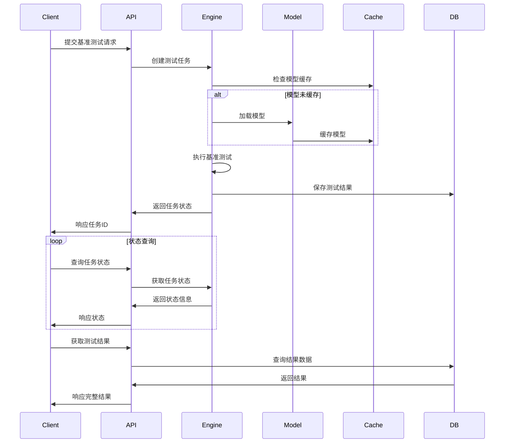
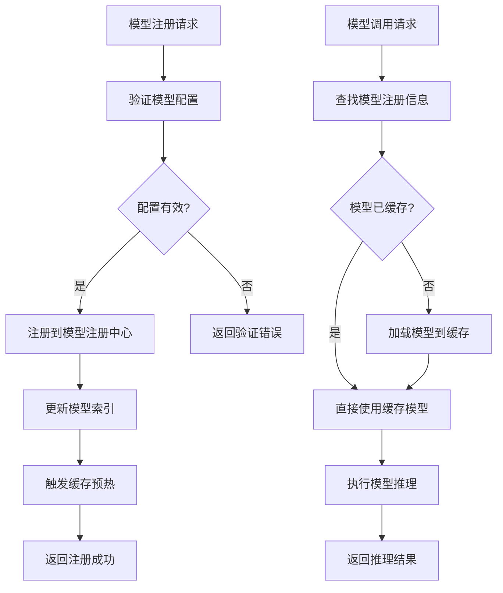

# SuokeBench 架构设计文档

## 概述

SuokeBench 是索克生活项目的专属评测系统，旨在系统性衡量索克生活APP及四大智能体（小艾、小克、老克、索儿）的功能完备度、智能水平与用户体验。

## 系统架构

### 整体架构

```
┌─────────────────────────────────────────────────────────────┐
│                    SuokeBench 评测系统                        │
├─────────────────────────────────────────────────────────────┤
│  API Gateway (FastAPI)                                     │
│  ├── REST API                                              │
│  ├── gRPC API                                              │
│  └── WebSocket (实时状态)                                   │
├─────────────────────────────────────────────────────────────┤
│  核心服务层                                                  │
│  ├── 基准测试引擎 (Benchmark Engine)                        │
│  ├── 模型管理器 (Model Manager)                             │
│  ├── 评估分析器 (Evaluation Analyzer)                       │
│  ├── 报告生成器 (Report Generator)                          │
│  └── 任务调度器 (Task Scheduler)                            │
├─────────────────────────────────────────────────────────────┤
│  支撑服务层                                                  │
│  ├── 缓存服务 (Redis/Memory)                               │
│  ├── 消息队列 (RabbitMQ/Kafka)                             │
│  ├── 监控观测 (Prometheus/Grafana)                         │
│  ├── 配置管理 (YAML/Environment)                           │
│  └── 日志聚合 (ELK Stack)                                  │
├─────────────────────────────────────────────────────────────┤
│  数据存储层                                                  │
│  ├── 关系数据库 (PostgreSQL)                               │
│  ├── 时序数据库 (InfluxDB)                                 │
│  ├── 对象存储 (MinIO/S3)                                   │
│  └── 搜索引擎 (Elasticsearch)                              │
└─────────────────────────────────────────────────────────────┘
```

### 核心组件

#### 1. 基准测试引擎 (Benchmark Engine)

**职责**：
- 执行各类基准测试任务
- 管理测试生命周期
- 提供异步执行能力
- 支持批量处理

**关键类**：
- `BenchmarkExecutor`: 基准测试执行器
- `BenchmarkTask`: 测试任务抽象
- `BenchmarkResult`: 测试结果封装

#### 2. 模型管理器 (Model Manager)

**职责**：
- 模型注册与发现
- 模型生命周期管理
- 模型缓存优化
- 多框架支持

**关键类**：
- `ModelRegistry`: 模型注册中心
- `ModelInterface`: 模型统一接口
- `ModelCache`: 模型缓存管理

#### 3. 评估分析器 (Evaluation Analyzer)

**职责**：
- 多维度指标计算
- 中医特色评估
- 智能体协作分析
- 性能基准对比

**关键类**：
- `MetricsCalculator`: 指标计算器
- `TCMEvaluator`: 中医评估器
- `AgentCollaborationAnalyzer`: 智能体协作分析器

#### 4. 报告生成器 (Report Generator)

**职责**：
- 多格式报告生成
- 可视化图表创建
- 模板化输出
- 自定义报告

**关键类**：
- `ReportGenerator`: 报告生成器
- `VisualizationEngine`: 可视化引擎
- `TemplateManager`: 模板管理器

## 数据流架构

### 基准测试执行流程



### 模型管理流程



## 技术栈

### 后端技术

- **Web框架**: FastAPI 0.104+
- **异步运行时**: asyncio + uvloop
- **gRPC**: grpcio + protobuf
- **数据验证**: Pydantic v2
- **依赖注入**: dependency-injector
- **任务队列**: Celery + Redis
- **缓存**: Redis + 内存缓存
- **数据库**: PostgreSQL + SQLAlchemy
- **监控**: Prometheus + Grafana
- **日志**: structlog + ELK

### AI/ML 技术

- **深度学习**: PyTorch + Transformers
- **传统ML**: scikit-learn + XGBoost
- **模型服务**: TorchServe + ONNX Runtime
- **向量数据库**: Qdrant + FAISS
- **图像处理**: OpenCV + Pillow
- **自然语言**: spaCy + jieba

### 部署技术

- **容器化**: Docker + Docker Compose
- **编排**: Kubernetes + Helm
- **CI/CD**: GitHub Actions + ArgoCD
- **服务网格**: Istio
- **负载均衡**: Nginx + HAProxy
- **存储**: MinIO + NFS

## 设计原则

### 1. 模块化设计

- **单一职责**: 每个模块专注特定功能
- **松耦合**: 模块间通过接口交互
- **高内聚**: 相关功能集中在同一模块
- **可扩展**: 支持插件化扩展

### 2. 异步优先

- **非阻塞IO**: 使用 asyncio 处理并发
- **任务队列**: 长时间任务异步执行
- **流式处理**: 支持数据流式传输
- **事件驱动**: 基于事件的架构模式

### 3. 可观测性

- **结构化日志**: 使用 JSON 格式日志
- **指标监控**: Prometheus 指标收集
- **链路追踪**: 分布式追踪支持
- **健康检查**: 多层次健康检查

### 4. 容错设计

- **优雅降级**: 部分功能失效时继续服务
- **熔断机制**: 防止级联故障
- **重试策略**: 智能重试机制
- **备份恢复**: 数据备份与恢复

## 性能优化

### 1. 缓存策略

```python
# 多级缓存架构
L1: 内存缓存 (最热数据)
L2: Redis缓存 (热数据)
L3: 数据库 (冷数据)

# 缓存策略
- 模型缓存: LRU + TTL
- 结果缓存: 基于内容哈希
- 配置缓存: 版本化缓存
```

### 2. 并发处理

```python
# 异步并发模型
- 协程池: 处理IO密集型任务
- 线程池: 处理CPU密集型任务
- 进程池: 处理计算密集型任务
- GPU队列: 处理深度学习推理
```

### 3. 资源管理

```python
# 资源池化
- 连接池: 数据库连接复用
- 模型池: 模型实例复用
- 内存池: 内存分配优化
- GPU池: GPU资源调度
```

## 安全设计

### 1. 认证授权

- **JWT Token**: 无状态认证
- **RBAC**: 基于角色的访问控制
- **API Key**: 服务间认证
- **OAuth2**: 第三方集成

### 2. 数据安全

- **传输加密**: TLS 1.3
- **存储加密**: AES-256
- **敏感数据**: 脱敏处理
- **审计日志**: 操作审计

### 3. 网络安全

- **防火墙**: 网络隔离
- **限流**: API 限流保护
- **CORS**: 跨域请求控制
- **CSP**: 内容安全策略

## 扩展性设计

### 1. 水平扩展

- **无状态服务**: 支持多实例部署
- **负载均衡**: 智能流量分发
- **数据分片**: 数据库水平分片
- **缓存集群**: Redis 集群模式

### 2. 垂直扩展

- **资源弹性**: 自动资源调整
- **GPU扩展**: 多GPU并行处理
- **存储扩展**: 分布式存储
- **计算扩展**: 分布式计算

### 3. 功能扩展

- **插件系统**: 动态功能扩展
- **模板引擎**: 自定义评估模板
- **钩子机制**: 生命周期钩子
- **事件系统**: 事件驱动扩展

## 监控告警

### 1. 系统监控

- **资源监控**: CPU、内存、磁盘、网络
- **服务监控**: 可用性、响应时间、错误率
- **业务监控**: 任务成功率、模型性能
- **用户监控**: 用户行为、使用模式

### 2. 告警策略

- **阈值告警**: 基于指标阈值
- **异常检测**: 基于机器学习
- **趋势分析**: 基于历史数据
- **智能降噪**: 减少误报

### 3. 可视化

- **实时大屏**: Grafana 仪表板
- **历史分析**: 时序数据分析
- **性能报告**: 定期性能报告
- **用户画像**: 用户行为分析

## 部署架构

### 1. 开发环境

```yaml
# docker-compose.dev.yml
services:
  suokebench:
    build: .
    environment:
      - ENV=development
      - DEBUG=true
    volumes:
      - ./:/app
    ports:
      - "8000:8000"
```

### 2. 测试环境

```yaml
# k8s/test/deployment.yaml
apiVersion: apps/v1
kind: Deployment
metadata:
  name: suokebench-test
spec:
  replicas: 2
  selector:
    matchLabels:
      app: suokebench
      env: test
```

### 3. 生产环境

```yaml
# k8s/prod/deployment.yaml
apiVersion: apps/v1
kind: Deployment
metadata:
  name: suokebench-prod
spec:
  replicas: 5
  strategy:
    type: RollingUpdate
    rollingUpdate:
      maxSurge: 1
      maxUnavailable: 0
```

## 总结

SuokeBench 采用现代化的微服务架构，具备高性能、高可用、高扩展性的特点。通过模块化设计、异步处理、多级缓存等技术手段，确保系统能够高效处理大规模的基准测试任务，为索克生活项目提供可靠的评测服务。